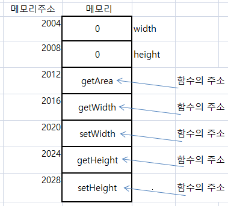

### 1. 변수의 스코프에 대하여 설명하시오.
	변수는  변수가 선언된 중괄호 안에서만 유효하다. 
	상위의 중괄호에서 선언된 변수는 사용할 수 있다.
	상위 중괄호에 선언된 변수를  재 선언을 하면 에러가 발생한다.

### 2.지역변수란?
	함수 또는 메소드 내부에 선언된 변수를 지역 변수라 한다.

### 3.인스턴스 변수란?
	클래스에 의해서 
	메모리에 객체를 만들었을때,
	이 객체를 인스턴스라고 부르며
	인스턴스 변수는  메모리에 있는 	
		클래스의 필드에 해당하는 부분이다.
	

### 4. 아래의 함수를 펙토리얼로 표현하시오.
```java
System.out.println("3 factorial: " + factorial(3));
System.out.println("3 factorial: " + factorial(12));
```

```java
작성:
	public static void main(String[] args) {
		System.out.println("3 factorial: " + factorial(3));
		System.out.println("3 factorial: " + factorial(12));
	}
	
	public static int factorial(int n) {
		if(n==1)
			return 1;
		
		return n * factorial(n-1); 
	}
```

```
	결과:
		3 factorial: 6
		3 factorial: 479001600
```


### 5.클래스의 구성요소는?
	클래스의 구성 요소 =  필드 + 메소드 
	로 구성이 된다.
		필드 : 객체의 데이터에 해당
		메소드 : 객체의 기능동작에 해당
		
		필드를 인스턴스 변수 , 
		메소드를 인스턴스 메소드라고 부른다.


### 6.원의 넓이는 구하는 프로그램을 아래와 같이 작성하시오.
```
  - 원클래스를 만들것
    - 변수 radius
    - 변수 radius에 대한 setter getter 함수 만들것
    - getArea 함수
  
	-메인 메소드를 가진 다른 클래스(AreaTest)에서 원 객체를 생성할것
```

```java
작성:
	class Circle{
		int radius;
		
		public double getArea() {
			double PI = Math.PI;
			return radius*radius*PI; 
		}

		public int getRadius() {
			return radius;
		}

		public void setRadius(int radius) {
			this.radius = radius;
		}
		
	}

	public class AreaTest {
		public static void main(String[] args) {
			Circle circle = new Circle();
		}
	}
```


### 7. 객체에 대하여 설명하시오.
	객체란 눈에보이는 사물(ex. 자동차, 버스 )또는 눈에보이지 않는 추상화된 사물(ex.강의 )
	를 상태와 동작으로 정의하여
	다른것들과 구분한 것을 말한다.
	자바에서는  상태(속성)와 동작을  클래스안에서  필드와 메소드 로 표현한다. 

### 8. 아래의 클래스에 대하여, 메모리 그림을 그리시오.
```java
class Rectangle{
	int width;
	int height;
	
	public int getArea() {
		return width * height;
	}
	
	public int getWidth() {
		return width;
	}
	public void setWidth(int width) {
		this.width = width;
	}
	public int getHeight() {
		return height;
	}
	public void setHeight(int height) {
		this.height = height;
	}
}
```
	작성:



### 9.클래스와 객체의 차이는?
```
- 클래스 : .class 
- 객체: .class를 메모리에 올린것
```


### 10.아래의 프로그램을 작성하시오.
```java
1 부터 num 까지 합을 구하는 class 를 작성하도록 하시오.
 
public class SumMain {

    public static void main(String[] args) {

        GetSum getsum = new GetSum(); //1)객체 생성
         int num; //2)num 변수 선언
         num = 50;

         getsum.setNum(num); //3)getsum 객체의 setNum함수 호출, num값 50 저장
         getsum.sum(); //4)getsum객체의 sum함수 호출, 1-50까지 합 구함

      }

}
```

```java
작성:
	class GetSum{
		int end;
		public void setNum(int num){
			end = num; 
		}
		//public int sum() {
		public void sum() {
			int sum=0;
			for(int i=0; i<=end; i++) {
				sum += i;
			}
			System.out.println("sum:"+ sum);
			//return sum;
		}
	}
```

```
	결과:
	sum:1275
```

### 11.아래의 프로그래밍을 작성하시오.
```java
Gugudan gugudan = new Gugudan();
gugudan.printGugu(10); //1단부터 10단까지 출력
gugudan.printGugu(20); //1단부터 20단까지 출력
```

```java
작성:
	public class gugudan {

		public static void printGugu(int endDan) {
			// TODO Auto-generated method stub
			for(int i=1; i<endDan; i++) {
				for(int j=1; j<=9; j++) {
					System.out.print(i + "x" + j + "=" + (i*j) + ", ");	
				}
				System.out.println();
			}
			System.out.println();
		}

	}

	public class WTodayTest4 {
		
		public static void main(String[] args) {
			gugudan.printGugu(10); //1단부터 10단까지 출력
			gugudan.printGugu(20); //1단부터 20단까지 출력	
		}
	}
```

```
	결과: 
	1x1=1, 1x2=2, 1x3=3, 1x4=4, 1x5=5, 1x6=6, 1x7=7, 1x8=8, 1x9=9, 
	2x1=2, 2x2=4, 2x3=6, 2x4=8, 2x5=10, 2x6=12, 2x7=14, 2x8=16, 2x9=18, 
	3x1=3, 3x2=6, 3x3=9, 3x4=12, 3x5=15, 3x6=18, 3x7=21, 3x8=24, 3x9=27, 
	4x1=4, 4x2=8, 4x3=12, 4x4=16, 4x5=20, 4x6=24, 4x7=28, 4x8=32, 4x9=36, 
	5x1=5, 5x2=10, 5x3=15, 5x4=20, 5x5=25, 5x6=30, 5x7=35, 5x8=40, 5x9=45, 
	6x1=6, 6x2=12, 6x3=18, 6x4=24, 6x5=30, 6x6=36, 6x7=42, 6x8=48, 6x9=54, 
	7x1=7, 7x2=14, 7x3=21, 7x4=28, 7x5=35, 7x6=42, 7x7=49, 7x8=56, 7x9=63, 
	8x1=8, 8x2=16, 8x3=24, 8x4=32, 8x5=40, 8x6=48, 8x7=56, 8x8=64, 8x9=72, 
	9x1=9, 9x2=18, 9x3=27, 9x4=36, 9x5=45, 9x6=54, 9x7=63, 9x8=72, 9x9=81, 

	1x1=1, 1x2=2, 1x3=3, 1x4=4, 1x5=5, 1x6=6, 1x7=7, 1x8=8, 1x9=9, 
	2x1=2, 2x2=4, 2x3=6, 2x4=8, 2x5=10, 2x6=12, 2x7=14, 2x8=16, 2x9=18, 
	3x1=3, 3x2=6, 3x3=9, 3x4=12, 3x5=15, 3x6=18, 3x7=21, 3x8=24, 3x9=27, 
	4x1=4, 4x2=8, 4x3=12, 4x4=16, 4x5=20, 4x6=24, 4x7=28, 4x8=32, 4x9=36, 
	5x1=5, 5x2=10, 5x3=15, 5x4=20, 5x5=25, 5x6=30, 5x7=35, 5x8=40, 5x9=45, 
	6x1=6, 6x2=12, 6x3=18, 6x4=24, 6x5=30, 6x6=36, 6x7=42, 6x8=48, 6x9=54, 
	7x1=7, 7x2=14, 7x3=21, 7x4=28, 7x5=35, 7x6=42, 7x7=49, 7x8=56, 7x9=63, 
	8x1=8, 8x2=16, 8x3=24, 8x4=32, 8x5=40, 8x6=48, 8x7=56, 8x8=64, 8x9=72, 
	9x1=9, 9x2=18, 9x3=27, 9x4=36, 9x5=45, 9x6=54, 9x7=63, 9x8=72, 9x9=81, 
	10x1=10, 10x2=20, 10x3=30, 10x4=40, 10x5=50, 10x6=60, 10x7=70, 10x8=80, 10x9=90, 
	11x1=11, 11x2=22, 11x3=33, 11x4=44, 11x5=55, 11x6=66, 11x7=77, 11x8=88, 11x9=99, 
	12x1=12, 12x2=24, 12x3=36, 12x4=48, 12x5=60, 12x6=72, 12x7=84, 12x8=96, 12x9=108, 
	13x1=13, 13x2=26, 13x3=39, 13x4=52, 13x5=65, 13x6=78, 13x7=91, 13x8=104, 13x9=117, 
	14x1=14, 14x2=28, 14x3=42, 14x4=56, 14x5=70, 14x6=84, 14x7=98, 14x8=112, 14x9=126, 
	15x1=15, 15x2=30, 15x3=45, 15x4=60, 15x5=75, 15x6=90, 15x7=105, 15x8=120, 15x9=135, 
	16x1=16, 16x2=32, 16x3=48, 16x4=64, 16x5=80, 16x6=96, 16x7=112, 16x8=128, 16x9=144, 
	17x1=17, 17x2=34, 17x3=51, 17x4=68, 17x5=85, 17x6=102, 17x7=119, 17x8=136, 17x9=153, 
	18x1=18, 18x2=36, 18x3=54, 18x4=72, 18x5=90, 18x6=108, 18x7=126, 18x8=144, 18x9=162, 
	19x1=19, 19x2=38, 19x3=57, 19x4=76, 19x5=95, 19x6=114, 19x7=133, 19x8=152, 19x9=171, 
```

