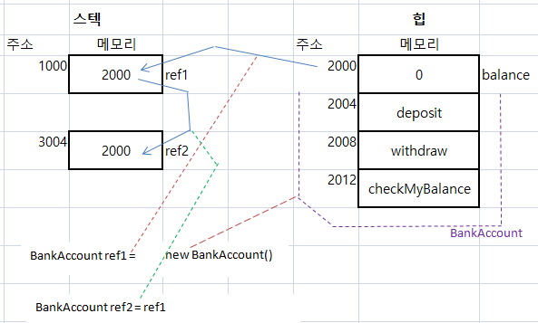

### 1. 아래의 BankAccount(소스 PPT 참고) 에 대하여 메모리 그림을 그리시오.

	BankAccount ref1 = new BankAccount();
	
	BankAccount ref2 = ref1;


작성:


### 2.생성자란 무엇인가요?
	클래스가지고 객체가 만들어 졌을때,
	처음 실행이 되는 함수이고,
	클래스의 필드 변수들을 초기화 할때 사용함.
		특징: 리턴값이 없음.
			클래스 내에 생성자 선언을 안하면, 
			컴파일러가 자동 디폴트 생성자를 만들어줌
			

### 3.디폴트 생성자에 대하여 설명하시오.
	클래스 내에 생성자 선언을 안하면,
	컴파일러가 자동 만들어 주는 것.

### 4.생성자의 용도는?
	클래스의 필드 변수들을 초기화 할때 사용함

### 5. null 에 대하여 설명하시오.
	참조 변수에 주소값이 들어 있지 않은 상태를 의미함.
	자바에서의 키워드임.

### 6.아래의 TV 클래스를 만드시오.
```java
public static void main(String[] args) {
	TV myTV = new TV("LG", 2017, 32); //LG에서 만든 2017년 32인치
	myTV.show();
}

//출력
LG에서 만든 2017년형 32인치 TV
```

```java
작성: 
	
class TV {
	String brand;
	int year;
	int inch;
	
	public TV(String brand, int year, int inch){
		this.brand = brand;
		this.year = year;
		this.inch = inch;
	}
	public void show() {
		System.out.println(brand + "에서 만든 " + year + "년형 " + inch +"인치 TV");
	}
}

public class TestTV {

	public static void main(String[] args) {
		// TODO Auto-generated method stub
		TV myTV = new TV("LG", 2017, 32);//LG에서 만든 2017년 32인치
		myTV.show();
	}

}
```

```
결과:
	LG에서 만든 2017년형 32인치 TV

```

### 7. 아래의 Grade 를 만드시오.
```java
	public static void main(String[] args) {
		
		int math, science, english;
		math = 90;
		science = 80; 
		english = 80;

		Grade me = new Grade(math, science, english);
		System.out.println("평균은 " + me.average());
		System.out.println(me.getGrade()); //우 입니다.
```

```java
작성:
class Grade {
	int math;
	int science;
	int english;
	double avg;
	Grade(int math, int science, int english){
		this.math = math;
		this.science = science;
		this.english = english;
	}
	double average() {
		avg = (math + science + english)/3.0;
		return avg;
	}
	String getGrade() {
		String str;
		if(avg>=90)
			str = "수 입니다.";
		else if(avg>=80)
			str = "우 입니다.";
		else if(avg >=70)
			str = "미 입니다.";
		else if(avg >=60)
			str = "양 입니다.";
		else
			str = "가 입니다.";
		return str;
	}
}

public class TestGrade {

	public static void main(String[] args) {
		// TODO Auto-generated method stub
		int math, science, english;
		math = 90;
		science = 80;
		english = 80;
		
		Grade me = new Grade(math, science, english);
		System.out.println("평균은 " + me.average());
		System.out.println(me.getGrade());//우 입니다.
	}

}

```
	결과:
		평균은 83.33333333333333
		우 입니다.
		

### 8.노래 한 곡을 나타내는 Song 클래스를 작성하라. Song은 다음 필드로 구성된다.

	- 노래의 제목을 나타내는 title
	- 가수를 나타내는 artist
	- 노래가 발표된 연도를 나타내는 year
	- 국적을 나타내는 country

	또한 Song 클래스에 다음 생성자와 메소드를 작성하라.

	- 생성자 2개: 기본 생성자와 매개변수로 모든 필드를 초기화하는 생성자
	- 노래 정보를 출력하는 show() 메소드
	- main() 메소드에서는 
	 
	Song 객체로 생성하고 
	show()를 이용하여 노래의 정보를 다음과 같이 출력하라.

	출력:
	1978년, 스웨덴 국적의 ABBA가 부른 "Dancing Queen"


```java
작성:
class Song {
	String year, country, artist, title;
	Song(){
		
	}
	
	Song(String year,String country,String artist,String title){
		this.year =year;
		this.country = country;
		this.artist = artist;
		this.title = title;
	}
	void show() {
		System.out.println(year + "년, " + country + " 국적의 " + artist + "가 부른 "+"\"" + title + "\"");
	}
}

public class TestSong {

	public static void main(String[] args) {
		// TODO Auto-generated method stub
		Song song = new Song("1978", "스웨덴", "ABBA", "Dancing Queen");
		song.show();
		
	}

}

```

	결과:	
		1978년, 스웨덴 국적의 ABBA가 부른 "Dancing Queen"