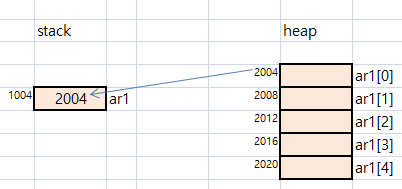
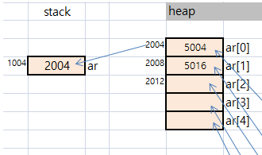

### 1. String 에서 concat 메서드에 대해서 설명하시오.
	String str의 뒤에 str2를 붙이는 것
	  ex.
		String str = "abc";
		string str2 = "de";
		str.concat(str2);

### 2. String 에서 substring 메서드 사용법은?
	String의 인덱스에 해당하는 char를 제거 하는것
		ex.
		String str = "abcdef";
		str.substring(2);// c를 재거 -->결과: "abdef"
		str.substring(1,3); //i=1, i<3제거 -->결과: "adef"

### 3. String  compareTo 사용법은?
	문자열이 같으면 (대소 구분 함, 길이도 비교) 정수 0을 리턴하고
	 음수를 리턴하면 사전적으로 str < str2 을 의미함
	 양수를 리턴하면 사전적으로 str > str2 을 의미함
	 
		ex.
		String str = "Lux";
		String str2 = "lux";
		str.compareTo(str2);  // 리턴값 음수, 

### 4. String.valueOf 에 대하여 설명하시오.
		valueOf에 파라미터로 어떤type이 들어가도 String으로 변환해 주는 함수
		
		ex.
		int numi = 13;
		String str = String.valueOf(numi);//str에 "13"이 대입됨

### 5. 아래가 실행되는 원리(함수)를 표현해 보세요.
```
String str = "age" + 17;
```

	설명 : 
		"age" 와 
		문자열로 바꾼 17 ( String.concat(17)을 함)을 
		합한뒤 새로운 메모리 할당받고, 참조변수 str에 집에 넣는다.


### 6.StringBuilder 와 String 의 차이는?
	String은 immutable( 메모리에 있던 String 의 원본을 훼손하지 않는 다는 의미 )인데,
	StringBuilder는
		( StringBuilder sb = "abcd" 처럼은 직접 넣는 방법은 사용하지 않고,)
		객체를 생성해서 사용한다.
		그리고 append, delete, replace, reverse등의 메소드를 지원 한다. 
		생성했던 객체 주소가 바뀌지 않으므로 mutable 이라고 할수 있다.


### 7.아래의 메모리 그림을 그리시오. (1차원 배열)
```java
int[] ar1 = new int[5];
```



### 8.아래의 메모리 그림을 그리시오. (1차원 배열)
```java
Box[] ar = new Box[5];
```


### 9. 아래를 프로그래밍 하시오.
```
"Hello.java" 문자열에서 파일명과 확장자인 java를 분리시키는 프로그램을 짜시오.

입력: Hello.java
출력: 파일이름은: Hello 이며 확장자는 java 입니다.

입력: Java.avi
출력: 파일 이름은: Java 이며 확장자는 avi 입니다.
```

```java
작성:

import java.util.Scanner;

public class AArray6_stringDiv {

	public static void main(String[] args) {
		
		Scanner sc = new Scanner(System.in);
		
		for(int i=0; i<2; i++) {
			System.out.print("입력: ");
			String str = sc.next();
			//System.out.println(str);
	
			
			FileName fn = new FileName(str);
			fn.divFileNameExt();
			System.out.println();
		}
	}
}

class FileName{
	private String fullname;
	private String fname;
	private String fext;
	private boolean find;
	
	FileName(String fullname){
		this.fullname = fullname;
		find = false;
	}
	
	void divFileNameExt(){
		for(int i=0; i<fullname.length(); i++) {
			if(fullname.charAt(i) == '.') {
				fname = fullname.substring(0,i);
				fext = fullname.substring(i+1,fullname.length());
				find = true;
			}
		}
		if(find)
			System.out.println("출력: 파일이름은:" + fname + "이며 확장자는 " + fext + "입니다.");
		else
			System.out.println(".이 없습니다.");
	}
	
}

```

```
결과:
	입력: Hello.java
	출력: 파일이름은:Hello이며 확장자는 java입니다.

	입력: Java.avi
	출력: 파일이름은:Java이며 확장자는 avi입니다.

```


### 10.아래를 배열을 활용하여 프로그램을 짜시오.
```
화폐매수 구하기
- 1원 부터 5000 원 까지 랜덤으로 생성.
- 500원 100 원 50 원 10원은 배열로 선언 하여 저장 

해당 랜덤생성된 화폐 매수를 아래와 같이 출력

2860원 

출력
500원 : 5개 
100원 : 3개 
50원 : 1개 
10원 : 1개
```

```java
작성:

public class AArray7_Money {

	public static void main(String[] args) {
		AutoMoney am = new AutoMoney();
		System.out.println();
		System.out.println("출력");
		am.show();
	}
}

class AutoMoney{
	
	private int money;
	private int[] rem = new int[4+1];
	private int[] divMon = new int[4];
	
	AutoMoney(){
		this.divMon[0] = 500;
		this.divMon[1] = 100;
		this.divMon[2] = 50;
		this.divMon[3] = 10;
		this.money = gen();
		System.out.println(this.money +"원");
	}
	private int gen() {
		double r = java.lang.Math.random();
		int rand = (int)(r * 5000 + 1);
		return rand;
	}
	void show() {
		rem[0] = money;
		
		for(int i=0; i<4; i++) {
			System.out.println( divMon[i]+ "원 : " + rem[i]/divMon[i] +"개");
			rem[i+1] = rem[i] % divMon[i];
		}
		
	}
	
}


```

```
결과:
	1727원

	출력
	500원 : 3개
	100원 : 2개
	50원 : 0개
	10원 : 2개
```

