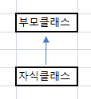
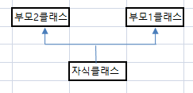

### 1. 상속을 UML로 표시하면?
UML Generalizatin(일반화)


### 2. 부모 클래스와 자식 클래스의 다른 용어들은?
	부모클래스 : 상위 클래스, 기초 클래스
	자식클래스 : 하위 클래스, 유도 클래스
### 3. this 키워드와 super 키워드의 차이는 무엇인가요?
	this는 자신을 가리키고
	super는 부모를 가리킴
### 4. 단일 상속과 다중 상속 이란 무엇인가요? UML 로의 표기는?
단일 상속 : 부모클래스가 1개 인것


다중 상속 : 부모클래스가 2개 이상 인것


### 5.
```java
	다음은 2차원 상의 한 점을 표현하는 Point 클래스이다. 
	Point를 상속받아 색을 가진 점을 나타내는 ColorPoint 클래스를 작성하라. 
	다음 main() 메소드를 포함하고 실행 결과와 같이 출력되게 하라.

	class Point {
		private int x, y;
		public Point(int x, int y) { this.x = x; this.y = y; }
		public int getX() { return x; }
		public int getY() { return y; }
		protected void move(int x, int y) { this.x =x; this.y = y; }

	public static void main(String[] args) {
		ColorPoint cp = new ColorPoint(5, 5, "YELLOW");
		cp.setXY(10, 20);
		cp.setColor("RED");
		String str = cp.toString();
		System.out.println(str+"입니다. ");
	}

	/*
	=======================
	RED색의 (10,20)의 점입니다.
	*/
```

```java
작성: 

public class A4TestPoint {

	public static void main(String[] args) {
		ColorPoint cp = new ColorPoint(5, 5, "YELLOW");
		cp.setXY(10, 20);
		cp.setColor("RED");
		String str = cp.toString();
		System.out.println(str+"입니다. ");
	}

}
 
class Point{
		private int x;
		private int y;
		Point(int x, int y){
			this.x = x;
			this.y = y;
		}
		public int getX() { return x; }
		public int getY() { return y; }
		protected void move(int x, int y) { this.x =x; this.y = y; }
		
		void setXY(int x, int y){
			this.x = x;
			this.y = y;
		}
}
 
class ColorPoint extends Point{
	private String color;
	
	ColorPoint(int x, int y, String color){
		super(x,y);
		this.color = color;
	}

	void setColor(String color) {
		this.color = color;
	}
	public String toString() {
		//
		// super.x 억세스가 않되는 이유는 private int x; 로 되어 있으므로,
		// 그래서, super.getX() 를 사용해야 한다.
		//
		//String str = color + "색의 (" + getX() +","+ getY() + ")의 점 ";
		String str = color + "색의 (" + super.getX() +","+ super.getY() + ")의 점 ";
		return str;
	}
}
 
```

```
결과:
	RED색의 (10,20)의 점 입니다. 
```

### 6. 다음 main() 메소드와 실행 결과를 참고하여 TV를 상속받은 ColorTV 클래스를 작성하라.
```java
다음 TV 클래스가 있다.

class TV{
   private int size;
   public TV(int size) { this.size = size; }
   protected int getSize() { return size; }
}


public static void main(String[] args) {
   ColorTV myTV = new ColorTV(32, 1024);
   myTV.printProperty();
}
/*
===========
32인치 1024컬러
*/
```

```java
작성: 


public class A5TestTV {

	public static void main(String[] args) {
		ColorTV myTV = new ColorTV(32, 1024);
		myTV.printProperty();
	}

}
 
class TV{
	   private int size;
	   public TV(int size) { this.size = size; }
	   protected int getSize() { return size; }
}

class ColorTV extends TV{
	private int color;
	ColorTV(int size, int color){
		super(size);
		this.color = color;
	}
	void printProperty(){
		System.out.println(getSize() + "인치 " + this.color + "컬러");
	}
}
 
```

```
결과 : 
	32인치 1024컬러
```

### 7. 다음 main() 메소드와 실행 결과를 참고하여 ColorTV를 상속받는 IPTV 클래스를 작성하라.
```java
public static void main(String[] args) {
   IPTV iptv = new IPTV("192.1.1.2", 32, 2048); //"192.1.1.2" 주소에 32인치, 2048컬러
   iptv.printProperty();
}
/*
=============================================
나의 IPTV는 192.1.1.2 주소의 32인치 2048컬러
*/
```

```java
작성 : 


public class A6TestIPTV {

	public static void main(String[] args) {
		IPTV iptv = new IPTV("192.1.1.2", 32, 2048); 
		iptv.printProperty();
		
	}
}
 
class TV{
	   private int size;
	   public TV(int size) { this.size = size; }
	   protected int getSize() { return size; }
}

class ColorTV extends TV{
	private int color;
	ColorTV(int size, int color){
		super(size);
		this.color = color;
	}
	protected int getColor() {
		return this.color;
	}
	void printProperty(){
		System.out.println(getSize() + "인치 " + this.color + "컬러");
	}
}
 
class IPTV extends ColorTV{
	private String ip;
	IPTV(String ip, int size, int color){
		super(size, color);
		this.ip = ip;
	}
	
	void printProperty(){
		//192.1.1.2 주소에 32인치, 2048컬러
		//
		//	할아버지 꺼 super.getSize (인치) 도  호출 가능
		//	부모꺼  super.getColor (컬러) 호출가능 
		//
		System.out.println(this.ip + " 주소에 "+ super.getSize() + "인치, " + super.getColor() + "컬러");
	}
}
 

```

```
결과: 
	192.1.1.2 주소에 32인치, 2048컬러
```

##  실무에서의 사용될수 있는 대안 방법(선생님) 
### ( 사용할 클래스 내부에, getter가 없는 경우에 대한 대안, (아래의 getColor()가 없는 경우) )


```java
선생님 작성 : 

public class IPTVTest {

	public static void main(String[] args) {

		IPTV iptv = new IPTV("192.1.1.2", 32, 2048); 
		iptv.printProperty();		   
	}

}

class TV {
	private int size;

	public TV(int size) {
		this.size = size;
	}

	//protected int getSize() {
	int getSize() {
		return size;
	}
}

class ColorTV extends TV{
	private int color;
	ColorTV(int size , int color){
		//
		//  부모가 가진 생성자 호출 -> super()
		//
		super(size);
		this.color = color;
	}
	
	//
	// getColor() 가 없음.
	//
	
	void printProperty() {
		System.out.println(super.getSize() + "인치 " + this.color + "컬러");
	}
}

class IPTV extends ColorTV{
	private String ip;
	IPTV(String ip, int size, int color){
		//
		// 주의 : super() 를 먼저 호출 되어야 한다.
		// 		이유 : 부모것 메모리를 올리고 나서, 자식것을 처리 해야 한다.
		//
		super(size, color);
		this.ip = ip;
		
	}
	public void printProperty() {
		//
		//
		//
		//  super.getColor() 가 없는 경우에  처리할수 있는 방법:
		//
		//
		System.out.print(ip + "주소에 ");
		super.printProperty();
		
		//System.out.println(ip + "주소에 " + super.getSize() + "인치" + super.getColor() + "컬러");
	}
}

```

```
	결과: 
		192.1.1.2주소에 32인치 2048컬러
```		