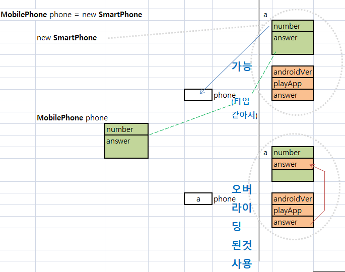

### 상속받은 클래스 메소드 선언시, @Override 를 붙여주기
	Annotation : 
		컴파일러에게 코드 문법 에러를 체크하돌고 정보를 제공하는 것임
		대표적인 예.는  @Override  임.

### 상속받은 클래스를 부모로 타입변환했을때, 오버라이딩 메소드의  그림

### 주의 : 판단할때 애매하면 Has-A 관계로

### IS-A 관계 
	class 참새 extends Bird{
	
	}

### Has-A 관계
	class Computer{
		Memory memory;
	}
	
### 다형성
	다양한 자식들의 인스턴스를 
	부모클래스타입으로 받을 수 있음으로 해서,
	
	다양한 결과가 나오는 성질을 다형성이라고 한다.
	
	다형성의 예를 들면
			사각형, 원, 삼각형의 여러 자식들의 인스턴스를 
			Shape 부모 클래스 타입으로 받아들이고,
			
			자식들의 오버라이딩된 면적함수 사용해서,
			자식들 면적의 전체 합을 구한다.

### 오버라이딩
	부모로 부터 상속받은 자식 클래스에
	부모에 있는 함수를 
	내용만 다르고 나머지(리턴타임, 함수이름, 파라메터 갯수 및 타입)는 똑같게
	자식에서 만드는 것
	
### 오버로딩
	상속과는 관계없고,
	함수이름은 동일한데, 파리메터 갯수와 타입등이 다른 함수를 
	클래스에 만든것.
	대표적인 예로 println 이 있다.