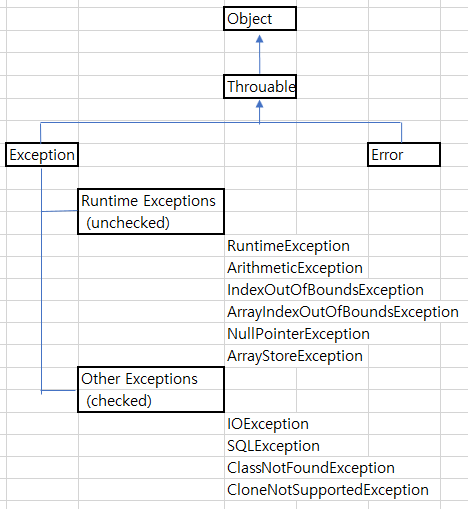

### 1. 에러(Error)와 예외(Exception)의 차이는?
```
	Error란: 
		시스템 오류 수준의 예외 상황, 프로그램 내에서 처리할 수 있는 수준이 아님, 
		ex.
		VirtualMachineError //가상머신에 심각한 오류 발생
		IOError //입출력 관련 코드수준 복구가 불가능한 오류
				//ex. 메모리 부족, HDD 에러
				
	Exception이란:
		예외상황이 발생하면, JVM이 예외 객체를 만들고
		호출한 함수쪽으로 되돌려 준다.
		프로그램 내에서 try catch  또는 throws 익셉션이름 등을
		사용하여 처리 할수 있다.
```
### 2. unchecked 와 checked 예외의 차이는?
```
	unchecked exception 이란 :
		실행을 해야지 만이 확인이 가능한 exception 객체을 말한다.
		
	checked exception 이란 : 
		개발자가 코드상으로 에러 처리를 해야하는 excepton 객체을 말한다.
		코드 작성단계에서, 이클립스가 에러내 보내 준다.
			( 'throws 익셉션이름' 정의를 함수 뒤에 추가 하던지,
			함수내에서'try catch'로 묶거나 하라고,)
			
```
### 3. 예외처리(Exception Handling) UML(상속도)참고하여  그리시오.



### 4. throws 에 대하여 설명하시오.
	'throws 익셉션이름'을 함수이름 뒤에 붙여주면,
	함수를 호출곳에서 exception을 try catch 로 처리 
	하라는 의미이다.

### 5. 아래가 컴파일 에러가 나는 이유에 대하여 설명하시오.
```java
try {
		int num = 6 / 0;
} catch (Exception e) {
		e.printStackTrace();
} catch (InputMismatchException e) {
		e.printStackTrace();
}
```
#### 설명:

	Exception 이 InputMismatchException 의 부모클래스 이므로
	catch( Exception e) 문만 타고,
	catch (InputMismatchException e)문은 진입하지 않으므로(진입할 일이 없음)발생하는 에러이다.
	
	에러 발생 위치 : InputMismatchException
	에러 메시지  :  Unreachable catch block for InputMismatchException. 
			     It is already handled by the catch block for Exception
	
	상속관계:
		Exception
		<-	RuntimeException
			<-	NoSuchElementException
				<-	InputMismatchException
#### 에러수정 방법 :  하위클래스를 먼저 , 상위클래스를 나중에 사용한다.
	주의 :  catch블록이 여러개라 할지라도, 단 하나의 catch 블록만 실행이 된다.
		그 이유는 try블록에서 동시다발적으로 예외가 발생하지 않고,
		하나의 예외가 발생하면 즉시 실행을 멈추고 해당 catch블록으로 이동하기 때문이다.

```java
try {
		int num = 6 / 0;
}catch (InputMismatchException e) {
		e.printStackTrace();
}catch (Exception e) {
		e.printStackTrace();
} 
```


### 6. 사칙연산 계산기를 아래의 조건으로 짜시오.
```java
interface ICalculator {
	int add(int x, int y);
	int sub(int x, int y);
	int mul(int x, int y);
	int div(int x, int y);
}

public class CalculatorMain {

	public static void main(String[] args) {
		ICalculator cal = new Calculator();

		//출력결과 참고 하여 try catch 를 적절히 넣을것  
			System.out.println(cal.add(6, 5));
			System.out.println(cal.sub(6, 5));	
			System.out.println(cal.mul(6, 5));	
			System.out.println(cal.div(6, 0));

	}
}

/*
================================================
11
1
30
java.lang.ArithmeticException: / by zero
	at Calculator.div(CalculatorMain.java:32)
	at CalculatorMain.main(CalculatorMain.java:45)
계산기 종료
*/
```
#### 작성:
```java
public class Test6 {

	public static void main(String[] args) {

		ICalculator cal = new Calculator();

		//출력결과 참고 하여 try catch 를 적절히 넣을것  
			System.out.println(cal.add(6, 5));
			System.out.println(cal.sub(6, 5));	
			System.out.println(cal.mul(6, 5));	
			System.out.println(cal.div(6, 0));
	}

}

interface ICalculator {
	int add(int x, int y);
	int sub(int x, int y);
	int mul(int x, int y);
	int div(int x, int y);
}

class Calculator implements ICalculator{
	
	public int add(int x, int y){
		return x+y;
	}
	public int sub(int x, int y){
		return x-y;
	}
	public int mul(int x, int y){
		return x*y;
	}
	
	public int div(int x, int y){
		int res=0;
		try {
			res = x/y;
		}
		//catch(Throwable e) {
		catch(Exception e) {
			e.printStackTrace();
			
			// test  
				//	catch(Exception e) {  
				//	System.out.println(e.getMessage()); <-- 사용시 
				//	/ by zero		<--결과 : 만 나온다.
			System.out.println("계산기 종료");
		}
		return res;
	}

}
```
#### 결과:
```
11
1
30
java.lang.ArithmeticException: / by zero
	at e_today_test6_calculator.Calculator.div(Test6.java:53)
	at e_today_test6_calculator.Test6.main(Test6.java:26)
계산기 종료
0
```

### 7.과일, 사과, 배, 포도를 표현한 클래스를 만들고 이들 간의 관계를 고려하여 하나의 클래스를 추상 클래스로 만들어 메소드 print()를 구현하고 
### 다음과 같은 소스와 결과가 나오도록 클래스를 작성하시오.
```java
- 소스
Fruit fAry[] = {new Grape(), new Apple(), new Pear());
for(Fruit f : fAry)
f.print();

- 결과
나는 포도이다.
나는 사과이다.
나는 배이다.
```
#### 작성:
```java
public class Test7 {

	public static void main(String[] args) {

		Fruit fAry[] = {new Grape(), new Apple(), new Pear()};
		for(Fruit f : fAry)
			f.print();
	}
}

abstract class Fruit{
	public abstract void print();
}	

class Grape extends Fruit{
	public void print() {
		System.out.println("나는 포도이다.");
	}
}
class Apple extends Fruit{
	public void print() { 
		System.out.println("나는 사과이다.");
	}
}
class Pear extends Fruit{
	public void print() {
		System.out.println("나는 배이다.");
	}
}
```
#### 결과:
```
나는 포도이다.
나는 사과이다.
나는 배이다.
```