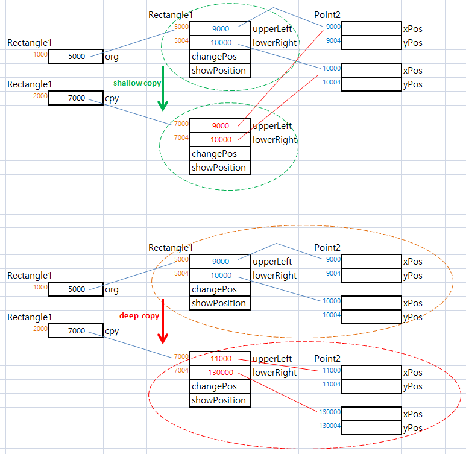

### 1. Object클래스의 11개 함수를 나열해 보시오.
그중 우리가 외워야 할 함수들은 찍어 보세요 ㅎㅎ
```java
		@IntrinsicCandidate
		public final native Class<?> getClass();
		
		@IntrinsicCandidate
		public native int hashCode();
		
		@IntrinsicCandidate
		protected native Object clone() throws CloneNotSupportedException;
		
		@IntrinsicCandidate
		public final native void notify();
		
		@IntrinsicCandidate
		public final native void notifyAll();

		public boolean equals(Object obj) {
			return (this == obj);
		}
		
		public String toString() {
			return getClass().getName() + "@" + Integer.toHexString(hashCode());
		}
		
		public final void wait() throws InterruptedException {
			wait(0L);
		}
		
		public final native void wait(long timeoutMillis) throws InterruptedException;
		
		public final void wait(long timeoutMillis, int nanos) throws InterruptedException {
			:
			:	
		}
		@Deprecated(since="9")
		protected void finalize() throws Throwable { }
```
### 외워야할 함수들
```
상속받은후 오버라이드해서 많이 사용하는 함수

	equals
		파라메터 : Object obj
		리턴 :  boolean 
		
	toString
		파라메터 : 없음
		리턴 :  String
		
	hashCode
		파라메터 : 없음
		리턴 :   native int
```

### 2. equals 함수에 대하여 설명하시오.
#### 작성: 
	Ojbect의 하나의 함수이고, 
		파라메터는 : Object obj
		리    턴 : boolean 
		동    작 : 자신과 입력 받은 참조변수의 값(주소)을 비교후 같으면 true 리턴한다.
		소    스 :	public boolean equals(Object obj) {
						return (this == obj);
					}
		
	상속을 받은뒤에 오버라이드 해서 많이 사용한다.
	

### 3. String 클래스 에서 문자열 비교시 equals를 쓰는 이유는?
#### 작성:
	String 클래스에서는, Object의 equals 함수를 오버라이드 하여 사용하고 있다.
	
	이유 : 
		Oject 클래스의 equals 함수는 참조변수의 주소값만 비교를 하므로
		String 클래스에서 이것을 그대로 사용한다면,
		두개의 String 객체안에 동일한 문자열이 들어 있다고 하더라도, equals  false를 리턴하게 된다.
			
		그래서, String 클래스에서는 두개의 객체안에 동일 문자가 들어 있다면,
		equal true를 리턴하도록 equals를 오버라이딩 하여 사용한다.		---> (1)

#### String 클래스 안의 equals
```java
    public boolean equals(Object anObject) {
        if (this == anObject) {
            return true;
        }
        if (anObject instanceof String) {
            String aString = (String)anObject;
            if (!COMPACT_STRINGS || this.coder == aString.coder) {
                return StringLatin1.equals(value, aString.value);
            }
        }
        return false;
    }
	
	@IntrinsicCandidate
    public static boolean equals(byte[] value, byte[] other) {
        if (value.length == other.length) {
            for (int i = 0; i < value.length; i++) {
                if (value[i] != other[i]) {	
                    return false;			
                }
            }
            return true;				<--- (1)
        }
        return false;
    }
```		


### 4. shallow copy, deep copy 의 차이는?
	Object의 clone함수를 통해서 새로운 객체를 생성할때
	복사되는 객체안의 필드데이터가 참조변수인 경우 	---->(2)
	참조변수가 가리키는 메모리의 내용까지 복제를 하면 deep copy라고 하며
	참조변수만 자체만 포함하여 객체를 복제하면 shallow copy라고 부른다.
	
#### shallow copy : 
```java
	public Object clone() throws CloneNotSupportedException {
			// shallow copy					
			Rectangle1 copy = (Rectangle1)super.clone();
			//copy.upperLeft = (Point2)upperLeft.clone();
			//copy.lowerRight = (Point2)lowerRight.clone();
			return copy;
		}
```

	
#### ex:
```java
	class Point2 implements Cloneable {
		private int xPos;
		private int yPos;
		
		@Override
		public Object clone() throws CloneNotSupportedException {
			return super.clone();   // Object 클래스의 clone 메소드 호출
		}
	}
	
	class Rectangle1 implements Cloneable {
		private Point2 upperLeft;			<----(2)
		private Point2 lowerRight;
		
		public Rectangle1(int x1, int y1, int x2, int y2) {
			upperLeft = new Point2(x1, y1);
			lowerRight = new Point2(x2, y2);
		}
		
		public Object clone() throws CloneNotSupportedException {
				// deep copy					<--- (3)
				Rectangle1 copy = (Rectangle1)super.clone();
				copy.upperLeft = (Point2)upperLeft.clone();
				copy.lowerRight = (Point2)lowerRight.clone();
				return copy;
			}
	}
	
	class Test {	
		public static void main(String[] args) {
			Rectangle1 org = new Rectangle1(1, 1, 9, 9);
			Rectangle1 cpy;
			cpy = (Rectangle1)org.clone();
		}
	}
```	
	
### 5. 금일 배운 Rectangle의 shallow copy 와 deep copy 일 때의 메모리 그림을 그려보시오.


### 6. 아래를 프로그래밍 하시오.
```
- 클래스 Person
* 필드 : 이름, 나이, 주소 선언
- 클래스 Student
* 필드 : 학교명, 학과, 학번, 8개 평균평점을 저장할 배열로 선언
* 생성자 : 학교명, 학과, 학번 지정
* 메소드 average() : 8개 학기 평균평점의 평균을 반환
- 클래스 Person과 Student 
- 프로그램 테스트 프로그램의 결과 : 8개 학기의 평균평점은 표준입력으로 받도록한다.

이름 : 김다정
나이 : 20

주소 : 서울시 관악구
학교 : 동양서울대학교
학과 : 전산정보학과
학번 : 20132222
----------------------------------------

8학기 학점을 순서대로 입력하세요

1학기 학점  → 3.37
2학기 학점  → 3.89
3학기 학점  → 4.35
4학기 학점  → 3.76
5학기 학점  → 3.89
6학기 학점  → 4.26
7학기 학점  → 4.89
8학기 학점  → 3.89

----------------------------------------

8학기 총 평균 평점은 4.0375점입니다.
```
#### 작성:
```java
import java.util.Scanner;
public class Test6 {
	public static void main(String[] args) {
		Scanner scan = new Scanner(System.in);
		System.out.print("이름 : ");
		String name = scan.next();
		
		System.out.print("나이 : ");
		String age = scan.next();
		//scan.nextLine();
		
		System.out.print("주소 : ");
		String address = scan.next();
		scan.nextLine();
		
		System.out.print("학교 : ");
		String university = scan.next();
		
		System.out.print("학과 : ");
		String major = scan.next();		

		System.out.print("학번 : ");
		String snum = scan.next();			
		
		Person person = new Person(name, age, address, university, major, snum);
		System.out.println("8학기 학점을 순서대로 입력하세요");
		for(int i=0;i < 8; i++) {
			System.out.print((i+1) + "학기 학점 -> ");
			double  score= scan.nextDouble();
			person.setScore(score);	
		}
		
		System.out.println("8학기 총 평균 평점은 " + person.Average() + "점입니다.");
	}
}


class Student{
	private String university, major, snum;
	private double[] semester = new double[8];
	private int i=0;
	Student(String university, String major, String snum){
		this.university = university;
		this.major = major;
		this.snum = snum;
	}
	public double Average() {
		double sum = 0;
		for (double d : semester) {
			sum += d;
		}
		return (sum/(double)semester.length);
	}
	
	public void setScore(double semester) {
		this.semester[i++] = semester;
		if(i>= this.semester.length)
			i=0;
	}

}

class Person extends Student{
	private String name, age, address;
	Person(String name, String age, String address, String university, String major, String snum){
		super(university, major, snum);
		this.name = name;
		this.age = age;
		this.address = address;
	}
}
```
#### 결과:
```
이름 : 김다정
나이 : 20
주소 : 서울시 관악구
학교 : 동양서울대학교
학과 : 전산정보학과
학번 : 20132222
8학기 학점을 순서대로 입력하세요
1학기 학점 -> 3.37
2학기 학점 -> 3.89
3학기 학점 -> 4.35
4학기 학점 -> 3.76
5학기 학점 -> 3.89
6학기 학점 -> 4.26
7학기 학점 -> 4.89
8학기 학점 -> 3.89
8학기 총 평균 평점은 4.0375점입니다.
```
### 7.철수 학생은 다음 3개의 필드와 메소드를 가진 4개의 클래스 Add, Sub, Mul, Div를 작성하려고 한다.
```
- int 타입의 a, b 필드: 2개의 피연산자
- void setValue(int a, int b): 피연산자 값을 객체 내에 저장한다.
- int calculate(): 클래스의 목적에 맞는 연산을 실행하고 결과를 리턴한다.

곰곰 생각해보니, Add, Sub, Mul, Div 클래스에 공통된 필드와 메소드가 존재하므로 새로운 추상 클래스 Calc를 작성하고,
 Calc를 상속받아 만들면 되겠다고 생각했다. 
그리고 main() 메소드에서 다음 실행 사례와 같이 2개의 정수와 연산자를 입력받은 후, 
Add, Sub, Mul, Div 중에서 이 연산을 처리할 수 있는 객체를 생성하고 setValue() 와 calculate()를 호출하여 
그 결과 값을 화면에 출력하면 된다고 생각하였다. 

철수처럼 프로그램을 작성하라.(예외처리 구문도 넣어 주세요^^)

두 정수와 연산자를 입력하시오 >> 5 7 +
```
#### 작성:
```java
public class Test7 {

	public static void main(String[] args) {
		Calc calc = null;
		
		try {
			Scanner sc = new Scanner(System.in);
			System.out.print("두 정수와 연산자를 입력하시오 >>");
			int n1 = sc.nextInt();
			int n2 = sc.nextInt();
			String str = sc.next();
			
			switch(str) {
			case "+":
				calc = new Add(n1, n2);
				break;
			case "-":
				calc = new Sub(n1, n2);
				break;
			case "*":
				calc = new Mul(n1, n2);
				break;
			case "/":
				calc = new Div(n1, n2);
				break;			
			}
			
			System.out.println(" = " + calc.calculate());
		}catch(Exception e) {
			e.printStackTrace();
		}
		

	}

}

abstract class Calc{
	protected int a;
	protected int b;
	public void setValue(int a, int b) {
		this.a = a;
		this.b = b;
	}
	public abstract int calculate();
}
class Add extends Calc{
	Add(int a, int b){
		setValue(a,b);
	}
	@Override
	public int calculate() {
		return (a+b); 
	}
}
class Sub extends Calc{
	Sub(int a, int b){
		setValue(a,b);
	}
	@Override
	public int calculate() {
		return (a-b); 
	}	
}
class Mul extends Calc{
	Mul(int a, int b){
		setValue(a,b);
	}
	@Override
	public int calculate() {
		return (a*b); 
	}	
}
class Div extends Calc{
	Div(int a, int b){
		setValue(a,b);
	}
	@Override
	public int calculate() {
		return (a/b); 
	}	
}
```
#### 결과:
```
두 정수와 연산자를 입력하시오 >>5 7 +
 = 12

```

### 8. 문자열을 입력 받아 한 글자씩 회전시켜 모두 출력하는 프로그램을 작성하라.
```
(클래스로 작성할 필요없이 메인에서 직접 할것)
[Hint] Scanner.nextLine()을 이용하면 빈칸을 포함하여 한 번에 한 줄을 읽을 수 있다.
문자열을 입력하세요. 빈칸이나 있어도 되고 영어 한글 모두 됩니다.

I Love you
Love youI
Love youI
ove youI L
ve youI Lo
e youI Lov
youI Love
youI Love
ouI Love y
uI Love yo
I Love you
```
#### 작성:
```java
import java.util.Scanner;
public class Test8 {

	public static void main(String[] args) {
		Scanner sc = new Scanner(System.in);
		System.out.println("문자열을 입력하세요: ");
		String str = sc.nextLine();
		for(int i=0; i<str.length()+1; i++ ) {
			int k=i;
			for(int j=i; j<(i+str.length()); j++ ) {
				if(k == str.length()) {
					k=0;
				}
				System.out.print(str.charAt(k++));
			}
			System.out.println();
		
		}
	}

}

```
#### 결과: 
```
문자열을 입력하세요: 
I Love you
I Love you
 Love youI
Love youI 
ove youI L
ve youI Lo
e youI Lov
 youI Love
youI Love 
ouI Love y
uI Love yo
I Love you

```