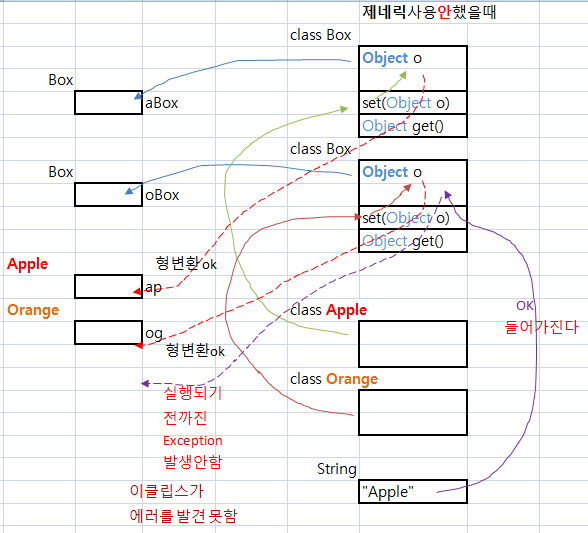
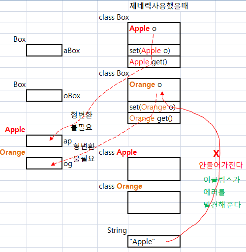

### 1.Wrapper class란?
	기본 자료형의 값을 인스턴스로 감싸는 목적의 클래스를 가리켜 래퍼 클래스라고 한다.
```java
래퍼 클래스의 종류와 생성자

	Boolean 		public Boolean(boolean value)
	Character 		public Character(char value)
	Byte 			public Byte(byte value)
	Short 			public Short(short value)
	Integer 		public Integer(int value)
	Long 			public Long(long value)
	Float 			public Float(float value), public Float(double value)
	Double 			public Double(double value)
```
	
### 2.auto unboxing 이란?
	래퍼 클래스로 정의된 로컬 변수를 
	기본 자료형의 변수에 대입을 하면 , 
	컴파일러가 자동으로 래퍼클래스변수를 unboxing 하여
	기본 자료형에 넣어 주는 기능을 말함.
	ex.
		Double dObj = 3.14;
		double num2 = dObj;	//<-- 오토 unboxing
		
### 3.BigInteger 클래스에 대하여 설명하시오. 
	매우 큰 정수 표현 위한 java.math.BigInteger 클래스 이다.

### 4. 프로그램 작성
```java
- 클래스 Person은 이름을 저장하는 필드 구성
- 클래스 Person은 상위 클래스 Object의 메소드 equals()를 오버라이딩하여 이름이 같으면 true를 반환하는 메소드 구현
- 다음과 같은 소스로 클래스 Person을 점검

Person p1 = new Person("홍길동");
System.out.println(p1.equals(new Person("홍길동")));
System.out.println(p1.equals(new Person("최명태")));

결과 
true
flase
```
#### 작성:
```java
public class Test4 {
	public static void main(String[] args) {
		Person p1 = new Person("홍길동");
		System.out.println(p1.equals(new Person("홍길동")));
		System.out.println(p1.equals(new Person("최명태")));
	}
}

class Person{
	String name;
	Person(String name){
		this.name = name;
	}
	@Override
	public boolean equals(Object obj) {
		Person person = (Person)obj;
		if(this.name.equals(person.name)) {
			return true;	
		}else
			return false;
	}
}
```
#### 결과:
```
	true
	false

```


### 5. 다음 조건을 만족하는 클래스 String의 객체 이용 프로그램을 작성하여 
###   메소드 equals()와 연산자 == 의 차이를 비교 설명하시오.
```java


String s1 = new String("java");
String s2 = new String("java");
String s3 = s2;

System.out.println(s1 == s2);			//(1)
System.out.println(s1.equals(s2));			//(2)
System.out.println(s2 == s3);			//(3)
System.out.println(s2.equals(s3));			//(4)
```
#### 설명:
```java
	메소드 equals() 는 String 문자열의 문자 하나 하나를 일일히 비교 하는 동작.
	연산자 ==  는  String 객체의 주소값이 같은 지를 비교하는 동작.

public class Test5 {
	public static void main(String[] args) {

		String s1 = new String("java");	//메모리의 "java" String 객체 주소를 S1 참조변수에 대입
		String s2 = new String("java"); //메모리의 "java" String 객체 주소를 S2 참조변수에 대입
		String s3 = s2;					//S2 주소값을 S3에 대입

		System.out.println(s1 == s2);	//메모리에 생성된 주소값이 같은지를 파라메터로 입력함, 결과:false.
		System.out.println(s1.equals(s2));//s1객체안의 문자열과 s2객체 안의 문자열이 같은지를 비교, 결과:true.
		System.out.println(s2 == s3); //메모리에 생성된 객체의 주소값이 같아서, 결과:true.
		System.out.println(s2.equals(s3));//동일 객체 메모리 주소안의 String을 비교하는 것이 되어서, 결과:true.
	}
}
```
#### 결과: 
```
	false
	true
	true
	true
```

### 6.아래를 정리하시오.
 - 프로토콜
 - DNS
 - 포트 번호

```
	프로토콜 : 규약
	DNS : Domain Name System,  숫자로 된 ip를 사람이 인지하기 쉬운 문자로 부여하는 것을 말함.
	포트번호 :  ip를 가지는 컴퓨터 내부에서
			실행되고 있는 하나의 프로그램의 번호를 의미.
``` 

### 7. 지네릭에 관하여 예습 하시오.
### 제네릭 :
	제네릭을 사용하면 : 
	인스턴스 생성시 결정이 되는 자료형의 정보를 T로 대체 한다.

	장점 : 잘못된 Type이 사용되는 것을 컴파일 과정에서 막을 수 있다.
		(컴파일시 강한 Type체크를 할수 있다)
		타입변환(Casting을 제거한다.
		
#### 제네릭 사용 안한 경우
```java
public static void main(String[] args) {
	Box aBox = new Box(); // 상자 생성
	Box oBox = new Box(); // 상자 생성
	//aBox.set(new Apple()); // 상자에 사과를 담는다.
	aBox.set("Apple"); //사과와 오렌지가 아닌 '문자열'을 담았다
	oBox.set(new Orange()); // 상자에 오렌지를 담는다.
	Apple ap = (Apple) aBox.get(); // 상자에서 사과를 꺼낸다.
	Orange og = (Orange) oBox.get(); // 상자에서 오렌지를 꺼낸다.
}
```
```java
class Box { // 무엇이든 저장하고 꺼낼 수 있는 상자
	private Object ob;

	public void set(Object o) {
		ob = o;
	}

	public Object get() {
		return ob;
	}
}		
```



### 제네릭 사용 한 경우 ( 같은Box이지만 객체생성시 Type이 다르게 설정이 된다.)
```java
public static void main(String[] args) {
	Box<Apple> aBox = new Box<Apple>();
	Box<Orange> oBox = new Box<Orange>();
	aBox.set(new Apple());  // 사과를 상자에 담는다.
	oBox.set(new Orange());  // 오렌지를 상자에 담는다.
	Apple ap = aBox.get();  // 사과를 꺼내는데 형 변환 하지 않는다.
	Orange og = oBox.get();  // 오렌지를 꺼내는데 형 변환 하지 않는다.
}
```
```java
class Box<T> {  // 인스턴스 생성시 결정이 되는 자료형의 정보를 T로 대체한다. 
	private T ob;
	public void set(T o) {
		ob = o;
	}
	public T get() {
		return ob;
	}
}
```
