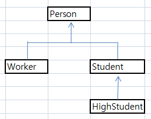
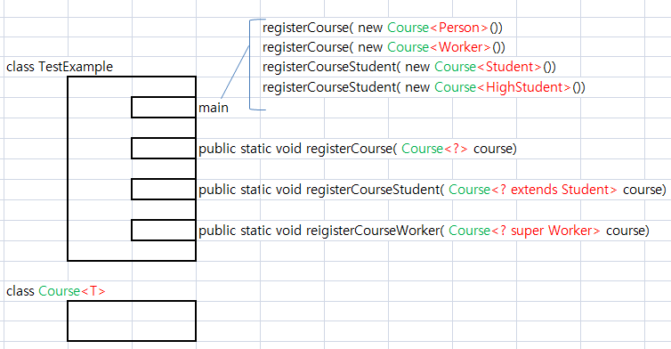

### 1. Generic 메소드에 대하여 설명하시오.
	메소드 안에서 사용할 타입을 컴파일 단계에서 
	메소드 외부에서 지정을 할 수 있도록 만든 것을 말한다.
	
	형태는 public static <T> Box<T> 함수이름(Box<T> box ){
	
	}	
	형태를 가진다.
		<T> : 제네릭 메소드임을 의미
		Box<T> : 제네릭 메소드의 리턴 타입
		Box<T> box : 제네릭 메소드 파라메터 인자


### 2.Generic(제네릭) 클래스의 타입 인자 제한하는 방법과 효과는?
	제네릭 클래스 타입 인자 제한하는 방법은 
		(예) <T extends Number > 형태로 사용한다.
	여기에서   Number 부분에 상위 타입 클래스명, 부모 타입 클래스명
	을 적어 주면 된다. 
	
	Number 부분 위치에는 클래스명 뿐만 아니라 인터페이스 명을 
	적을수도 있는데, 인터페이스 상속과는 달리 implements를 사용하지
	않고, 그냥 extends를 사용한다.
	
	<T extends Number> 형태로 타입을 제한을 하면
	조금더 구체적으로 어떤 타입와야 하는지 예측이 가능해 진다.
	위의 경우에는 T에는 Number타입이 오거나 또는 하위타입 타입인
	(Byte, Short, Interger, Long, Double)의 인스턴스만
	가져야 한다.
	

### 3.와일드 카드란?
	와일드 카드를 사용하는 부분은
	제네릭클래명<T> 를 사용할
	제네릭 메소드의 파라미터 인자에 <?>을 사용을 한다.(그림2 참조)
	( 파리미터 인자로 제네릭클래스의 타입을  바꿔서 여러종류를 넣을수 있도록 하기위해서 ? 사용한다.)

	제네릭 타입을 ? 를 사용해서 표시 하는데,
	?를 와일드 카드라고 부른다.
	사용할수 있는 형태는 메소드 파라미터 인자에 다음 3가지 이다.(그림2 참조)
	
		제네릭클래스명<?> 
			 타입으로 모든 타입이올 수 있다.
			 
		제네릭클래스명< ? extends 제한타입>
			타입으로 제한타입의 자식들만 올수 있다.
			
			아래그림에서 (
		제네릭클래스명< ? super 제한타입>
			타입으로 제한타입의 부모(상위)들만 올수 있다. 




### 4. 아래가 에러나는 이유를 설명하시오.
```java
class Box<T> {
    private T ob;     
    public void set(T o) { ob = o; }
    public get() { return ob; }
}

...

public static void inBox(Box<? super Toy> box, Toy n) {
   box.set(n);   // 넣는 것! OK!
   Toy myToy = box.get();   // 꺼내는 것! Error!
}
```
#### 설명:
```
	Box<? super Toy> 의 의미는
	box 안에는  Toy의 부모 클래스가 와야한다.( 하한 제한 )
	
	Toy myToy = box.get(); 
	는 box안에 Toy 부모를 꺼내서  자식 Toy에게 넣는 것이 되므로 형변환 할 수 없다.
```

### 5. 아래의 소스코드 중에 System.out.println(zBox.get().get().get()); 부분을 설명하시오.

```java
class Box<T> {
	private T ob;
	
	public void set(T o) {
		ob = o;
	}

	public T get() {
		return ob;
	}
}

public class BoxInBox {

	public static void main(String[] args) {
		Box<String> sBox = new Box<>();
		sBox.set("I am so happy.");
	
		Box<Box<String>> wBox = new Box<>();
		wBox.set(sBox);
		
		Box<Box<Box<String>>> zBox = new Box<>();
		zBox.set(wBox);
		
		System.out.println(zBox.get().get().get());
	}
}
```
#### 설명 :
```
	zBox.get() 통해서 얻은 것은 wBox의 주소값이고 (zBox안의 ob는  wBox)
	wBox.get() 통해서 얻는 것은 sBox의 주소값이다.(wBox안의 ob는 sBox)
	그래서,

	zBox.get().get().get()
	
			==> wBox.get().get() 
			
						==>  sBox.get()
	
	된다.
	(sBox안의 ob는 "I am so happy.")
	
	그래서 sBox.get() 결과는  "I am so happy." 가 된다.
			
```

### 6. 아래를 컴파일 에러가 나지 않게끔 프로그래밍 하시오.
```java

    public static void main(String[] args) {
        Box7<Integer> box1 = new Box7<>();
        box1.set(99);

        Box7<Integer> box2 = new Box7<>();
        box2.set(55);

        System.out.println(box1.get() + " & " + box2.get());
        swapBox(box1, box2); 
        System.out.println(box1.get() + " & " + box2.get());
    }

출력 =========================================

99 & 55
55 & 99
```
#### 작성:
```java
public class Test6 {
 
	public static void main(String[] args) {
        Box7<Integer> box1 = new Box7<>();
        box1.set(99);

        Box7<Integer> box2 = new Box7<>();
        box2.set(55);

        System.out.println(box1.get() + " & " + box2.get());
        swapBox(box1, box2); 
        System.out.println(box1.get() + " & " + box2.get());

	}
	
	public static <T> void swapBox(Box7<T> o , Box7<T> p) {
		Box7<T> a = new Box7<T>();
		a.set(o.get());
		o.set(p.get());
		p.set(a.get()); 
		
	}

}

class Box7<T>{
	private T o;
	public void set(T o) {
		this.o = o;
	}
	public  T get() {
		return (this.o);
	}
	public String toString() {
		return o.toString();
	}
}
```
#### 결과:
```
99 & 55
55 & 99
```

### 7.Scanner를 이용하여 한 라인을 읽고, 공백으로 분리된 어절이 몇 개 들어 있는지 "그만"을 입력할 때까지 반복하는 프로그램을 작성하라.
```
>>I love Java.
어절 개수는 3
>>자바는 객체 지향 언어로서 매우 좋은 언어이다.
어절 개수는 7
>>그만
종료합니다...
[Hint] Scanner.nextLine()을 이용하면 빈칸을 포함하여 한 번에 한 줄을 읽을 수 있다.

(1) StringTokenizer 클래스를 이용하여 작성하라.
```
#### 작성: 
```java
import java.util.Arrays;
import java.util.Scanner;
import java.util.StringTokenizer;

public class Test7 {

	public static void main(String[] args) {

		while(true) {

			try {
				System.out.println(">>");
				Scanner sc = new Scanner(System.in);
				String str = sc.nextLine();
		
				StringTokenizer token = new StringTokenizer(str, " ");
	
				int count = token.countTokens();
				
				for (int i=0; i< count; i++) {
					
					if(token.hasMoreTokens()) {
						String strTemp = token.nextToken();
						//System.out.println(strTemp);
						if(strTemp.equals("그만")) {
							System.out.println("종료합니다...");
							return;
						}
					}
				}
				System.out.println("어절 개수는 " + count);
			
				// 주의 : 이것은 사용 불가 하다. Override한 toString이 StringTokenizer 안에 안들어 잇는 건가?
				//System.out.println(Arrays.toString(token));
				
			} catch (Exception e) {
				
			}
			

		}//while
	}
}

```
#### 결과:
```
	>>
	I love Java.
	어절 개수는 3
	>>
	자바는 객체 지향 언어로서 매우 좋은 언어이다.
	어절 개수는 7
	>>
	이제는 그만 하고
	종료합니다...
```
