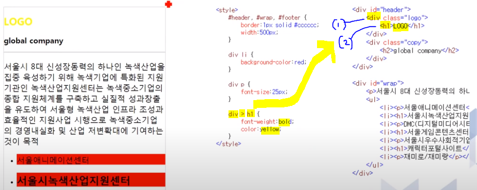
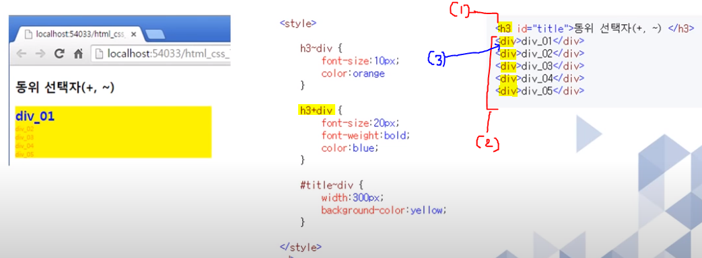
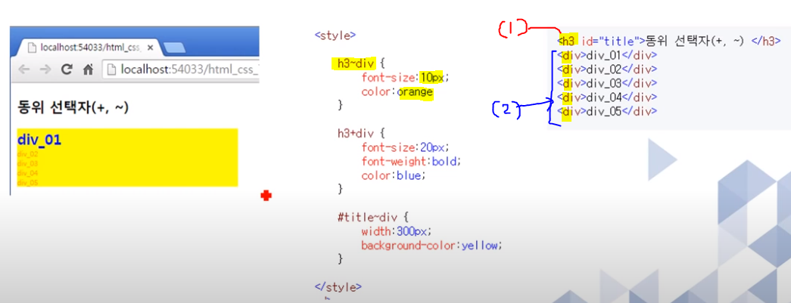
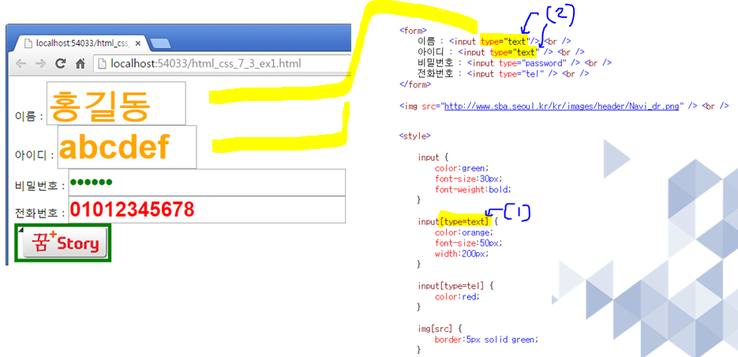
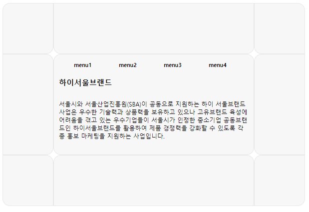
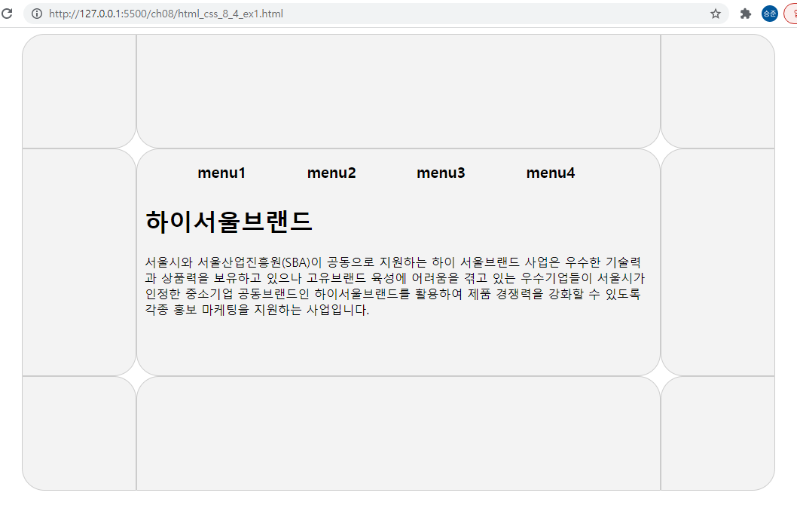

### 1. ArrayList 와 LinkedList 의 장단점은?
	
	ArrayList의 장점
		끝에서 부터 (순차적으로) 추가,삭제하는 경우 빠르다.
		데이터를 검색할때는 빠르다.
		
	ArrayList의 단점
		리스트 중간에 있는 인덱스의 객체를 제거를 하면 
		바로뒤 인덱스 부터 마지막 인텍스까지 모두 앞으로 1씩 당겨진다.
		(저장되어 있는 데이터의 양이 많아질수록,
		또는 추가 삭제의 경우가 많이 질수록 ) 
		속도가 많이 걸린다.

	LinkedList의 장점
		리스트 중간에 추가,삭제하는 경우는 앞뒤 링크 정보만 변경하면 되므로,
		(저장되어 있는 데이터의 양이 많아지거나,
		또는 추가 삭제의 경우가 많아져도 ) 
		속도가 느려 지지 않는다.
		
	LinkedList의 단점
		(저장되어 있는 데이터의 양이 많을때) 
		데이터를 검색 속도가 느려진다.


### 2. 로또 프로그램을 작성하시오.(Set 으로)
#### 작성:
```java
import java.util.Set;
import java.util.Iterator;


import java.util.HashSet;
public class Test2 {
	
	public static void main(String[] args) {
		Set<Integer> set = new HashSet<>();
		while(set.size() != 6) {
			int num = (int)(Math.random()*45 + 1);
			set.add(num);
		}
		Iterator iter = set.iterator();
		while(iter.hasNext()) {
			System.out.print( iter.next() +"\t");
		}
			
	}


}
```
#### 결과:
```
17	24	8	41	42	31	
```

### 3. Set에 대하여 설명하시오.
	컬렉션 프레임워크의 주요 인터페이스에는 List, Set, Map등이 있다.
	
	Set인터페이스를 구현한 구현클래스로는 HashSet, LinkedHashSet, TreeSet등이 있다.
	
	List 컬렉션은 저장 순서를 유지 하지만,
	Set 컬렉션은 저장 순서를 유지 하지 않는다.
	(들어 갈때의 순서와 나올때의 순서가 다르다는 것을 의미.)
	또  중복해서 저장을 할 수 없다.
	
	Set 컬렉션은 인덱스로 객체를 검색해서 가져오는 메소드가 없다.
	대신, 전체 객체를 대상으로 한번씩 반복해서 가져오는 반복자(Iterator)를 제공한다.
	
	반복자는 Iterator 인터페이스를 구현한 객체를 말하는 데
	iterator() 메소드를 호출하면 얻을수 있다.

```java
	ex.
		Set<String> set = new HashSet<Strng>();
		Iterator<String> iterator = set.iterator();
		while(iterator.hasNext()){
			String str = iterator.next();
		}
		
```

### 4. 아래의 선택자에 대하여 설명하시오.
```
>
+
~
[]
```
#### 설명
####   > : 자손선택자 ( A>B : A(1)바로 밑에B(2) 가 있는 것을 선택한다. (바로밑이 아니면 해당이 않된다. )
예:

	
####  +  : 동등 선택자( A+B : A(1)와 동등한 B들(2)중에서 바로 근접한 것 (3)하나만 선택을 한다.)
예:

####  ~  : 동등 선택자( A~B : A(1)와 동등한 B(2)들은 모두다 선택한다. )
예:

#### []  : 속성 선택자(어떤 태그가 가지고 있는 속성을 선택한다.)
예:  input태그의 type속성이 text인 것(2)을 선택  : <input type="text"/>  


### 5. 하이 서울 브랜드를 html 로 짜시오.
#### 작성:
```css
<!DOCTYPE html>
<html lang="en">
<head>
    <title>Document</title>
    <style>
        #d1 div{
            background-color: rgb(248, 247, 247);
            border: 1px solid rgb(231, 231, 229);
        }
        #d2 div{
            background-color: rgb(248, 247, 247);
            border: 1px solid rgb(231, 231, 229);
        }
        #d3 div{
            background-color: rgb(248, 247, 247);
            border: 1px solid rgb(231, 231, 229);
        }
        #d1{
            width: 612px ;
            height: 102px;
            overflow: hidden;
        }
        #d1_1{
            width:100px;
            height: 100px;
            
            
            float: left;
            border-radius: 15px 0 15px 0;
        }
        #d1_2{
            width: 400px;
            height: 100px;
            
            
            float: left;
            border-radius: 0 0 15px 15px;
        }
        #d1_3{
            width: 100px;
            height: 100px;
            
            
            float: left;
            border-radius: 0 15px 0 15px;
        }
        /* --------------------- */
        /* --------------------- */
        /* --------------------- */
        #d2{
            width: 612px ;
            height: 202px;
            overflow: hidden;
            font-size: small ;
        }

        #d2_1{
            width:100px;
            height: 200px;
            
            
            float: left;
            border-radius: 0 15px 15px 0;
        }
        #d2_2{
            width: 400px;
            height: 200px;
            
            float: left;
            border-radius: 15px 15px 15px 15px;
        }
        #d2_3{
            width: 100px;
            height: 200px;
            
            float: left;
            border-radius: 15px 0 0 15px;
        }
        
        div ol li{
            list-style: none;
            width: 90px;
            float:left;
            font-weight: bold;
            font-size: smaller;
        }
        div p{
            font-size: 12px;
            padding:10px;
        }
        div h3{
            margin-left: 10px;
        }
        /* --------------------- */
        /* --------------------- */
        /* --------------------- */
        
        #d3{
            width: 612px ;
            height: 102px;
            overflow: hidden;
        }
        #d3_1{
            width:100px;
            height: 100px;
            
            
            float: left;
            border-radius: 0 15px 0 15px;
        }
        #d3_2{
            width: 400px;
            height: 100px;
            
            float: left;
            border-radius: 15px 15px 0 0;
        }
        #d3_3{
            width: 100px;
            height: 100px;
            
            float: left;
            border-radius: 15px 0 15px 0;
        }

    </style>
</head>
<body>
    <div id="d1">
        <div id="d1_1">

        </div>

        <div id="d1_2">

        </div>

        <div id="d1_3">

        </div>
    </div>
    <!-- --------------------- -->
    <div id="d2">
        <div id="d2_1">

        </div>
        <div id="d2_2">
            <ol>
                <li>menu1</li>
                <li>menu2</li>
                <li>menu3</li>
                <li>menu4</li>
            </ol>
            <br>

            <h3>하이서울브랜드</h3> 
            <p>서울시와 서울산업진흥원(SBA)이 공동으로 지원하는 하이
                서울브랜드 사업은 우수한 기술력과 상품력을 보유하고 있으나
                 고유브랜드 육성에 어려움을 겪고 있는 우수기업들이 서울시가 인정한 중소기업 공동브랜드인 하이서울브랜드를 활용하여 제품 경쟁력을 강화할 수 있도록 각종 홍보 마케팅을 지원하는 사업입니다. 
                </p>

        </div>
        <div id="d2_3">

        </div>
    </div>
    <!-- --------------------- -->
    <div id="d3">
        <div id="d3_1">

        </div>
        <div id="d3_2">

        </div>
        <div id="d3_3">

        </div>
    </div>
</body>
</html>

```
#### 결과:


#### 참조(정답)


### 6.금요일 다하지 못한 문제가 있으면 문제를 푸시오.
### 7.개별진척도 못한거 다시 한번 풀어 주세요.

