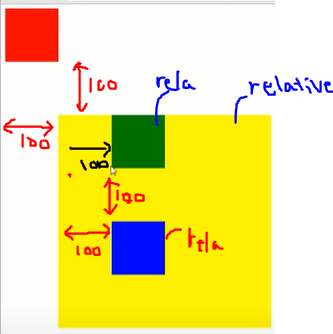
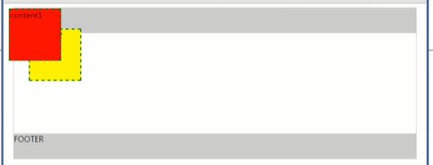

### 1. I/O 스트림 이란?
### 2. float 에 대하여 설명하시오.
### 3.아래의 포지션 4가지에 대하여 설명하시오.
```
-static
-relative
-absolute
-fixed
```
포지션은 태그의 요소(Element)의 위치를 설정해 줌.

#### static : 
	포지션의 디폴트 값임. 
	포지션값을 주지 않으면 기본적으로 static 임.
	기본적으로 div는 블럭타입이기 때문에 위에서 아래로 층층이 나열이 됨.
	포지션:static 을 한다음에 top, left값을 주어도 의미가 없음.
	( (2): top:50, left:50 주었지만, (1)아래에 쌓임)

```css
    <style>
        div:nth-child(1) {
            width:100px; height:100px;
            background-color:red;
            position:static;
            top:0; left:0;
        }

        div:nth-child(2) {
            width:100px; height:100px;
            background-color:green;
            position:static;
            top:50px; left:50px;
        }

        div:nth-child(3) {
            width:100px; height:100px;
            background-color:blue;
            position:absolute;
            top:100px; left:100px;
        }
    </style>
```	

#### relative : 
	관계가 있다는 의미.
	yellow가 포지션:relative 이면서 top:100, left:100 일때, 
	아래 처럼 보인 이유는 ( 위의 red div와 관련이 있는데,)
	원래 자기가 위치해야 할 자리가 red div 밑인데,
	거기를 기준 움직였기 때문임.
	( 원래 위치할 자리에서, top:100, left:100 만큼 이동.)


	green은 green이 원래있어야 할 자리에서 left:100 이동 한 것임
	blue도 blue가 있어야할 원래 자리에서 top:100 left:100 이동 것임.
	
```css

    <style>
        #red {
            width:100px; height:100px;
            background-color:red;
        }

        #yellow {
            width:400px; height:400px;
            background-color:yellow;
            position:relative;
            top:100px; left:100px;
        }

        #green {
            width:100px; height:100px;
            background-color:green;
            position:relative;
            top:0; left:100px;
        }

        #blue {
            width:100px; height:100px;
            background-color:blue;
            position:relative;
            top:100px; left:100px;
        }
    </style>

</head>
<body>
    <div id="red"></div>
    <div id="yellow">
        <div id="green"></div>
        <div id="blue"></div>
    </div>
</body>
```	
#### absolute : 
	포지션:absolute의 값은 절대적인 위치를 설정해 줌.
		top:값 left:값 위치값을 직접 지정해서 같이 사용함.

		(5) : 바깥쪽에 자신을 감싸고 있는 태그가 있다면,
			자신을 감싸고 있는 태그의 좌,상단을 기준으로 삼고
			거기에서 top, left의 위치값이 적용이 됨.
```css
    <style>
        div {
            width:100px; height:100px;
            opacity:0.7;
        }

       div:nth-child(1) {
           background-color:#ff0000;
           position:absolute;
           top:0;
           left:0;
       }

       div:nth-child(2) {
           background-color:#00ff00;
           position:absolute;
           top:50px;
           left:50px;
       }

       div:nth-child(3) {
           background-color:#0000ff;
           position:absolute;
           top:100px;
           left:100px;
       }

       #wrap {
           width:300px; height:300px;
           position:absolute;
           top:300px; left:300px;
           background-color:yellow;
           opacity:1.0;
       }

       #wrap .content {
           width:100px; height:100px;
           position:absolute;
           top:100px; left:100px;
           background-color:red;
           opacity:1.0;
       }

    </style>

</head>
<body>
    <div></div>
    <div></div>
    <div></div>

    <div id="wrap">
        <div class="content"></div>
    </div>
```		
#### fixed : 
	딱 고정이 되는 것을 의미
	브라우저가 클 때에는 fixed 와 absolute 가 차이가 없지만,

	브라우저을 작게 만들고 스크롤을 내리면, fixed는 움직이지 않음.
	(fixed는 화면상에서  브라우저를 따라 가지 않고, 화면상에 항상 그 위치에 놓임.
	화면이 스크롤이 되서 움직이더라도 움직이지 않는다(항상 보인다.))


```css
    <style>
        div {
            width:100px; height:100px;
            opacity:0.7;
        }

       div:nth-child(1) {
           background-color:#ff0000;
           position:fixed;
           top:0;
           left:0;
       }

       div:nth-child(2) {
           background-color:#00ff00;
           position:absolute;
           top:50px;
           left:50px;
       }

       div:nth-child(3) {
           background-color:#0000ff;
           position:absolute;
           top:100px;
           left:100px;
       }

       #wrap {
           width:300px; height:300px;
           position:fixed;
           top:300px; left:300px;
           background-color:yellow;
           opacity:1.0;
       }

       #wrap .content {
           width:100px; height:100px;
           position:absolute;
           top:100px; left:100px;
           background-color:red;
           opacity:1.0;
       }
    </style>
```		

#### relative 와 absolute의 혼합
	wrap은 content1과 content2를 감싸고 있는데,
	content1과 content2 안쪽의 테그에 포지션:absolute를 줄때에는
	content1과 content2 를 감싸고 있는 태그에는 포지션:relative를 꼭 사용해야 한다.(암기사항)
	그래야 top, left의 좌표값을 정확하게 계산을 할 수 있음.
	
	
```css
    <style>
        #contain {
            width:800px;
            margin:0 auto;
            border:1px solid #cccccc;
        }

        #header {
            height:50px;
            background-color:#cccccc;
        }

        #wrap {
            height:200px;
            position:relative;
        }
        #content1 {
            width:100px; height:100px;
            background-color:red;
            border:2px dashed green;
            position:absolute;
            top:10px; left:10px;
            z-index:20;
        }
        
        #content2 {
            width:100px; height:100px;
            background-color:yellow;
            border:2px dashed green;
            position:absolute;
            top:50px; left:50px;
            z-index:10;
        }

        #footer {
            height:50px;
            background-color:#cccccc;
        }
    </style>

</head>
<body>
    <div id="contain">
        <div id="header">HEADER</div>
        <div id="wrap">
            <div id="content1">content1</div>
            <div id="content2">content2</div>
        </div>
        <div id="footer">FOOTER</div>
    </div>
</body>
```
	content1과 content2 를 감싸고 있는 태그에는 포지션:relative을 사용안하고
	content1과 content2 안쪽의 테그에 포지션:absolute 을 쓰면
	브라우저 기준으로 top, left 좌표가 적용이 된다.


### 3. 아래를 프로그래밍 하시오.
좋은 아침 입니다. 를 love.txt 로 저장 -> 해당 내용을 읽어 들여 love2.txt 로 복사
#### 작성:
```java
package c_today_test3;

import java.io.FileInputStream;
import java.io.FileOutputStream;
import java.io.InputStream;
import java.io.OutputStream;

public class Test3 {

	public static void main(String[] args) {
		OutputStream os = null;
		InputStream is = null;
		OutputStream os2 = null;
		try {
			
			os = new FileOutputStream("src\\c_today_test3\\love.txt");
			
			String str = "좋은 아침 입니다.";
			byte[] ba = str.getBytes();
			os.write(ba);
			
			is = new FileInputStream("src\\c_today_test3\\love.txt");
			os2 = new FileOutputStream("src\\c_today_test3\\love2.txt");
			
			byte[] rallb = is.readAllBytes();
			os2.write(rallb);
			
			
		} catch (Exception e) {
			e.printStackTrace();
		}finally {
			try {
				if(os!=null)
					os.close();
				if(is!=null)
					is.close();
				if(os2!=null)
					os2.close();
			} catch (Exception e2) {
				
			}
		}

	}
}
```

### 4.금일 배운 내용을 바탕으로,  아래를 프로그래밍 하시오.
```
나라 이름과 인구를 입력하세요.(예: Korea 5000)
나라 이름, 인구 >> Korea 5000
나라 이름, 인구 >> USA 1000000
나라 이름, 인구 >> Swiss 2000
나라 이름, 인구 >> France 3000
나라 이름, 인구 >> 그만

인구 검색 >> France
France의 인구는 3000
인구 검색 >> 스위스
스위스 나라는 없습니다.
인구 검색 >> 그만
  
그만"이 입력될 때까지 나라 이름과 인구를 입력 받아 저장하고, 
다시 나라 이름을 입력받아 인구를 출력하는 프로그램을 해시맵을 이용하여 아래와 같이 작성 하였다.
```
#### 작성:
```java

import java.util.HashMap;
import java.util.Iterator;
import java.util.Scanner;
import java.util.Set;

public class Test4 {

	public static void main(String[] args) {
		// TODO Auto-generated method stub
		CountryMap map = new CountryMap();
		map.getMap();
		map.search();
	}

}
class CountryMap{
	
	private HashMap<String,Integer> map;
	
	public CountryMap() {
		map = new HashMap<>();
	}
	
	public HashMap<String, Integer> getMap() {
		
		Scanner sc = new Scanner(System.in);
		System.out.println("나라 이름과 인구를 입력하세요.(예: Korea 5000)");
		
		while(true) {
			
			System.out.print("나라 이름, 인구 >>");
			String country = sc.next();
			
			if(country.equals("그만")) {
				break;
			}
			
			Integer popula = sc.nextInt();
			map.put(country, popula);
		}
		return map;
	}
	
	public void setMap(HashMap<String, Integer> map) {
		this.map = map;
	}
	
	public void search() {
		try {
			
			Scanner sc = new Scanner(System.in);
			String countryInput = null;
			
			while(true) {
				
				System.out.print("인구 검색 >>");
				countryInput = sc.next();
				
				if(countryInput.equals("그만"))
					break;
				else if(!map.containsKey(countryInput)) {
					System.out.println(countryInput + " 나라는 없습니다.");
					continue;
				}
				
				Integer population = map.get(countryInput);	
				System.out.println(countryInput + "의 인구는" + population + "입니다.");
				
			}
			
		} catch (Exception e) {
			System.out.println("잘못된 입력입니다. 다시 입력하세요.");
			search();
		}
		

	}
	
}
```
#### 결과:
```
나라 이름과 인구를 입력하세요.(예: Korea 5000)
나라 이름, 인구 >>korea 50000
나라 이름, 인구 >>usa 10000203
나라 이름, 인구 >>swiss 2000
나라 이름, 인구 >>France 30000
나라 이름, 인구 >>그만
인구 검색 >>France
France의 인구는30000입니다.
인구 검색 >>스위스
스위스 나라는 없습니다.
인구 검색 >>그만
```


### 5. 위의 CountryMap 에서 아래의 함수를 추가하여 테스트 하시오
```java
// country.bin 에 HashMap<String, Integer> map; 안에 저장된 나라와 인구수를 저장
// I/O Stream 사용 
public boolean saveFileMap() {
    
}
// I/O Stream 사용 
// 저장된 country.bin 을 읽어 들여, HashMap<String, Integer> 으로 반환  
public HashMap<String, Integer> readFileMap() {
    
}
// I/O Stream 사용 
// 저장된 country.bin 을 읽어 들여, 저장된 나라와 인구수를 출력
public void printFileMap() {
		    
}

import java.util.HashMap;
import java.util.Scanner;

import javax.lang.model.util.ElementScanner6;

class CountryMap {
private HashMap<String, Integer> map;

public CountryMap() {
    map = new HashMap<>();
}

public HashMap<String, Integer> getMap() {

    try {
        System.out.println("나라 이름과 인구를 입력하세요.(예: Korea 5000)");
        Scanner sc = new Scanner(System.in);

        int population = 0;
        String country = " ";

        while (true) {
            System.out.print("나라 이름, 인구 >> ");
            country = sc.next();

            if (country.equals("그만")) // 입력 "그만" 하면 입력 종료
                break;

            population = sc.nextInt();
            map.put(country, population);
        }


    } catch (Exception e) {
        System.out.println("잘못된 입력입니다. 다시 입력하세요.");
        getMap();
    }

    return map;
}

public void setMap(HashMap<String, Integer> map) {
    this.map = map;
}

public void search() {

    try {
        // 키 입력받아서 검색해서 정보 출력하기 그만할때까지
        // 없으면 없습니다 출력
        Scanner sc = new Scanner(System.in);

        String key = " ";
        while (true) {
            System.out.print("인구 검색 >> ");
            key = sc.next();

            if (key.equals("그만")) // 입력 "그만" 하면 검색 종료
                break;
            else if (!map.containsKey(key)) { // map의 key에 key가 있지 않으면
                System.out.println(key + " 나라는 없습니다.");
                continue;
            }
            System.out.println(key + " " + map.get(key)); // 키값으로 내용 출력
        }

    } catch (Exception e) {
        System.out.println("잘못된 입력입니다. 다시 입력하세요.");
        getMap();
    }

}
}

public class ContryMapTest {
public static void main(String[] args) {
CountryMap countryMap = new CountryMap();
countryMap.getMap();

    System.out.println();
    countryMap.search();

}
}
```
### 작성:
```java

import java.io.DataInputStream;
import java.io.DataOutputStream;
import java.io.FileInputStream;
import java.io.FileOutputStream;
import java.io.InputStream;
import java.io.OutputStream;
import java.util.HashMap;
import java.util.Iterator;
import java.util.Scanner;
import java.util.Set;

public class Test5 {

	public static void main(String[] args) {

		CountryMap map = new CountryMap();
		
		map.getMap();
		map.saveFileMap();//sj - add
		
		System.out.println();
		
		map.readFileMap();//sj - add
		map.search();
	}

}
class CountryMap{
	
	private HashMap<String,Integer> map;
	private final String FILE_NAME = "src\\c_today_test5_2\\contry.bin";
	
	public CountryMap() {
		map = new HashMap<>();
	}
	
	public HashMap<String, Integer> getMap() {
		try {
			
			Scanner sc = new Scanner(System.in);
			System.out.println("나라 이름과 인구를 입력하세요.(예: Korea 5000)");
			
			while(true) {
				
				System.out.print("나라 이름, 인구 >>");
				String country = sc.next();
				
				if(country.equals("그만")) {
					break;
				}
				
				Integer popula = sc.nextInt();
				map.put(country, popula);
			}
			
		} catch (Exception e) {
			System.out.println("잘못된 입력입니다. 다시 입력해 주세요.");
			getMap();
		}

		return map;
	}
	
	public void setMap(HashMap<String, Integer> map) {
		this.map = map;
	}
	
	public void search() {
		try {
			
			Scanner sc = new Scanner(System.in);
			String countryInput = null;
			
			while(true) {
				
				System.out.print("인구 검색 >>");
				countryInput = sc.next();
				
				if(countryInput.equals("그만"))
					break;
				else if(!map.containsKey(countryInput)) {
					System.out.println(countryInput + " 나라는 없습니다.");
					continue;
				}
				
				Integer population = map.get(countryInput);	
				System.out.println(countryInput + "의 인구는" + population + "입니다.");
				
			}
			
		} catch (Exception e) {
			System.out.println("잘못된 입력입니다. 다시 입력하세요.");
			search();
		}
		

	}
	
	//sj - add
	public boolean saveFileMap() {
		
		OutputStream os = null;
		DataOutputStream dos = null;
		
		try {
			
			os = new FileOutputStream(FILE_NAME);
			dos = new DataOutputStream(os);

			Set<String> set = map.keySet();
			Iterator<String> it = set.iterator();
			
			while(it.hasNext()) {
				
				String country = it.next();
				Integer population = map.get(country);
				
				//String save = country + " " + String.valueOf(population) + "\n";
				//dos.writeBytes(save);
				
				dos.writeUTF(country);
				dos.writeInt(population);
				
			}
			
		} catch (Exception e) {
			e.printStackTrace();
		}finally {
			try {
				if(os != null)
					os.close();
				if(dos != null)
					dos.close();
			} catch (Exception e2) {
				
			}
		}
		return false;
	}
	//sj - add
	public HashMap<String, Integer> readFileMap(){
		
		InputStream is = null;
		DataInputStream dis = null;
				
		try {
			
			is = new FileInputStream(FILE_NAME);
			dis = new DataInputStream(is);

			while(dis.available() > 0) {
				
				//String country = dis.readLine();
				//System.out.println(country + ", ");
				
				String country = dis.readUTF();
				Integer population = dis.readInt();
				//System.out.println(country + "," + population);
				
				map.put(country, population);
				
			}
	
		} catch (Exception e) {
			e.printStackTrace();
		}finally {
			try {
				if(is != null)
					is.close();
				if(dis != null)
					dis.close();
				
			} catch (Exception e2) {
				
			}
		}
		return map;
		
	}
	
	//sj - add
	public void printFileMap() {
		
		Set<String> set = map.keySet();
		Iterator<String> it = set.iterator();
		
		while(it.hasNext()) {
			
			String country = it.next();
			Integer population = map.get(country);
			System.out.println(country + "\t" + population);
		}
	}
	
	
}

```

### 결과:
```
나라 이름과 인구를 입력하세요.(예: Korea 5000)
나라 이름, 인구 >>korea 50000
나라 이름, 인구 >>usa 10000203
나라 이름, 인구 >>swiss 2000
나라 이름, 인구 >>France 30000
나라 이름, 인구 >>그만

인구 검색 >>France
France의 인구는30000입니다.
인구 검색 >>스위스
스위스 나라는 없습니다.
인구 검색 >>그만

```


