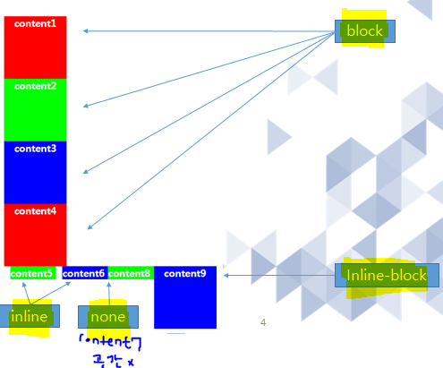

### 1. 프로세스와 쓰레드의 차이점은?
	프로세스란 
		실행 중인 하나의 프로그램을 말한다.
		(윈도우의 작업관리자에서 보이는 작업이 프로세스 이다.)
		하나의 프로그램은 다중 프로세스를 만들기도 한다.
	쓰레드는 
		한개의 프로그램안에서 내부적으로 여러가지 작업 동시에 하기(멀티태스킹)위해서
		사용한다.
		
### 2. 쓰레드에서 동기화란 무엇인가?
	멀티 스레드가 하나의 객체를 공유하므로서 생기는 오류를	막기 위한 방법으로,
	단 하나의 스레드만 공유객체를 실행 할수 이도록 하는 것을 말한다.
	( = 하나의 스레드가 실행 중이면, 
		다른 스레드는 대기 한다.)
		
	쓰레드 동기화 방법으로는 아래와 같은 방법이 있다.
		동기화 메소드
			: 메소드 앞에 synchronized를 붙인다.
```java		
			ex. 
			public synchronized void withdraw(int money){
				if(balance >= money) {
					balance -= money;
				}
			};
```			
		동기화 블록
			: 메소드 안에서 특정부분을 synchronized(this){ }로 감싼다.
```java
			ex. 
			public void withdraw(int money){
				synchronized(this) {
					if(balance >= money) {
						balance -= money;
					}
				}
			};
```

### 3.html 에서  display 종류와 속성에 대하여 설명하시오.
	display 속성의 종류:
	
		inline : 
				줄바꿈 않됨.

		block : 
				줄바꿈이 됨. width height 값이 적용이 된다.
		none : 
				공간이 사라진다.
				
		inline-block:
				inline처럼 줄바꿈이 않되면서, 
				block 처럼 
						width height 
						margin,
						padding 값이 적용이 된다.
		

### 4.px 과 em 의 차이는? (font)
	px은 정확한 픽셀의 값을 의미하며,
	em은 기준이 되는 값을  배수로 변환해 표현한 크기 를 말한다.
		( 기준: 현재 스타일 지정 요소의 font-size값을 의미 )
		
	참고:
	rem 도 em과 같이 기준이 되는 값을  배수로 변환해 표현하는 크기이지만, 기준이 다르다.
		(기준 : 최상위 요소(보통은 html 태그)에서 지정된 font-size의 값)


### 5. inline-block 태그의 종류는?
	대표적인 inline-block 엘리먼트로는
	<button>, <input>, <select> 태그 등이 있다.
	
	inline-block 엘리먼트는 아래와 같이 명시적으로 해당 엘리먼트의 스타일을 
	
	display: inline-block 으로 지정을 해 줘야 한다.
	
```html
<style>
	span{
		display: inline-block;
		background: yellow;
		width: 200px;
		height: 50px;
		margin: 20px;
		padding: 10px;
</style>
```	


### 6. display:none; 과 visibility:hidden;의 차이는?
	display:none
			아예 사라지게 하는 것, 보이지도 않고 해당 공간도 존재하지 않음.
			(--> 영역이 아예 없어짐)
			
	visibility:hidden			
			보이지만 않고, 공간은 존재 한다.
			width와 height값이 있다면 그만큼 공간은 존재하게 된다.
			(--> 영역은 있으나 보이지 않음)
			
### 7.HashMap<Integer, String> map = new HashMap<>();
```
   map.put(45, "Brown");
   map.put(37, "James");
   map.put(23, "Martin");

======================================
위의 Value 값이 다나오도록 for 문 돌리시오.
```
#### 작성:
```java
public class Test7 {

	public static void main(String[] args) {
			Map<Integer, String> map = new HashMap<>();
		   map.put(45, "Brown");
		   map.put(37, "James");
		   map.put(23, "Martin");
		   
		   Set<Integer> set = map.keySet();
		   Iterator<Integer> ite = set.iterator();
		   for( ; ite.hasNext(); ) {
			   Integer i = ite.next();
			   System.out.println(i+","+ map.get(i));
		   }
	}
}
```
#### 결과:
```
37,James
23,Martin
45,Brown
```

### 8.로또 번호6개를 출력 -중복없이
Set 으로 구현 과
일반 for 문 구현을 따로 하시오.
#### 작성:
```java
public class Test8 {
	public static void main(String[] args) {
		Set<Integer> set = new HashSet<>();
		//로또 번호6개를 출력 -중복없이
		//Set 으로 구현 과
		//일반 for 문 구현을 따로 하시오.
		while(true) {
			int num = (int)(Math.random()*45+1);
			//int num = (int)(Math.random()*8+1);
			set.add(num);
			//System.out.println(num);
			if(set.size()==6)
				break;
		}
		Iterator<Integer> ite = set.iterator();
		for( ; ite.hasNext(); ) {
			System.out.print(ite.next() + ", ");
		}
	}
}
```
#### 결과:
```
1, 34, 39, 28, 30, 15, 
```
### 9.아래가 돌아 가도록 구현하시오.
```java
    main(){
        ThreadCount threadCount = new ThreadCount();
                threadCount.start();
                
                String input = JOptionPane.showInputDialog("아무 값이나 입력하세요."); 
                System.out.println("입력하신 값은 " + input + "입니다.");
}
=============================================
10 9 8 7 6 ... 이 1초마다 실행 되도록 쓰레를 완성하시오.
```
#### 작성:
```java
public class Test9 {
	public static void main(String[] args) {
        ThreadCount threadCount = new ThreadCount();
        threadCount.start();
        
        String input = JOptionPane.showInputDialog("아무 값이나 입력하세요."); 
        System.out.println("입력하신 값은 " + input + "입니다.");
	}

}
class ThreadCount extends Thread{

	@Override
	public void run() {
		try {
			Thread.sleep(1000);	
		} catch (InterruptedException e) {
			e.printStackTrace();
		}
		System.out.println("");
		for(int i = 10; i > 0 ; i--) {
			System.out.println(i);
		}
	}
}

```
#### 결과:
```
```
