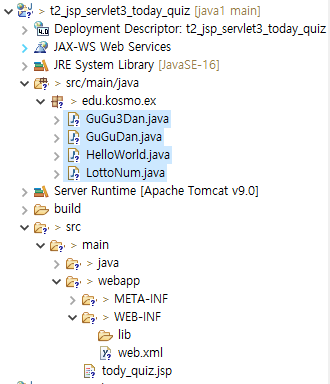
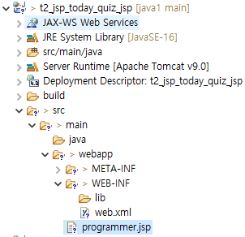

### 1. 아래를 프로그래밍 하시오.
```
-JSP 프로젝트 생성
-/hello 로 치고 들어오면 Hello 를 출력하는 HelloWorld.java 서블릿 파일 작성
-/lotto 로 치고 들어오면 로또번호 6개를  출력하는 LottoNum.java 서블릿 파일 작성
-/gugu3 으로 치고 들어오면 구구단 3단을 출력하는 GuGu3Dan.java 서블릿 파일 작성
-/gugudan 으로 치고 들어오면 구구단(1단~9단)을 출력하는 GuGuDan.java 서블릿 파일 작성
```
#### 작성 : 

#### 작성 : HelloWorld.java
```java
@WebServlet("/hello")
public class HelloWorld extends HttpServlet {
	private static final long serialVersionUID = 1L;
       
    /**
     * @see HttpServlet#HttpServlet()
     */
    public HelloWorld() {
        super();
        // TODO Auto-generated constructor stub
    }

	/**
	 * @see HttpServlet#doGet(HttpServletRequest request, HttpServletResponse response)
	 */
	protected void doGet(HttpServletRequest request, HttpServletResponse response) throws ServletException, IOException {
		// TODO Auto-generated method stub
		response.getWriter().append("Served at: ").append(request.getContextPath());
		//sj - add
		response.getWriter().append("\n Hello ");
	}

	/**
	 * @see HttpServlet#doPost(HttpServletRequest request, HttpServletResponse response)
	 */
	protected void doPost(HttpServletRequest request, HttpServletResponse response) throws ServletException, IOException {
		// TODO Auto-generated method stub
		doGet(request, response);
	}

}

```
#### 작성 : LottoNum.java
```java
/**
 * Servlet implementation class LottoNum
 */
@WebServlet("/lotto")
public class LottoNum extends HttpServlet {
	private static final long serialVersionUID = 1L;
       
    /**
     * @see HttpServlet#HttpServlet()
     */
    public LottoNum() {
        super();
        // TODO Auto-generated constructor stub
    }

	/**
	 * @see HttpServlet#doGet(HttpServletRequest request, HttpServletResponse response)
	 */
	protected void doGet(HttpServletRequest request, HttpServletResponse response) throws ServletException, IOException {
		// TODO Auto-generated method stub
		response.getWriter().append("Served at: ").append(request.getContextPath());
		System.out.println("LottoNum.java~~~~~");
		
		//sj - add
		Set<Integer> set = new HashSet<>();
		while(true) {
			set.add((int)(Math.random()*45 + 1));
			if(set.size() == 6)
				break;
		}
		response.getWriter().append("\n");
		response.getWriter().append("lotto num : \n");
		for (Integer integer : set) {
			response.getWriter().append(integer + ", ");
		}
		
	}

	/**
	 * @see HttpServlet#doPost(HttpServletRequest request, HttpServletResponse response)
	 */
	protected void doPost(HttpServletRequest request, HttpServletResponse response) throws ServletException, IOException {
		// TODO Auto-generated method stub
		doGet(request, response);
	}

}

```
#### 작성 : GuGu3Dan.java
```java
@WebServlet("/gugu3")
public class GuGu3Dan extends HttpServlet {
	private static final long serialVersionUID = 1L;
       
    /**
     * @see HttpServlet#HttpServlet()
     */
    public GuGu3Dan() {
        super();
        // TODO Auto-generated constructor stub
    }

	/**
	 * @see HttpServlet#doGet(HttpServletRequest request, HttpServletResponse response)
	 */
	protected void doGet(HttpServletRequest request, HttpServletResponse response) throws ServletException, IOException {
		// TODO Auto-generated method stub
		response.getWriter().append("Served at: ").append(request.getContextPath());
		System.out.println("GuGu3Dan.java~~~~~, doGet");
		
		//sj -add
		response.getWriter().append("\n");
		for(int i=1;i<=3;i++) {
			for(int j=1;j<=9;j++) {
				String str = i+" x " + j +" = " +  i*j +"\n";
				response.getWriter().append(str);
			}
			response.getWriter().append("\n");
		}
		
	}

	/**
	 * @see HttpServlet#doPost(HttpServletRequest request, HttpServletResponse response)
	 */
	protected void doPost(HttpServletRequest request, HttpServletResponse response) throws ServletException, IOException {
		// TODO Auto-generated method stub
		doGet(request, response);
		System.out.println("GuGu3Dan.java~~~~~, doPost");
	}

}
```
#### 작성 : GuGu3an.java
```java
@WebServlet("/gugudan")
public class GuGuDan extends HttpServlet {
	private static final long serialVersionUID = 1L;
       
    /**
     * @see HttpServlet#HttpServlet()
     */
    public GuGuDan() {
        super();
        // TODO Auto-generated constructor stub
    }

	/**
	 * @see HttpServlet#doGet(HttpServletRequest request, HttpServletResponse response)
	 */
	protected void doGet(HttpServletRequest request, HttpServletResponse response) throws ServletException, IOException {
		// TODO Auto-generated method stub
		response.getWriter().append("Served at: ").append(request.getContextPath());
		System.out.println("GuGuDan.java~~~~~");
		
		//sj -add
		response.getWriter().append("\n");
		for(int i=1;i<=9;i++) {
			for(int j=1;j<=9;j++) {
				String str = i+" x " + j +" = " +  i*j +"\n";
				response.getWriter().append(str);
			}
			response.getWriter().append("\n");
		}
		
	}

	/**
	 * @see HttpServlet#doPost(HttpServletRequest request, HttpServletResponse response)
	 */
	protected void doPost(HttpServletRequest request, HttpServletResponse response) throws ServletException, IOException {
		// TODO Auto-generated method stub
		doGet(request, response);
	}

}

```

### 2.프로토콜이란 무엇이며, 프로토콜의 종류는?
```
	컴퓨터에서는 통신규약이라고 하고,
	네트워크의 접속 순서, 통신 회선을 이용하여, 
	컴퓨터와 컴퓨터 또는 컴퓨터와 단말 장치간에
	정보나 데이터를 주고 받기 위하여
	정하여 놓은 통신규약을 말한다.
```
### 3.*.jsp 가 컴파일 되는 과정을 설명하시오.
```
	jsp파일은 톰캣에 의해서 java 소스 파일로 변환이 되고, 다시 class파일로 컴파일이 된다.
```


### 4. 아래를 프로그래밍 하시오.
```
아래의 주소를 접속시 아래가 웹브라우져에 나타나도록 하시오.
http://localhost:8282/프로젝트명/programmer.jsp

I am a programmer (웹브라우져 출력)
```

#### 작성:

```html
<%@ page language="java" contentType="text/html; charset=UTF-8"
    pageEncoding="UTF-8"%>
<!DOCTYPE html>
<html>
<head>
<meta charset="UTF-8">
<title>Insert title here</title>
</head>
<body>
	<p>I am a programmer</p>
</body>
</html>
```

### 5. HttpServlet에 대하여 설명하시오.
	
	http 프로토콜을 캡슐화 시켜 놓은 객체 이다.
	서블릿 파일을 생성할때,
	super class로 javax.servlet.http.HttpServlet을
	상속을 받아야 서블릿이 된다. ( HttpServlet을 상속)
	
### 6.web.xml 에 대하여 설명하시오.
	서블릿 (URL )매핑 하는 방법 2가지 중(web.xml이용, 에노테이션 이용) 한가지로 방법임.
	
	클래스안의 에노테이션으로 정해진 URL 메핑
	외에 추가적으로 URL매핑을 더 하고 싶은경우에
	web.xml에  서블릿 매핑을 추가할 수 있다.
	
	(예 : http://localhost:8282/프로젝트명/hw 
		http://localhost:8282/프로젝트명/hello )

	주의 할점
		<url-pattern>은  반드시 / 로 시작을 해야 함
		<servlet-class>은 패키지 명을 포함해서 클래스명을 써야함


	URL 매핑이란
		서블릿 클래스 파일을 만든뒤
		웹상에서 접근하여 들어올때 사용하는 이름으로서,
		이 이름으로 들어 오면, 서블릿 클래스로 접근하게 된다.
		(예 : http://localhost:8282/프로젝트명/hw )
		
		실제 클래스명의 위치 정보를 보여주지 않을수 있어서 보안에 좋다.
		실제 파일 경로: 
			http://localhost:8282/프로젝트명\src\main\java\edu\kosmo\ex\HelloWorld.java
		URL매핑후 경로:
			http://localhost:8282/프로젝트명/hw

#### 예: 클래스 안
```java
	@WebServlet("/hello")
	public class HelloWorld extends HttpServlet {
		:
		:
	}
```
#### 예: web.xml 안 ( hw 을 추가함)

```xml
	<servlet>
		<servlet-name>helloworld</servlet-name>
		<servlet-class>edu.kosmo.ex.HelloWorld</servlet-class>
	</servlet>
	
	<servlet-mapping>
		<servlet-name>helloworld</servlet-name>
		<url-pattern>/hw</url-pattern>
	</servlet-mapping>
```


