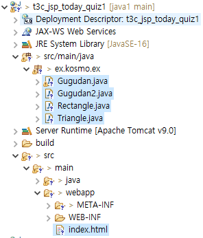
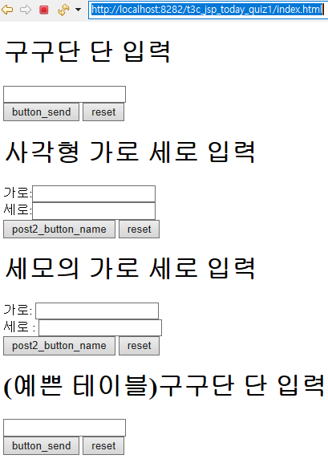
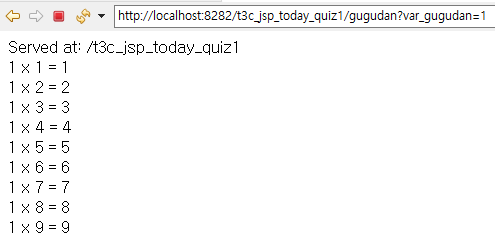
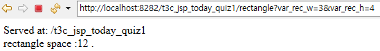
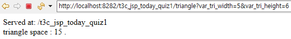
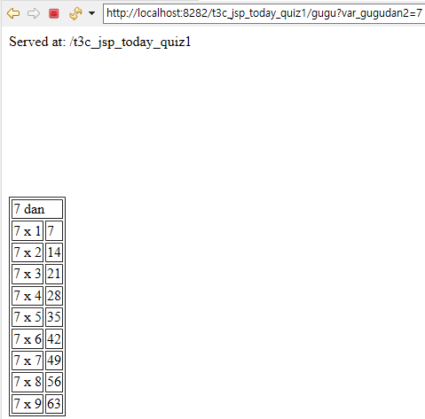

### 1. 아래를 프로그래밍 하시오.
-JSP 프로젝트 생성
-/gugudan - input 박스에 단을 입력받음 -해당 구구단 출력 
-/rectangle - input 박스에 반지름 입력 -해당 넓이 출력
-/triangle - input 박스 두개에 가로 세로 입력 - 해당 넓이 출력
-/gugu - 구구단을 좀더 예쁘게 출력(테이블 좀 입혀 주세요.^^;) 

전체 reset 버튼도 달아 줄것

#### 작성: index.html

```html
<body>
	<form action="gugudan" method="get">
		<h1>구구단 단 입력</h1>
		<input type="text" name="var_gugudan" size="20"><br>
		<input type="submit" value="button_send">
		<input type="reset" value="reset"><br>
	</form>

	<form action="rectangle" method="get">
		<h1>사각형  가로 세로  입력</h1>
		가로:<input type="text" name="var_rec_w" size="20"><br>
		세로:<input type="text" name="var_rec_h" size="20"><br>
		<input type="submit" value="post2_button_name">
		<input type="reset" value="reset"><br>
	</form>
	<form action="triangle" method="get">
		<h1>세모의 가로 세로 입력</h1>
		가로: <input type="text" name="var_tri_width" size="20"><br>
		세로 : <input type="text" name="var_tri_height" size="20"><br>
		<input type="submit" value="post2_button_name">
		<input type="reset" value="reset"><br>
	</form>

	<form action="gugu" method="get">
		<h1>(예쁜 테이블)구구단 단 입력</h1>
		<input type="text" name="var_gugudan2" size="20"><br>
		<input type="submit" value="button_send">
		<input type="reset" value="reset"><br>
	</form>
</body>
```
#### 결과: 



### 작성: gugudan
```java
@WebServlet("/gugudan")
public class Gugudan extends HttpServlet {
		:
		:
		:
	protected void doGet(HttpServletRequest request, HttpServletResponse response) throws ServletException, IOException {
		// TODO Auto-generated method stub
		response.getWriter().append("Served at: ").append(request.getContextPath());
		
		//sj - add
		response.getWriter().append("<br>");
		Integer dan = Integer.valueOf(request.getParameter("var_gugudan"));
		for(int i=1; i<=9; i++) {
			response.getWriter().append(dan + " x " + i +" = " +dan*i + "<br>");
		}
		response.getWriter().append("<br>");
		System.out.println("get 호출~~" );	
		
	}
```
#### 결과: 



### 작성: rectangle
```java
@WebServlet("/rectangle")
public class Rectangle extends HttpServlet {
		:
		:
		:
	protected void doGet(HttpServletRequest request, HttpServletResponse response) throws ServletException, IOException {
		// TODO Auto-generated method stub
		response.getWriter().append("Served at: ").append(request.getContextPath());

		//sj - add
		response.getWriter().append("<br>");
		Integer wid = Integer.valueOf(request.getParameter("var_rec_w"));
		Integer hig = Integer.valueOf(request.getParameter("var_rec_h"));
		
		
		response.setContentType("text/html; charset=euc-kr");
		PrintWriter wr = response.getWriter();
		wr.println("<!DOCTYPE html>");
		wr.println("<html>");
		wr.println("<head>");
		wr.println("</head>");
		wr.println("<body>");
		
		wr.println("<p1> rectangle space :" + wid*hig  +" .</p1>");
		
		wr.println("</body>");
		wr.println("</html>");
		
		
		System.out.println("get 호출~~" );	
		
		
	}
```
#### 결과: 



### 작성: triangle
```java
@WebServlet("/triangle")
public class Triangle extends HttpServlet {
		:
		:
		:
	protected void doGet(HttpServletRequest request, HttpServletResponse response) throws ServletException, IOException {
		// TODO Auto-generated method stub
		response.getWriter().append("Served at: ").append(request.getContextPath());
		
		//sj - add
		response.getWriter().append("<br>");
		Integer wid = Integer.valueOf(request.getParameter("var_tri_width"));
		Integer hig = Integer.valueOf(request.getParameter("var_tri_height"));
		
		
		response.setContentType("text/html; charset=euc-kr");
		PrintWriter wr = response.getWriter();
		wr.println("<!DOCTYPE html>");
		wr.println("<html>");
		wr.println("<head>");
		wr.println("</head>");
		wr.println("<body>");
		
		wr.println("<p1> triangle space :  " + String.valueOf(wid*hig/2)  +" .</p1>");
		
		wr.println("</body>");
		wr.println("</html>");
		
		
		System.out.println("get 호출~~" );					
		
	}
```
#### 결과: 



### 작성: gugu ( with tale )
```java
@WebServlet("/gugu")
public class Gugudan2 extends HttpServlet {
		:
		:
		:
	protected void doGet(HttpServletRequest request, HttpServletResponse response) throws ServletException, IOException {
		// TODO Auto-generated method stub
		response.getWriter().append("Served at: ").append(request.getContextPath());
		//sj - add
		response.getWriter().append("<br>");
		Integer dan = Integer.valueOf(request.getParameter("var_gugudan2"));
		
		
		response.setContentType("text/html; charset=euc-kr");
		PrintWriter wr = response.getWriter();
		wr.println("<!DOCTYPE html>");
		wr.println("<html>");
		wr.println("<head>");
		wr.println("</head>");
		wr.println("<body>");

		wr.println("<table border=\"1\">");
		wr.println("<tr>");
		String title = String.valueOf(dan) + " dan";
		wr.println("<td colspan=\"2\">"+ title + "</td>");
		wr.println("</tr>");
		for(int i=1; i<=9; i++) {
			String row1 = String.valueOf(dan + " x " + i);
			String row2 = String.valueOf(dan*i);
			
			wr.println("<tr>");	
			wr.println("<td>"+row1+"</td>");
			wr.println("<td>"+row2+"</td><br>");
			wr.println("</tr>");			
		}
		wr.println("</table>");
		
		
		
		
		wr.println("</body>");
		wr.println("</html>");
		
		
		System.out.println("get 호출~~" );	
				
		
	}
```
#### 결과: 



### 2. get 방식 과 post 방식에 대하여 설명하시오.
```
	차이점 : 
		브라우져에서 서버로 데이터를 보낼때, 
		get방식은 url에 데이터를 붙여서 보내는 반면, 
		post방식은 url에 붙여서 보내지 않고. 
		body에다가 데이터를 넣어서 보낸다.

GET 방식: 
	브라우져에서 서버에 접속을 할때	
	Http URL 규약 뒤에 ?를  붙이고 
	파리미터(query strig)를 보내는 방식. (보안에 취약하다.)
	
	Http URL 규약 :
		http://도메인이름: 포트번호/컨텍스트명/URL-메핑명
		(ex) http://localhost:8282/HelloWorld/hello

	get 방식 (예) :
		http://localhost:8282/HelloWorld/hello?name1=value1&name2=value2
		
	query strig(예) :
		http://localhost:8282/HelloWorld/hello?name1=value1&name2=value2
		에서
		name1=value1&name2=value2
		부분

POST 방식 : 
	html의 <form> 안의 type="submit" 을 통해서 전달한다.
	
	예:
		<form action="gugu" method="post">
			<input type="submit" value="button_send">
		</form>	
		
	설명: "gugu"는 URL-메핑명
		"post"는 POST방식 ( "get"을 입력하면 GET방식으로전달 함)
```
### 3. 컨텍스트 패스(Context Path)란 무엇인가?
	컨텍스트 패스는	이클립스 기준으로는 프로젝트명에 해당함.
	
	예:
		Http URL 규약 :
		http://도메인이름: 포트번호/컨텍스트명/URL-메핑명
		
		(ex) http://localhost:8282/HelloWorld/hello

### 4. 아래의 객체에 대하여 설명하시오.
HttpServletRequest request, HttpServletResponse response)

	HttpServletRequest request  : 
	
		클라이언트(브라우져)의 요청이 왔을때, HttpServletRequest 객체를 생성하여
		요청 관련된 정보와 동작등을 저장한 객체 이다.
		
		헤더정보, 파라미터, 쿠키 , URI, URL 등의 정보를 읽어 들이는 메소드를 가짐.
		
		body의 Stream을 읽어 들이는 메소드를 가짐.
	
	HttpServletResponse	response  : 
	
		클라이언트(브라우져)에게 응답을 보낼때 사용하기 위해서	만들어진 객체
		
		이 객체를 통해서 content-type , 응답코드, 응답메시지 등을 전송함.


### 5. 아래의 submit 에 대하여 설명하시오.
<button type="submit" value="전송">

	<form> 태그 안에 사용된 데이터 내용을 서버로 전송하는 type이다.
	
	(예):
		<form action="gugu" method="get">
			<h1>(예쁜 테이블)구구단 단 입력</h1>
			<input type="text" name="var_gugudan2" size="20"><br>
			<input type="submit" value="button_send">
			<input type="reset" value="reset"><br>
		</form>

	<button> 태그 안에 들어 잇는 
		<button type="submit" value="전송">
	는
		<input type="submit" value="전송">
	와 같은 동작을 한다.
	

 
### ================================
### 내일 진척도

int 값을 하나 입력 받아
원의 넓이를 구하는 프로그램을 짜시오.
단 Circle 은 객체로 만들것.

출력 예)
반지름을 입력 하세요.
100
314.78678 입니다.
========================================

-/rectangle - input 박스에 가로 세로 입력 -해당 넓이 출력


