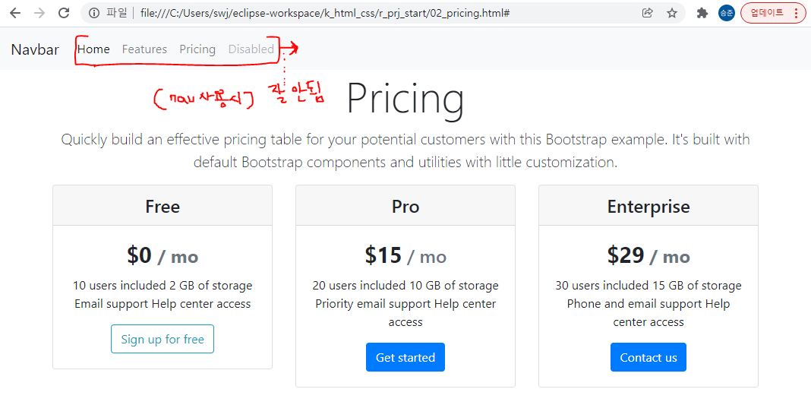

### 1. 아래를 프로그래밍 하시오.
```
/context명/gugudan.jsp - 구구단을 찍으시오(테이블로)
/context명/five_star.jsp - 아래의 별을 찍으시오
    *
    **
    ***
    ****
    *****
/context명/five_star_inverse.jsp - 아래의 별을 찍으시오


    *****
    ****
    ***
    **
    *
```

### 2. 아래에 대하여  예를 들어 설명하시오.
```
-지시자
-스크립틀릿
-expression
-include
```
#### 작성:
```jsp
JSP태그는 html코드 안에 Java언어를 삽입할수 있게 만들어 준다.

지시자	: 
	<%@	   %>	: 페이지 속성
	
	ex.
		<%@page import = "java.util.Arrays"%>
		
스크립트릿 :
	
	<%	   %>	: JAVA 코드	
	ex.
		<%
			int[] iArr = {10,20,30};
			out.println(Arrays.toString(iArr)};
		%>

표현식	:
	<%=	   %>	: 결과값 출력
	ex.
	

include 지시자:
	jsp 페이지의 전체적인 속성을 지정할때 사용되는
	<%@속성%>형태의 지시자 중 하나이며,( 속성 : include)
	
	현재 페이지내에 다른 페이지를 삽입 할 때 사용 됨.
		
	ex.
		<h1> include.jsp페이지 입니다. </h1><br/>
		<%@include file= "include01.jsp"%>
		<h1> 다시 include.jsp페이지 입니다.</h1><br/>
	
```


### 3. 부트스트랩 Pricing 을 완성하시오.
#### 작성

```html
<!doctype html>
<html lang="en">
  <head>
    <!-- Required meta tags -->
    <meta charset="utf-8">
    <meta name="viewport" content="width=device-width, initial-scale=1, shrink-to-fit=no">

    <!-- Bootstrap CSS -->
    <link rel="stylesheet" href="https://maxcdn.bootstrapcdn.com/bootstrap/4.0.0/css/bootstrap.min.css" integrity="sha384-Gn5384xqQ1aoWXA+058RXPxPg6fy4IWvTNh0E263XmFcJlSAwiGgFAW/dAiS6JXm" crossorigin="anonymous">

    <title>Hello, world!</title>
  </head>
  <body>
    <!-- <h1>Hello, world!</h1> -->


    <nav class="navbar navbar-expand-lg navbar-light bg-light">
      
      <!-- <a class="navbar-brand " href="#">Navbar</a> -->
      <a class="navbar-brand justify-content-start" href="#">Navbar</a>
      <button class="navbar-toggler" type="button" data-toggle="collapse" data-target="#navbarNav" aria-controls="navbarNav" aria-expanded="false" aria-label="Toggle navigation">
        <span class="navbar-toggler-icon"></span>
      </button>

      <div class="collapse navbar-collapse" id="navbarNav">
        <!-- <ul class="navbar-nav"> -->
        <ul class="navbar-nav justify-content-end">  
          
          <li class="nav-item active">
            <a class="nav-link" href="#">Home <span class="sr-only">(current)</span></a>
          </li>
          <li class="nav-item">
            <a class="nav-link" href="#">Features</a>
          </li>
          <li class="nav-item">
            <a class="nav-link" href="#">Pricing</a>
          </li>
          <li class="nav-item">
            <a class="nav-link disabled" href="#">Disabled</a>
          </li>
        </ul>
      </div>
      
    </nav>


   
    <div class="container text-center">
      
        <h1 class="display-4 ">Pricing</h1>
        <p class="lead">Quickly build an effective pricing table for your potential customers with this Bootstrap example. It's built with default Bootstrap components and utilities with little customization.</p>
        <!-- <hr class="my-4"> -->
        <!-- <p>It uses utility classes for typography and spacing to space content out within the larger container.</p> -->
      
      
    </div>


    <div class="container text-center" >

      <div class="row">


        <div class="col">
            <!-- <h2>Basic Card</h2> -->
            <div class="card">
                <h4 class="card-header">Free</h4>
                <div class="card-body">
                    <h4 class="card-title font-weight-bold"> <big>$0 </big><span class="text-secondary">/ mo</span></h4>
                    <p class="card-text">10 users included
                      2 GB of storage
                      Email support
                      Help center access</p>
                    <!-- <a href="" class="card-link">Card link</a> -->
                    <button type="button" class="btn btn-outline-info">Sign up for free</button>
                </div>
            </div>
        </div>


        <div class="col">
            <!-- <h2>Basic Card</h2> -->
            <div class="card">
                <h4 class="card-header">Pro</h4>
                <div class="card-body">
                    <h4 class="card-title "><span class="font-weight-bold"><big>$15</big></span> <span class="text-secondary"> / mo</h4></span>
                    <p class="card-text">20 users included
                      10 GB of storage
                      Priority email support
                      Help center access</p>
                    <!-- <a href="" class="card-link">Card link</a> -->
                    <button type="button" class="btn btn-primary">Get started</button>
                </div>
            </div>
          </div>


        <div class="col">
            <!-- <h2>Basic Card</h2> -->
            <div class="card">
                <h4 class="card-header">Enterprise</h4>
                <div class="card-body">
                    <h4 class="card-title font-weight-bold"><big>$29</big> <span class="text-secondary">/ mo</span></h4>
                    <p class="card-text">30 users included
                      15 GB of storage
                      Phone and email support
                      Help center access</p>
                    <!-- <a href="" class="card-link">Card link</a> -->
                    <button type="button" class="btn btn-primary">Contact us</button>
                </div>
            </div>
        </div>


      </div>
      
   </div>  


    <!-- Optional JavaScript -->
    <!-- jQuery first, then Popper.js, then Bootstrap JS -->
    <script src="https://code.jquery.com/jquery-3.2.1.slim.min.js" integrity="sha384-KJ3o2DKtIkvYIK3UENzmM7KCkRr/rE9/Qpg6aAZGJwFDMVNA/GpGFF93hXpG5KkN" crossorigin="anonymous"></script>
    <script src="https://cdnjs.cloudflare.com/ajax/libs/popper.js/1.12.9/umd/popper.min.js" integrity="sha384-ApNbgh9B+Y1QKtv3Rn7W3mgPxhU9K/ScQsAP7hUibX39j7fakFPskvXusvfa0b4Q" crossorigin="anonymous"></script>
    <script src="https://maxcdn.bootstrapcdn.com/bootstrap/4.0.0/js/bootstrap.min.js" integrity="sha384-JZR6Spejh4U02d8jOt6vLEHfe/JQGiRRSQQxSfFWpi1MquVdAyjUar5+76PVCmYl" crossorigin="anonymous"></script>


  </body>
</html>

```
===============================================================

#### 화요일 진척도 

#### /context명/gugudan.jsp - 구구단을 찍으시오(테이블로)

======================================================
#### 23번 문제
```
Money money = new Money(-126000);
money.show();

출력 
잘못된 입력입니다.
오만원 0장....
오만원 0장....
등등등....
```