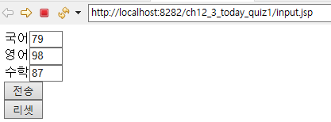
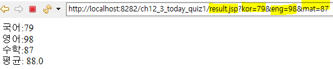
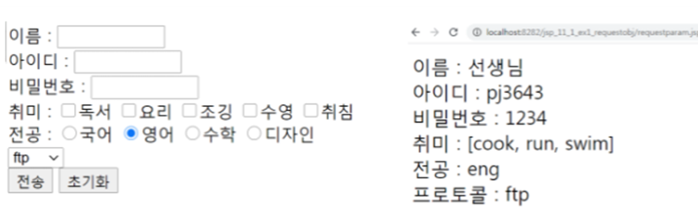
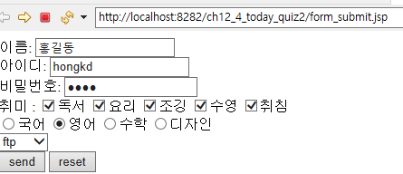
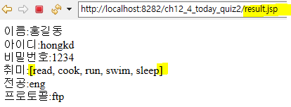

## 1. 아래를 프로그래밍 하시오.
```
/context명/input.jsp ->이름 국어 영어 수학 (input box) 센드 버튼, 리셋버튼
/context명/result.jsp ->이름 총점 평균
```
#### 작성:input.jsp
```jsp
<%@ page language="java" contentType="text/html; charset=UTF-8"
    pageEncoding="UTF-8"%>
<!DOCTYPE html>
<html>
<head>
<meta charset="UTF-8">
<title>Insert title here</title>
</head>
<body>
	<form action="result.jsp">
		국어<input type="text" name="kor" size="1"></input><br>
		영어<input type="text" name="eng" size="1"></input><br>
		수학<input type="text" name="mat" size="1"></input><br>
		<input type="submit" value="전송"> </input><br>
		<input type="reset" value="리셋"> </input><br>
	</form>
</body>
</html>
```
#### 작성:result.jsp
```jsp
<%@ page language="java" contentType="text/html; charset=UTF-8"
    pageEncoding="UTF-8"%>
<!DOCTYPE html>
<html>
<head>
<meta charset="UTF-8">
<title>Insert title here</title>
</head>
<body>

	<%
	String kor = request.getParameter("kor");
	String eng = request.getParameter("eng");
	String mat = request.getParameter("mat"); 
	double total = (Integer.valueOf(kor) + Integer.valueOf(eng) + Integer.valueOf(mat))/(double)3;
	%>
	국어:<%=kor%><br>
	영어:<%=eng%><br>
	수학:<%=mat%><br>
	평균: <%=total%><br>
		
</body>
</html>
```
#### 실행:

#### 결과:


## 2. 아래를 jsp 로 구현하시오.

#### 작성: form_submit.jsp
```jsp
<%@ page language="java" contentType="text/html; charset=UTF-8"
    pageEncoding="UTF-8"%>
<!DOCTYPE html>
<html>
<head>
<meta charset="UTF-8">
<title>Insert title here</title>
</head>
<body>
	<form action="result.jsp" method="post">
		이름: <input type="text" name="name"><br>
		아이디: <input type="text" name="id"><br>
		비밀번호: <input type="password" name="pwd"><br>
		취미 : <input type="checkbox" name="hobby" value="read" >독서
			<input type="checkbox" name="hobby" value="cook">요리
			<input type="checkbox" name="hobby" value="run">조깅
			<input type="checkbox" name="hobby" value="swim">수영
			<input type="checkbox" name="hobby" value="sleep">취침<br>
			<input type="radio" name="major" value="kor">국어
			<input type="radio" name="major" value="eng" checked="checked">영어
			<input type="radio" name="major" value="mat">수학
			<input type="radio" name="major" value="design">디자인<br>
			
			<select name="protocol">
				<option value="ftp" selected="selected">ftp</option>
				<option value="http" >http</option>
				<option value="smtp" >smtp</option>
			</select><br>
			<input type="submit" value="send">
			<input type = "reset" value="reset"> 
	</form>	
</body>
</html>
```
#### 작성: result.jsp
```jsp
<%@page import="java.util.Arrays"%>
<%@page import="org.apache.jasper.tagplugins.jstl.core.ForEach"%>
<%@ page language="java" contentType="text/html; charset=UTF-8"
    pageEncoding="UTF-8"%>
<!DOCTYPE html>
<html>
<head>
<meta charset="UTF-8">
<title>Insert title here</title>
</head>
<body>
	<%
	request.setCharacterEncoding("UTF-8");
	response.setCharacterEncoding("UTF-8");
	out.print("이름:" + request.getParameter("name" ) + "<br>");
	out.print("아이디:" + request.getParameter("id")+ "<br>");
	out.print("비밀번호:" + request.getParameter("pwd")+ "<br>");
	String[] hobby = request.getParameterValues("hobby");
	out.print("취미:" + Arrays.toString(hobby) + "<br>");
	out.print("전공:" + request.getParameter("major")+ "<br>");
	out.print("프로토콜:" + request.getParameter("protocol")+ "<br>");
	%>
</body>
</html>
```
### 실행:

### 결과:



## 3.부트스트랩 Carousel 을 완성 하시오.(boot.html 참고)

#### 작성:
```html
<!DOCTYPE html>
<html lang="en">
<head>
    <meta charset="UTF-8">
    <meta http-equiv="X-UA-Compatible" content="IE=edge">
    <meta name="viewport" content="width=device-width, initial-scale=1.0">
    <title>Document</title>
    <!-- Bootstrap CSS -->
    <link rel="stylesheet" href="https://maxcdn.bootstrapcdn.com/bootstrap/4.0.0/css/bootstrap.min.css" integrity="sha384-Gn5384xqQ1aoWXA+058RXPxPg6fy4IWvTNh0E263XmFcJlSAwiGgFAW/dAiS6JXm" crossorigin="anonymous">


</head>
<body>
    <!-- Optional JavaScript -->
    <!-- jQuery first, then Popper.js, then Bootstrap JS -->
    <script src="https://code.jquery.com/jquery-3.2.1.slim.min.js" integrity="sha384-KJ3o2DKtIkvYIK3UENzmM7KCkRr/rE9/Qpg6aAZGJwFDMVNA/GpGFF93hXpG5KkN" crossorigin="anonymous"></script>
    <script src="https://cdnjs.cloudflare.com/ajax/libs/popper.js/1.12.9/umd/popper.min.js" integrity="sha384-ApNbgh9B+Y1QKtv3Rn7W3mgPxhU9K/ScQsAP7hUibX39j7fakFPskvXusvfa0b4Q" crossorigin="anonymous"></script>
    <script src="https://maxcdn.bootstrapcdn.com/bootstrap/4.0.0/js/bootstrap.min.js" integrity="sha384-JZR6Spejh4U02d8jOt6vLEHfe/JQGiRRSQQxSfFWpi1MquVdAyjUar5+76PVCmYl" crossorigin="anonymous"></script>


 <!-- =======navbar======= -->

    <nav class="navbar navbar-expand-lg navbar-light bg-light">
        <a class="navbar-brand" href="#">Navbar w/ text</a>
        <button class="navbar-toggler" type="button" data-toggle="collapse" data-target="#navbarText" aria-controls="navbarText" aria-expanded="false" aria-label="Toggle navigation">
          <span class="navbar-toggler-icon"></span>
        </button>
        <div class="collapse navbar-collapse" id="navbarText">
          <ul class="navbar-nav mr-auto">
            <li class="nav-item active">
              <a class="nav-link" href="#">Home <span class="sr-only">(current)</span></a>
            </li>
            <li class="nav-item">
              <a class="nav-link" href="#">Features</a>
            </li>
            <li class="nav-item">
              <a class="nav-link" href="#">Pricing</a>
            </li>
          </ul>
          <span class="navbar-text">
            Navbar text with an inline element
          </span>
        </div>

        <form class="form-inline ml-auto">
            <input class="form-control mr-sm-2" type="search" placeholder="Search" aria-label="Search">
            <button class="btn btn-outline-success my-2 my-sm-0" type="submit">Search</button>
          </form>

      </nav>
 


 <!-- =======carousel======= -->

      <div id="carouselExampleControls" class="carousel slide" data-ride="carousel">

        <div class="carousel-inner">
          <div class="carousel-item active">
            
            <div class="carousel-caption d-block d-md-block">
                <h5> Paris City Cloudy Day Stormy Day Storm</h5>
                <p>AlleyAlleyAlleyAlley</p>
            </div>
          </div>
          <div class="carousel-item">
            
            <div class="carousel-caption d-block d-md-block">
                <h5> New York Nyc City Street Urban Buildings</h5>
                <p>AlleyAlleyAlleyAlley</p>
            </div>            
          </div>
          <div class="carousel-item">
            
            <div class="carousel-caption d-block d-md-block">
                <h5> Alley Stairs Buildings City Tourist Stone</h5>
                <p>AlleyAlleyAlleyAlley</p>
            </div>            
          </div>

        </div>
        
 <!-- =======carousel======= -->

        <a class="carousel-control-prev" href="#carouselExampleControls" role="button" data-slide="prev">
          <span class="carousel-control-prev-icon" aria-hidden="true"></span>
          <span class="sr-only">Previous</span>
        </a>

        <a class="carousel-control-next" href="#carouselExampleControls" role="button" data-slide="next">
          <span class="carousel-control-next-icon" aria-hidden="true"></span>
          <span class="sr-only">Next</span>
        </a>

      </div>


 <!-- =======container row col 1======= -->

     <div class="container border-top mt-lg-5">
 
        <div class="row my-lg-5">
            <div class="col mx-xl-5">
                <h5 class="h1">Cras sit amet nibh libero</h5>
                <p>Cras sit amet nibh libero, in gravida nulla. Nulla vel metus scelerisque ante sollicitudin. Cras purus odio, vestibulum in vulputate at, tempus viverra turpis. Fusce condimentum nunc ac nisi vulputate fringilla. Donec lacinia congue felis in faucibus.</p>
            </div>
            <div class="col-5">
                
            </div>
        </div>
    </div>

     <div class="container border-top">
        <div class="row my-lg-5">
            <div class="col-5 ">
                
            </div>
            <div class="col mx-xl-5">
                <h5 class="h1">Cras sit amet nibh libero</h5>
                <p>Cras sit amet nibh libero, in gravida nulla. Nulla vel metus scelerisque ante sollicitudin. Cras purus odio, vestibulum in vulputate at, tempus viverra turpis. Fusce condimentum nunc ac nisi vulputate fringilla. Donec lacinia congue felis in faucibus.</p>
            </div>
        </div>
     </div>

 <!-- =======container row col 2======= -->

        <div class="container border-top ">
           <div class="row my-lg-5">
                <div class="col-5">
                    
                </div>
                
                <div class="col">
                    <h5 class="h1">Media heading</h5>
                    Cras sit amet nibh libero, in gravida nulla. Nulla vel metus scelerisque ante sollicitudin. Cras purus odio, vestibulum in vulputate at, tempus viverra turpis. Fusce condimentum nunc ac nisi vulputate fringilla. Donec lacinia congue felis in faucibus.
                </div>
            </div>    
        </div>


        <div class="container border-top ">
            <div class="row my-lg-5">
                <div class="col">
                    <h5 class="display-3">Media heading</h5>
                    <p>Cras sit amet nibh libero, in gravida nulla. Nulla vel metus scelerisque ante sollicitudin. Cras purus odio, vestibulum in vulputate at, tempus viverra turpis. Fusce condimentum nunc ac nisi vulputate fringilla. Donec lacinia congue felis in faucibus.</p>
                </div>
                <div class="col-5 ">
                    
                </div>
            </div>    
        </div>


<!-- footer -->

      <div class="container border-top ">
        <div class="row  my-lg-5" >
            <div class="col my-lg-2">
                <a>&copy;2017-2018 Compnany, Inc</a> 
                &middot;<a href="#">Privacy</a>
                &middot;<a href="#">Terms</a>
            </div>

            <div class="col-2 my-lg-2 ml-auto">
                <a href="#">Back to top</a>
            </div>    
         </div>       
 
      </div>


</body>
</html>
```


## 4. 다음을 설명하시오.
-액션 태그 와 종류는?
#### 설명:
```
액션태그란 jsp에서 어떤 동작을 하도록 지시하는 태그임
액션태그의 종류에는
	forward,
	include,
	param 
등이 있음

사용예 및 설명:
	<jsp:forward page="sub.jsp"/>
	
		sub.jsp 페이지로 전환을 해라 의미 임.
		URL상에는 sub.jsp가 보이지 않음.
		
	<jsp:include page="include02.jsp" flush="true"/>
		
		현재의 페이지에 include02.jsp페이지를 삽입하라는 의미임.
		현재페이지의 java 서블릿 파일을 확인해 보면,
			include02.jsp의 header부분의 내용까지 모두
			현재페이지에 포하이 되어 있음.
	
	<jsp:forward page="forward_param.jsp">
		<jsp:param name="id" value="abcdef"/>
		<jsp:Param name="pw" value="1234"/>
	</jsp:forward>
	
		forward및 include 태그에 데이터 전달을 
		목적으로 사용되는 태그임. ( 같이 사용됨 )
		
```


## 5. redirect , forward 의 차이는?
####설명:
```
	redirect는 
		서버에서 redirect를 사용하면
		브라우져의 URL은 redirect한 주소값이 보이며,
		브라우져에서는 새로운 요청을 수행한다.
		
		사용예:
			response.sendRedirect("pass.jsp?age=" + age);
			
			브라우져에서 접속할 페이지 이름 과 파라미터를
			get방식으로 을 적어서 서버가 브라우져에게 보낸다.
			
	
	forward는
		브라우져에서 서버로 요청을 보냈을때,
		서버가 다른페이지를 호출하는 형태이며
		
		브라우져의 URL에서는 다른페이지의 주소는 보이지 않는다.
		
		서버가 받은 request와  서버가 다른페이지로 전환
		시킬때는 브라우져로 부터 받은 요청정보를 그대로
		공유해서 사용을 한다.
		
```
## 6. 쿠키의 개념에 대하여 설명하시오.

#### 설명:
```
	웹브라우저에서 서버로 어떤 데이터를 요청을 하면,
	서버측에서는 알맞은 로직을 수행한뒤 데이터를 
	웹브라우저에 응답 합니다.
	  그리고 서버는 웹브라우져와의 관계를 종료합니다.
	   ( Http프로토콜의 특징)
	   
	연결이 끊겼을때 어떤 정보를 지속적으로 유지하기 위한
	수단으로 쿠키를 사용하며,
	  쿠키는 서버에서 생성을 하며,
	  클라이언트측에 특정 정보를 저장함.
	  
	  서버에 요청할때마다 쿠키의 속성값을 참조 또는 변경 가능 함.
	  
	쿠키의 용량 크기  : 4KB
	가질수 있는 갯수 : 300 개 
	
```


#### 내일 개별진척도는
#### 위의 문제 2. 아래를 jsp 로 구현하시오. 


#### 개별진척도 22 번입니다.
```
public static void main(String[] args) {
                
                int math, science, english;
                math = 90;
                science = 80; 
                english = 80;

                Grade me = new Grade(math, science, english);
                System.out.println("평균은 " + me.average());
                System.out.println(me.getGrade()); //우 입니다.
```