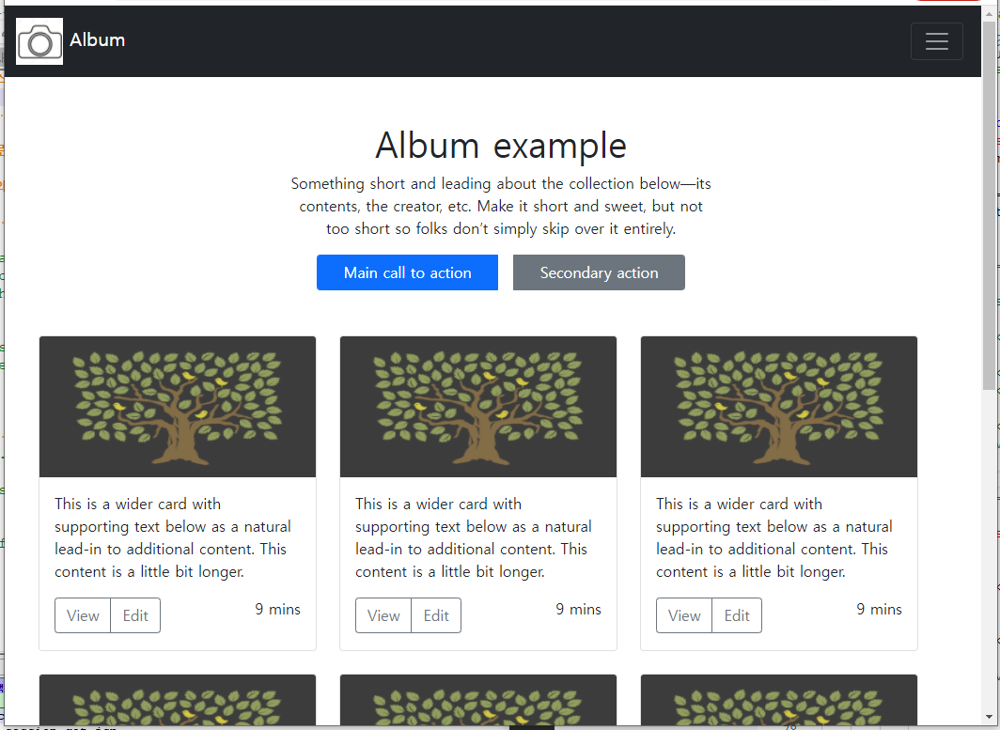

### 1. 부트스트랩 앨범을 완성을 하시오.

#### 작성:
```html
<!doctype html>
<html lang="en">
  <head>
    <!-- Required meta tags -->
    <meta charset="utf-8">
    <meta name="viewport" content="width=device-width, initial-scale=1">

    <!-- Bootstrap CSS -->
    <link href="https://cdn.jsdelivr.net/npm/bootstrap@5.1.3/dist/css/bootstrap.min.css" rel="stylesheet" integrity="sha384-1BmE4kWBq78iYhFldvKuhfTAU6auU8tT94WrHftjDbrCEXSU1oBoqyl2QvZ6jIW3" crossorigin="anonymous">

    <title>Hello, world!</title>
  </head>
  <body>
    <!-- <h1>Hello, world!</h1> -->

<!-- ========== nav bar =========== -->
    <nav class="navbar navbar-dark bg-dark">

        <!-- <div class="row"> -->

            <div class="col-11 container-fluid">
                <a class="navbar-brand" href="">
                    
                    Album
                </a>

            </div>
            <div class="col container-fluid ">
                <button class="navbar-toggler" type="button" data-bs-toggle="collapse" data-bs-target="#navbarToggleExternalContent" aria-controls="navbarToggleExternalContent" aria-expanded="false" aria-label="Toggle navigation">
                <span class="navbar-toggler-icon"></span>
                </button>
            </div>

        <!-- </div>     -->

    </nav>

 <!-- ================ contents ==================     -->
    <div class="container mx-5 my-5 ">
        <div class="row justify-content-center">
            <!-- <div class="col-3">

            </div> -->
            <div class="col-6 ">
                <h1 class="text-center">
                    Album example
                </h3>
                <p class="text-center">
                    Something short and leading about the collection below—its contents, the creator, etc. Make it short and sweet, but not too short so folks don’t simply skip over it entirely.
                </p>
    
                <!-- ====  버턴 두개 붙이기===== -->
<!-- 
                <div class="container ">
                    <div class="row  justify-content-lg-center">
                        <div class="col-4">
                            <button type="button" class="btn btn-primary ">Main call to action</button>
                        </div>    
                        <div class="col-4 ">    
                            <button type="button" class="btn btn-secondary ">Secondary action</button>
                        </div>
                    </div>
                </div>    
                 -->
                <!-- =====  버턴 두개 붙이기, 테스트 해 보기 ====== -->

                <div class="container ">

                    <div class="row  justify-content-lg-center ">
                        <div class="btn-group">
                            <button type="button" class="btn btn-primary mx-2">Main call to action</button>
                            <button type="button" class="btn btn-secondary mx-2">Secondary action</button>
                        </div>    
                            
                    </div>

                </div>    


            </div>

            <!-- <div class="col-3">

            </div> -->
        </div>

    </div>

    <!-- ================card 1st row================== -->

    <div class="container mx-4 my-4">
        <div class="row">

                <!-- ---------카드---------- -->
            <div class="col border-primary">
                <div class="card">
                    
                    <div class="card-body">
                        <p class="card-text"> This is a wider card with supporting text below as a natural lead-in to additional content. This content is a little bit longer.</p>
                           <!-- ---버턴그룹-- -->
                            <div class="btn-group">
                                <button type="button" class="btn btn-outline-secondary">View</button>
                                <button type="button" class="btn btn-outline-secondary">Edit</button>
                            </div>
                        <p class="float-end"> 9 mins</p>
                    </div>

                </div>
            </div>

                <!-- ---------카드---------- -->
                <div class="col border-primary">
                    <div class="card">
                        
                        <div class="card-body">
                            <p class="card-text"> This is a wider card with supporting text below as a natural lead-in to additional content. This content is a little bit longer.</p>
                               <!-- ---버턴그룹-- -->
                               <div class="btn-group">
                                    <button type="button" class="btn btn-outline-secondary">View</button>
                                    <button type="button" class="btn btn-outline-secondary">Edit</button>
                                </div>
                        <p class="float-end"> 9 mins</p>
                        </div>
    
                    </div>
                </div>
    
                <!-- ---------카드---------- -->
                <div class="col border-primary">
                    <div class="card">
                        
                        <div class="card-body">
                            <p class="card-text"> This is a wider card with supporting text below as a natural lead-in to additional content. This content is a little bit longer.</p>
                               <!-- ---버턴그룹-- -->
                               <div class="btn-group">
                                    <button type="button" class="btn btn-outline-secondary">View</button>
                                    <button type="button" class="btn btn-outline-secondary">Edit</button>
                                </div>
                            <p class="float-end"> 9 mins</p>
                        </div>
    
                    </div>
                </div>
    
        </div>

    </div>


    <!-- ================card 2nd row================== -->

    <div class="container mx-4 my-4">
        <div class="row">

                <!-- ---------카드---------- -->
            <div class="col border-primary">
                <div class="card">
                    
                    <div class="card-body">
                        <p class="card-text"> This is a wider card with supporting text below as a natural lead-in to additional content. This content is a little bit longer.</p>
                           <!-- ---버턴그룹-- -->
                            <div class="btn-group">
                                <button type="button" class="btn btn-outline-secondary">View</button>
                                <button type="button" class="btn btn-outline-secondary">Edit</button>
                            </div>
                        <p class="float-end"> 9 mins</p>
                    </div>

                </div>
            </div>

                <!-- ---------카드---------- -->
                <div class="col border-primary">
                    <div class="card">
                        
                        <div class="card-body">
                            <p class="card-text"> This is a wider card with supporting text below as a natural lead-in to additional content. This content is a little bit longer.</p>
                               <!-- ---버턴그룹-- -->
                               <div class="btn-group">
                                    <button type="button" class="btn btn-outline-secondary">View</button>
                                    <button type="button" class="btn btn-outline-secondary">Edit</button>
                                </div>
                        <p class="float-end"> 9 mins</p>
                        </div>
    
                    </div>
                </div>
    
                <!-- ---------카드---------- -->
                <div class="col border-primary">
                    <div class="card">
                        
                        <div class="card-body">
                            <p class="card-text"> This is a wider card with supporting text below as a natural lead-in to additional content. This content is a little bit longer.</p>
                               <!-- ---버턴그룹-- -->
                               <div class="btn-group">
                                    <button type="button" class="btn btn-outline-secondary">View</button>
                                    <button type="button" class="btn btn-outline-secondary">Edit</button>
                                </div>
                            <p class="float-end"> 9 mins</p>
                        </div>
    
                    </div>
                </div>
    
        </div>

    </div>


        <!-- ================card 3rd row================== -->

        <div class="container mx-4 my-4">
            <div class="row">
    
                    <!-- ---------카드---------- -->
                <div class="col border-primary">
                    <div class="card">
                        
                        <div class="card-body">
                            <p class="card-text"> This is a wider card with supporting text below as a natural lead-in to additional content. This content is a little bit longer.</p>
                               <!-- ---버턴그룹-- -->
                                <div class="btn-group">
                                    <button type="button" class="btn btn-outline-secondary">View</button>
                                    <button type="button" class="btn btn-outline-secondary">Edit</button>
                                </div>
                            <p class="float-end"> 9 mins</p>
                        </div>
    
                    </div>
                </div>
    
                    <!-- ---------카드---------- -->
                    <div class="col border-primary">
                        <div class="card">
                            
                            <div class="card-body">
                                <p class="card-text"> This is a wider card with supporting text below as a natural lead-in to additional content. This content is a little bit longer.</p>
                                   <!-- ---버턴그룹-- -->
                                   <div class="btn-group">
                                        <button type="button" class="btn btn-outline-secondary">View</button>
                                        <button type="button" class="btn btn-outline-secondary">Edit</button>
                                    </div>
                            <p class="float-end"> 9 mins</p>
                            </div>
        
                        </div>
                    </div>
        
                    <!-- ---------카드---------- -->
                    <div class="col border-primary">
                        <div class="card">
                            
                            <div class="card-body">
                                <p class="card-text"> This is a wider card with supporting text below as a natural lead-in to additional content. This content is a little bit longer.</p>
                                   <!-- ---버턴그룹-- -->
                                   <div class="btn-group">
                                        <button type="button" class="btn btn-outline-secondary">View</button>
                                        <button type="button" class="btn btn-outline-secondary">Edit</button>
                                    </div>
                                <p class="float-end"> 9 mins</p>
                            </div>
        
                        </div>
                    </div>
        
            </div>
    
        </div>
    


   <!-- ================ jumbotron 시도 ================== -->
    <!-- <div class="jumbotron ">
        <div class="container">
                <h1 class="text-center">
                    Album example
                </h3>
                <p class="text-center">
                    Something short and leading about the collection below—its contents, the creator, etc. Make it short and sweet, but not too short so folks don’t simply skip over it entirely.
                </p>
        </div>
    </div> -->


  <!-- 다시 고민해 보기   다시 고민 -->
 <!-- ================ 버턴 두개 따로 만들기 시도 ================== -->
    <!-- <div class="container border">
        <div class="row  justify-content-center">

            <div class="col-6 border mt-2">
                <button type="button " class="btn btn-primary ">Main call to action</button>
            </div>    
            <div class="col-6 border">    
                <button type="button" class="btn btn-secondary ">Secondary action</button>
            </div>
        </div>
    </div>     -->


    <!-- Optional JavaScript; choose one of the two! -->

    <!-- Option 1: Bootstrap Bundle with Popper -->
    <script src="https://cdn.jsdelivr.net/npm/bootstrap@5.1.3/dist/js/bootstrap.bundle.min.js" integrity="sha384-ka7Sk0Gln4gmtz2MlQnikT1wXgYsOg+OMhuP+IlRH9sENBO0LRn5q+8nbTov4+1p" crossorigin="anonymous"></script>

    <!-- Option 2: Separate Popper and Bootstrap JS -->
    <!--
    <script src="https://cdn.jsdelivr.net/npm/@popperjs/core@2.10.2/dist/umd/popper.min.js" integrity="sha384-7+zCNj/IqJ95wo16oMtfsKbZ9ccEh31eOz1HGyDuCQ6wgnyJNSYdrPa03rtR1zdB" crossorigin="anonymous"></script>
    <script src="https://cdn.jsdelivr.net/npm/bootstrap@5.1.3/dist/js/bootstrap.min.js" integrity="sha384-QJHtvGhmr9XOIpI6YVutG+2QOK9T+ZnN4kzFN1RtK3zEFEIsxhlmWl5/YESvpZ13" crossorigin="anonymous"></script>
    -->
  </body>
</html>

```
### 2.쿠키란 무엇인가요?

```
	쿠키란 클라이언트 로컬(local)에 저장되는 키와 값 (key , value)이
	들어있는 작은 데이터 파일이다.
	
	쿠키는 서버에서 HTTP response Header에 setCookie속성을
	이용하여 클라이언트에 쿠키를 제공한다.
	
	쿠키에는 이름, 값, 만료날짜/시간( 쿠키 저장기간), 경로정보 등이 들어있다.
	
	쿠키는 클라이언트의 상태정보를 로컬에 저장했다가
	서버에 요청(Request)할때 참조된다.
	
	쿠키는 서버측에서 만료 날짜/시간을 지정하여 정해진 시간동안
	데이터(상태정보)를 유지할 수 있다(로그인 상태 유지에 활용 된다.)

		
	쿠키 생성 시점 & 장소 : 
			웹브라우져 가  서버에게 요청을 보냈을때, 
			서버에서 생성함
			
	쿠키의 저장 : 
			서버가 브라우져에게 보내서, 브라우저에 저장이 됨.
	
	쿠키의 용량 : 4kB ( 300개 까지 데이터 정보를 가짐 ) 
```

### 3.세션이란 무엇인가요? 

```
	서버에 클라이언트의 상태정보를 저장하는 기술로
	논리적인 연결을 세션이라고 한다.
	
	웹서버에 클라이언트에 대한 정보를 저장하고
	클라이언트에게 클라이언트를 구분할 수 있는 ID를 부여하는데
	이것을 세션ID라고 한다.
	
	서버는 세션에 클라이언트에 대한 데이터를 저장하고
	세션아이디를 응답을 통해  
	클라이언트에게 발급해 준다.
	( 브라우져 단에서 관리될수 있도록 쿠키로 발급하는게 일반적인 구조)
	
	클라이언트는 발급받은 세션아이디를 쿠키로 저장한다.
```
### 4. 아래의 cookie_set.jsp 파일에 대하여
### cookie get 를 클릭하면 모든 쿠키 값을 출력하는 cookie_get.jsp를 만드시오.

```jsp
<%@ page language="java" contentType="text/html; charset=UTF-8"
    pageEncoding="UTF-8"%>
<!DOCTYPE html>
<html>
<head>
<meta charset="UTF-8">
<title>Insert title here</title>
</head>
<body>
<%
	Cookie cookie = new Cookie("CookieN","CookieV"); //쿠키객체생성
	cookie.setMaxAge(60*60); //쿠키 시간 설정
	
	response.addCookie(cookie);
%>

	<a href="cookie_get.jsp">cookie get</a>

</body>
</html>
```
#### 작성 : cookie_get.jsp
```jsp
<%@ page language="java" contentType="text/html; charset=EUC-KR"
    pageEncoding="EUC-KR"%>
<!DOCTYPE html>
<html>
<head>
<meta charset="EUC-KR">
<title>Insert title here</title>
</head>
<body>
	<% 
	Cookie[] ckis = request.getCookies();
	
	for(int i=0; i<ckis.length ; i++){
		System.out.println("name: "+ ckis[i].getName() + ", ");
		System.out.println("value: " + ckis[i].getValue());
		System.out.println();
	}
	%>
</body>
</html>
```
#### 결과:
```
name: CookieN, 
value: CookieV

name: JSESSIONID, 
value: 8EA5FEB9D36BA065B445032FD30794F2
```

### 5.아래의 session_set.jsp 파일에 대하여
### session get 를 클릭하면 모든 세션 값을 출력하는 session_get.jsp를 만드시오.
```jsp
<%@ page language="java" contentType="text/html; charset=UTF-8"
    pageEncoding="UTF-8"%>
<!DOCTYPE html>
<html>
<head>
<meta charset="UTF-8">
<title>Insert title here</title>
</head>
<body>
<%
	session.setAttribute("sessionName", "sessionValue");
	session.setAttribute("myNum", 12345);
%>

	<a href="session_get.jsp">cookie get</a>
</body>
</html>
```
#### 작성 : session_get.jsp
```jsp
<%@ page language="java" contentType="text/html; charset=EUC-KR"
    pageEncoding="EUC-KR"%>
<!DOCTYPE html>
<html>
<head>
<meta charset="EUC-KR">
<title>Insert title here</title>
</head>
<body>
	<%
	Object obj = session.getAttribute("sessionName");
	String str = (String)obj;
	System.out.println(str);
	
	Object obj2 = session.getAttribute("myNum");
	Integer val = (Integer)obj2;
	System.out.println(val);
	
	%>
</body>
</html>
```
#### 결과:
```
sessionValue
12345
```

### 6. sessin id 란?
```
    세션 id란 
	웹브라우저가   서버(jSP페이지)에  요청(request)하게 되면
	서버가 웹브라우저 단위당 세션이 설정되면서	하나씩 부여하는 것으로,
	웹브라우져 마다 유일한(중복되지 않는)세션 ID를 갖게 된다.
```
