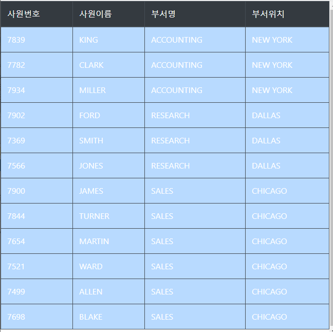

### 1. 아래의 문제를 푸시오.
```
-아래를 구현하시오.
DTO -  클래스 EmpDept
DAO - 함수 작성 -위의 객체를 ArrayList로 담는 함수 작성
 
12명의 아래의 정보 출력
- 사원번호, 사원 이름, 부서명 , 부서 위치 
-el 및 jstl을 사용 할것
```
#### 작성: select.jsp
```jsp
<%@page import="edu.kosmo.ex.dto.EmpDeptDto"%>
<%@page import="java.util.ArrayList"%>
<%@page import="edu.kosmo.ex.dao.EmpDeptDao"%>

<%@ page language="java" contentType="text/html; charset=EUC-KR"
    pageEncoding="EUC-KR"%>
    
    <!-- 
    이것을 꼭 넣어야 한다. 
    지시자 테그라이브러리를 쓰겠다.
    c라는 프레픽스
    문법은 여기에 있따.
     -->
<%-- 주의  주의  <% 는 왼쪽에 꼭 붙여서 쓰기 --%>
<%@ taglib prefix="c" uri="http://java.sun.com/jsp/jstl/core" %>


<!DOCTYPE html>
<html>
<head>
<meta charset="EUC-KR">
<title>Insert title here</title>


    <link rel="stylesheet" href="https://maxcdn.bootstrapcdn.com/bootstrap/4.5.2/css/bootstrap.min.css">
    <!-- <link rel="stylesheet" href="https://maxcdn.bootstrapcdn.com/bootstrap/3.4.1/css/bootstrap.min.css"> -->
    <script src="https://ajax.googleapis.com/ajax/libs/jquery/3.5.1/jquery.min.js"></script>
    <script src="https://cdnjs.cloudflare.com/ajax/libs/popper.js/1.16.0/umd/popper.min.js"></script>
    <script src="https://maxcdn.bootstrapcdn.com/bootstrap/4.5.2/js/bootstrap.min.js"></script>
  


</head>
<body>
	<%
	EmpDeptDao  dao = new EmpDeptDao(); 
	ArrayList<EmpDeptDto> dtos = dao.select();
	pageContext.setAttribute("dtos2", dtos);
	//for(EmpDeptDto dto : dtos){
	// out.print(dto);			
	//}
	%>
	
	
	
	
	    <table class="table table-bordered table-hover table-striped table-dark">

            <thead class="thead-dark">
                <tr>
                    <td>사원번호</td>
                    <td>사원이름</td>
                    <td>부서명</td>
                    <td>부서위치</td>
                </tr>
            </thead>   

            <tbody>
            
	            <c:forEach var="dto" items="${dtos2}">
		            
		                <tr class="table-primary">
		                    <td>${dto.empno}</td>
		                    <td>${dto.ename}</td>
		                    <td>${dto.dname}</td>
		                    <td>${dto.loc}</td>
		                </tr>
	                
				</c:forEach>
            

            </tbody>

        </table>
	
	
	
	
	
</body>
</html>
```
#### 작성: EmpDeptDao.java
```java
package edu.kosmo.ex.dao;

import java.sql.Connection;
import java.sql.DriverManager;
import java.sql.ResultSet;
import java.sql.Statement;
import java.util.ArrayList;
import edu.kosmo.ex.dto.EmpDeptDto;

public class EmpDeptDao {

	ArrayList<EmpDeptDto> dtos = new ArrayList<>();

	private String driver = "oracle.jdbc.driver.OracleDriver";
	
	private String url = "jdbc:oracle:thin:@localhost:1521:xe";
	private String uid = "scott";
	private String upw = "tiger";
	
	public EmpDeptDao() {
		try {
			Class.forName(driver);
		} catch (Exception e) {
			// TODO: handle exception
		}
	}
	
	public ArrayList<EmpDeptDto> select(){
			
			Connection con = null;
			Statement sta= null;
			ResultSet  rs = null;
	
			try {
String query = "select empno, ename, dname, loc from emp, dept where emp.deptno =dept.deptno";
				con = DriverManager.getConnection(url, uid, upw);
				sta = con.createStatement();
				rs = sta.executeQuery(query);
	
				while(rs.next()) {
					int empno = rs.getInt("empno");
					String ename;
					String dname;
					String loc;
					
					EmpDeptDto dto = new EmpDeptDto(rs.getInt("empno"),
										rs.getString("ename"),
										rs.getString("dname"),
										rs.getString("loc")
									);
					dtos.add(dto);
					
				}
				
			} catch (Exception e) {
				// TODO: handle exception
			}finally {
				try {
					
					if(rs!=null) rs.close();
					if(sta!=null) sta.close();
					if(con!=null) con.close();
					
				} catch (Exception e2) {
					// TODO: handle exception
				}
			}
			
					
					
		
			return dtos;
	}
	
	
	
}

```
#### 작성: EmpDeptDto.java
```java
package edu.kosmo.ex.dto;

public class EmpDeptDto {
	private int empno;
	private String ename;
	private String dname;
	private String loc;
	
	public EmpDeptDto() {

	}

	public EmpDeptDto(int empno, String ename, String dname, String loc) {
		super();
		this.empno = empno;
		this.ename = ename;
		this.dname = dname;
		this.loc = loc;
	}

	public int getEmpno() {
		return empno;
	}

	public void setEmpno(int empno) {
		this.empno = empno;
	}

	public String getEname() {
		return ename;
	}

	public void setEname(String ename) {
		this.ename = ename;
	}

	public String getDname() {
		return dname;
	}

	public void setDname(String dname) {
		this.dname = dname;
	}

	public String getLoc() {
		return loc;
	}

	public void setLoc(String loc) {
		this.loc = loc;
	}

	@Override
	public String toString() {
		return "EmpDeptDto [empno=" + empno + ", ename=" + ename + ", dname=" + dname + ", loc=" + loc + "]";
	}
	
	
	
}
```
#### 결과 :


### 2. 4개의 영역(Scope)에 대하여 설명하시오.
```
	JSP는 웹 어플리케이션을 구현하는데 필요한 요청, 응답, 세션 등에 쉽게 접근할 수 있도록
	request, response, session등의 기본 객체를 제공하고 있다.
	
	JSP는 EL 에서 사용할 수 있는 기본 객체도 제공하고 있다.
	이 객체를 이용해서 요청 파라미터나  세션 속성값등을 EL 에서 사용할 수 있다.
	
	JSP에서 EL 이 사용할 수 있는 기본 객체는  아래와 같다.
```
```
	pageContext  : JSP의 pageContext와 동일
	
	pageScope	: 	pageContext 기본 객체에 저장된 속성의 <속성, 값> 매핑을 저장한 Map 객체임.
	requestScope : request 기본 객체에 저장된 속성의 <속성, 값> 매핑을 저장한 Map 객체임.
	sessionScope :  session 기본 객체에 저장된 속성의 <속성, 값> 매핑을 저장한 Map 객체임.
	appicationScope : appplicaton 기본 객체에 저장된 속성의 <속성, 값> 매핑을 저장한 Map 객체임.
	
	param  : 요청 파라미터 <파라미터 이름,  값 >  매핑을 저장한 Map 객체임. 파라미터 값 타입은 String이며,
			request.getParameter(이름)의 결과와 동일하다.
	paramValues
	header
	headerValues
	cookie
	initParam
	
```
### 3. 아래의 조인에 대하여 설명하시오.

		관계형 데이터 베이스는
		모든정보들이 하나의 테이블에 몰려 있는 것이 아니라 
		여러 테이블에 정규화 되어 분산되어 있다.
		각 테이블끼리는 서로 특정한 규칙이나 관계가 있도록 설계가 되어있다.
			
		데이터가 여러 곳에 흩어져 있기 때문에 
		사용자가 원하는 데이터를 모두 찾으려면 여러 테이블을 다 조회해야 한다.
		
		여러테이블에 흩어져 있는 정보 중에서 사용자가 필요한 정보만 가져와서 
		가상의 테이블 처럼 만들어서 결과를 보여 줄려고 할때,
		JOIN 을 사용한다.
		

- 등가조인
```sql
	조인 대상이 되는 두 테이블에서 공통적으로 존재하는  
	컬럼의 값이 일치되는 행을 연결하여
	결과를 생성하는 조인.
	
	ex.
		사원 정보를 출력할 때, 각 사원이 소속된 부서의 상세 정보를 출력하기 위해 두 개의 테이블을 조인하는 쿼리
		조인 대상이 되는 2개의 테이블에 공통적으로 존재하는 deptno 컬럼들과 동일한 조건으로 조인.
		select * from emp, dept where emp.deptno= dept.deptno;

		7839	KING	PRESIDENT		81/11/17	5000		10	10	ACCOUNTING	NEW YORK
		7782	CLARK	MANAGER	7839	81/06/09	2450		10	10	ACCOUNTING	NEW YORK
		7934	MILLER	CLERK	7782	82/01/23	1300		10	10	ACCOUNTING	NEW YORK
		7902	FORD	ANALYST	7566	81/12/03	3000		20	20	RESEARCH	DALLAS
		7369	SMITH	CLERK	7902	80/12/17	800			20	20	RESEARCH	DALLAS
		7566	JONES	MANAGER	7839	81/04/02	2975		20	20	RESEARCH	DALLAS
		7900	JAMES	CLERK	7698	81/12/03	950			30	30	SALES	CHICAGO
		7844	TURNER	SALESMAN	7698	81/09/08	1500	0	30	30	SALES	CHICAGO
		7654	MARTIN	SALESMAN	7698	81/09/28	1250	1400	30	30	SALES	CHICAGO
		7521	WARD	SALESMAN	7698	81/02/22	1250	500	30	30	SALES	CHICAGO
		7499	ALLEN	SALESMAN	7698	81/02/20	1600	300	30	30	SALES	CHICAGO
		7698	BLAKE	MANAGER		7839	81/05/01	2850		30	30	SALES	CHICAGO

```
- 비등가 조인
```sql
	동일 컬럼이 없이 다른 조건을 사용하여 두 테이블을 조인할때 사용.
	
	예:
		각 사원의 급여가 몇 등급인지 살펴보는 쿼리문
		select * from emp, salgrade where sal between salgrade.losal and salgrade.hisal ;
		
		7369	SMITH	CLERK	7902	80/12/17	800		20	1	700	1200
		7900	JAMES	CLERK	7698	81/12/03	950		30	1	700	1200
		7521	WARD	SALESMAN	7698	81/02/22	1250	500	30	2	1201	1400
		7654	MARTIN	SALESMAN	7698	81/09/28	1250	1400	30	2	1201	1400
		7934	MILLER	CLERK	7782	82/01/23	1300		10	2	1201	1400
		7844	TURNER	SALESMAN	7698	81/09/08	1500	0	30	3	1401	2000
		7499	ALLEN	SALESMAN	7698	81/02/20	1600	300	30	3	1401	2000
		7782	CLARK	MANAGER	7839	81/06/09	2450		10	4	2001	3000
		7698	BLAKE	MANAGER	7839	81/05/01	2850		30	4	2001	3000
		7566	JONES	MANAGER	7839	81/04/02	2975		20	4	2001	3000
		7902	FORD	ANALYST	7566	81/12/03	3000		20	4	2001	3000
		7839	KING	PRESIDENT		81/11/17	5000		10	5	3001	9999
```
- 셀프 조인
```sql
	자기 자신과 조인을 하는 방법.
	조인은 서로 다른 2개의 테이블을 연결하기도 하지만,
	하나의 테이블 내에서 조인을 해야만 자료를 얻을 수 있는 경우에 도 사용됨.
	
	예:
		이름이 SMITH 인 사원의 매니저 이름을 알아내기
		(셀프 조인을 위해서 동일 테이블 이름 두번 쓰면 에러 발생하므로,  테이블 별칭을 사용해야 한다.)
		select e1.ename , e2.ename from emp e1, emp e2 where e1.mgr= e2.empno and e1.ename='SMITH';
	
	결과: 
		SMITH	FORD

```

### 4. 아래의 SQL 문을 작성하시오.
```sql
-모든 사원의 이름,직업,부서이름,급여 및 등급을 출력하라.
select ename, job, dname, sal, grade from emp, dept, salgrade where  emp.sal between salgrade.losal and salgrade.hisal and emp.deptno=dept.deptno;
select ename , job , dname, sal, grade from emp e, dept d,salgrade s where e.sal between s.losal and s.hisal and e.deptno=d.deptno;
```
```
KING	PRESIDENT	ACCOUNTING	5000	5
FORD	ANALYST	RESEARCH	3000	4
JONES	MANAGER	RESEARCH	2975	4
BLAKE	MANAGER	SALES	2850	4
CLARK	MANAGER	ACCOUNTING	2450	4
ALLEN	SALESMAN	SALES	1600	3
TURNER	SALESMAN	SALES	1500	3
MILLER	CLERK	ACCOUNTING	1300	2
MARTIN	SALESMAN	SALES	1250	2
WARD	SALESMAN	SALES	1250	2
JAMES	CLERK	SALES	950	1
SMITH	CLERK	RESEARCH	800	1
```

```sql
### - 12명 사원의 메이져 이름을 출력하시오.
### 메이져?
```
```
```

```sql
-Smith보다 늦게 입사한 사원의 이름 및 입사일을 출력하라.
select ename, hiredate from emp where hiredate > (select hiredate from emp where ename='SMITH');
```
```
ALLEN	81/02/20
WARD	81/02/22
JONES	81/04/02
MARTIN	81/09/28
BLAKE	81/05/01
CLARK	81/06/09
KING	81/11/17
TURNER	81/09/08
JAMES	81/12/03
FORD	81/12/03
MILLER	82/01/23
```


=========================================================

#### 8번
11 이 1초과 100 미만의 숫자인가?
22 가 2의 배수 또는 3의 배수 숫자인가 ?
위의 결과를 나타내시오.true false 로

#### 9번
국영수 총점 평균 및 수우미양가출력

#### 66번
```jsp
. 아래의 cookie_set.jsp 파일에 대하여
cookie get 를 클릭하면 모든 쿠키 값을 출력하는 cookie_get.jsp를 만드시오.

<%@ page language="java" contentType="text/html; charset=UTF-8"
    pageEncoding="UTF-8"%>
<!DOCTYPE html>
<html>
<head>
<meta charset="UTF-8">
<title>Insert title here</title>
</head>
<body>
<%
        Cookie cookie = new Cookie("CookieN","CookieV"); //쿠키객체생성
        cookie.setMaxAge(60*60); //쿠키 시간 설정
        
        response.addCookie(cookie);
%>

        <a href="cookie_get.jsp">cookie get</a>

</body>
</html>
```