__04. SQL*PLUS 명령어의 종류__
	
__05. 특정 레코드 추출 및 SQL함수 정복하기__


- select/from/where 절

- desc
- select
- where 

```sql
	사원테이블(dept)에서 급여 (sal)가 3000 이상인 사원
	 select * from emp where sal > 3000;
```

- 산술/비교/논리 연산자
- 산술 연산자
```sql
	select ename, sal, sal+100 from emp;
```
- 비교 연산자
```sql
	부서 번호(deptno)가 20인 사원
	select * from emp where deptno = 20;
	
	문자, 날짜는 반드시 단일 따옴표 안에 표시해야 한다.
	(문자는 대소문자 구분 있음)
	이름(ename)이 FORD 사람의 사번(empno), 이름(ename), 급여(sal)를 출력
	select empno, ename, sal from emp where ename = 'FORD';
	
	1982년 1월 1일 이후에 입사한 사원
	select empno, ename, sal from emp where hiredate >= '1982/01/01';
```
- 논리연산자
```sql
AND
	select empno, deptno, job from emp where deptno = 10 and job = 'MANAGER';
	
OR : 두 가지 조건 중에서 한 가지만 만족하더라도 검색할 수 있다.	
	select empno, deptno, job from emp where deptno = 10 or job = 'MANAGER';
	
NOT : 조건에 만족하지 못하는 것만 검색할 수 있다	
	select empno, deptno, job from emp where not deptno = 10;
	
	select empno, deptno, job from emp where deptno <> 10;
	
	select empno, deptno, job from emp where deptno != 10;
```
- between and 연산자
```sql
between
	하나의 컴럼의 값이 범위 내에 속하는지 알아보기 위한 연산자
	숫자형, 문자형, 날짜형에 사용 가능
	
	급여가 2000~3000 사이의 사원을 검색하는 쿼리문
	select * from emp where sal between 2000 and 3000;

	급여가 2000 미만이거나 3000 초과인 사원을 검색하는 쿼리문
	select * from emp where sal not between 2000 and 3000;
	
	1987년에 입사한 사원을 출력하는 쿼리문
	select * from emp where hiredate between '1987/01/01' and '1987.12.31';
	
IN
	커미션(COMM)이 300 혹은 500 혹은 1400인 사원이 있는지 검색하는 쿼리문
	select * from emp where comm in (300, 500, 1400);
	
	
	커미션(COMM)이 300 혹은 500 혹은 1400이 아닌 사원이 있는지 검색하는 쿼리문
	select * from emp where comm not in (300, 500, 1400);
```

2)SQL문을 이용하여 데이터 가져오기-2

- like 연산자 와 와일드 카드
```sql
LIKE
	컬럼에 저장된 데이터의 시작 위치에 데이터가 일치하면 조회가 가능한 연산자
	
  %
	특정 문자가 포함되기만 하고 그 이전이나 이후에 어떤 문자가 몇 개가 오든지 상관없다는 의미를 표현하기 위해서는 LIKE 연산자와 함께 사용
		
		이름이 F로 시작하는 사람을 찾는 쿼리문
		select * from emp where ename like 'f%';
		
		위치 상관 없이 이름 중에 A가 들어있는 사람을 찾는 쿼리문
		select * from emp where ename like '%a%';

		이름이 N으로 끝나는 사람을 찾는 쿼리문
		select * from emp where ename like '%n';
		
  _
	
	어떤 문자가 오든 상관없다는 의미로 사용
	%와의 차이점은 %는 몇 개의 문자가 오든 상관이 없지만 _는 단 한 문자에 대해서만 와일드 카드 역할을 한다
	조건의 문자 위치와 순서에 유의하기 바란다
	
		이름의 두 번째 글자가 A인 사원을 찾는 쿼리문
		select * from emp where ename like '_A%';
	
		이름의 세 번째 글자가 A인 사원을 찾는 쿼리문
		select * from emp where ename like '__A%';
	
  escape 옵션
		LIKE 연산자에서 사용하는 와일드 문자(%, _) 자체를 포함한 문자열을 검색할 때, 
		와일드 문자를 일반 문자처럼 취급하기 위한 옵션이다.
		
		해당하는 와일드 문자 앞에 사용자가 원하는 한 글자를 적고 escape 옵션을 사용하여 
		해당 문자 뒤에 한 글자는 일반 문자 그대로 인식되도록 설정 되어있다.
		
		문자열 가운데 언더바(_)가 포함된 경우를 검색하는 쿼리문
		select * from emp where ename like '%_%';
		
		이름(ENAME)이 '%\%%'와 같은 데이터를 검색하는 쿼리문
		 select * from emp where ename like '%\%%' escape'\';

NOT LIKE 연산자
	
	이름에 A를 포함하지 않는 사람만 검색하는 쿼리문
	select * from emp where ename not like '%A%';
```
- null을 위한 연산자	
```sql
	is null/ is not null
		
		커미션(COMM)을 받지 않는 사원을 검색하는 쿼리문
		select ename, job, comm from emp where comm is null;
		
		
```
- 정렬을 위한 order by절
```sql
	사원들의 급여를 오름차순으로 정렬하는 쿼리문
	select * from emp order by sal asc;
	
	가장 최근에 입사한 사원부터 출력하는 쿼리문
	select * from emp order by hiredate desc;
	
```
- distinct/별칭/연결 연산자
```sql
	distinct
		동일한 데이터 값들이 중복되어 출력되지 않도록 사용
		
		사원들이 소속되어 있는 부서의 번호를 출력하는 쿼리문
		select distinct deptno from emp;
		
	별칭 연산자
		컬럼 이름으로 의미를 알아 보기 힘든 경우 컬럼의 이름에 별칭을 부여할 수 있다
		
		select ename, sal12+nvl(comm, 0) from emp;

		select ename, sal12+nvl(comm, 0) as annsal from emp;
		
	" "(큰 따옴표)로 별칭 부여하기
		공백문자나 특수 문자를 포함시킬때 사용한다
		
		select ename, sal*12+nvl(comm, 0) "＄＃＃A n n s a l＃＃＄" from emp;
		
	한글로 별칭 부여하기
		select ename, sal*12+nvl(comm, 0) "연봉" from emp;
		
	연결 연산자
		select문 내부에 "||" 수직바를 사용해서 표현한다
		
	
```

- 연결 연산자
```sql
	"||" 수직바
	기존의 컬럼내에 문자열을 추가하고자 할 ? 사용한다.
	
		select ename || ' is a ' || job "연결정의 예" from emp;
```
 
__06. SQL 단일행 함수 - 숫자 함수 문자 함수__
```sql
1) 함수의 종류 및 DUAL 테이블
	DUAL 테이블
		한 행으로 결과를 출력하기 위한 테이블
		산술 연산이나 가상 컬럼 등의 값을 한번만 출력하고 싶을 때 많이 사용한다
	
		select 24*60 from emp; 
		이렇게 하면, emp 의 행(12줄) 만큼 출력이 된다.
		
		산술 연산의 결과를 한 줄로 얻기 위해서 오라클에서 제공하는 테이블
		select 24*60 from dual;
		이렇게 하면, dual 의 행( 1줄) 만큼  산술연산의 결과가 1줄로 출력된다.
		
		DUAL 테이블이 쓰이는 적절한 예는 현재 날짜를 구할때이다.
		
			현재 날짜를 구하는 쿼리문
			select sysdate from dual;

2) 숫자 함수
	abs
		절대값을 구하는 함수
		
		-10에 대한 절대값을 구하는 쿼리문
		select -10, abs(-10) from dual;
		
	floor
		소수점 아래를 버리는 함수이다
		
		34.5432를 FLOOR 함수에 적용하는 쿼리문
		select 34.5432, floor(34.5432) from dual;
		
		결과: 34
		
	round
		특정 자릿수에서 반올림하는 함수이다.
		34.5678을 반올림하는 쿼리문
		 select 34.5678, round(34.5678) from dual;
		 
		 결과: 35
		
		특정 자릿수에서 34.5678을 반올림하는 쿼리문
		select 34.5678, round(34.5678, 2) from dual;
		  
		 결과: 34.57
		 
	trunc
		특정 자릿수에서 잘라내는 함수이다
		두번째 인자값이 2인 경우 : 소수점 이하 세번째 자리에서 버림 연산을 수행한다
		두번째 인자값이 0인 경우 : 소수점 자리에서 버림 연산을 수행한다
		두번째 인자값이 -1인 경우 : 일의 자리에서 버림 연산을 수행한다.
		두번째 인자값이 없는 경우 : 소수점 자리에서 버림 연산을 수행한다
		
		select trunc(34.5678, 2), trunc(34.5678, -1), trunc(34.5678), trunc(34.5678, 0) from dual;
		
		결과:     34.56                 30                   34                   34
	mod
		나누기 연산을 한 후 나머지를 결과로 되돌려주는 함수이다
		select mod(27, 2), mod(27, 5), mod(27, 7) from dual;
		
		결과:        1            2           6
		
3) 문자 처리 함수
	upper
		대문자로 변환하는 함수이다.
		select 'welcome to oracle' "적용전", upper('welcome to oracle') "upper적용후" from dual;
		
	lower
		소문자로 변환하는 함수이다.
		select 'welcome to oracle' "적용전", lower('welcome to oracle') "lower적용후" from dual;
		
	initcap
		이니셜만 대문자로 변환하는 함수이다.
		select 'welcome to oracle' "적용전", initcap('welcome to oracle') "initcap적용후" from dual;
		
		결과:                        -->  Welcome To Oracle
		
	length
		문자 길이를 구하는 함수이다.
		select length('oracle'), length('오라클') from dual;
		
		결과:            6                    3
		
	lengthb
		바이트 수를 알려주는 함수이다
		select lengthb('oracle'), lengthb('오라클') from dual;
		결과 :                6                  6
		
	instr
		특정 문자의 위치를 구하는 함수이다.
		select instr('welcome to Oracle', 'O') from dual;
		
		결과:                    12
		
		
	substr
		대상 문자열이나 컬럼의 자료에서 시작 위치부터 선택 개수만큼의 문자를 추출
		
			인덱스 4부터 시작해서 문자 3개를 추출
			select substr ('welcome to oracle', 4, 3) from dual;
		
			사원들의 입사일에서 입사 년도와 입사 달을 출력하는 쿼리문
			select ename, 19||substr(hiredate, 1, 2)년도, substr(hiredate, 4, 2)달 from emp;
		
			9월에 입사한 사원을 출력
			select ename, 19||substr(hiredate, 1, 2)년도, substr(hiredate, 4, 2)달 from emp where substr(hiredate, 4, 2) = '09';
	substrb 
		명시된 개수만큼의 문자가 아닌 바이트 수를 잘라낸다
		substr은 한글 한자를 1바이트로 보지만 substrb는 2바이트로 보기 때문에 밑에 결과는 다르게 나타난다
		
		select substr('웰컴투오라클', 3, 4), substrb('오라클오라클', 3, 4) from dual;
		
		결과:            투오라클                        라클   
		
	lpad/rpad
		특정 기호로 채우는 함수이다.
		
		lpad(left padding) : 오른쪽 정렬 후 왼쪽에 생긴 빈 공백에 특정 문자를 채우는 함수이다.
		
			20자리를 마련한 후 오른쪽에 대상 문자열을 출력하고, 왼쪽에 생긴 빈 공간을 '#' 기호로 채우는 쿼리문
			select lpad('oracle', 20, '#') from dual;
		
			결과: ##############oracle
		
		rpad(right padding) : 왼쪽 정렬 후 오른쪽에 생긴 빈 공백에 특정 문자를 채우는 함수이다
		
			20자리를 마련한 후 왼쪽에 대상 문자열을 출력하고, 오른쪽에 생긴 빈 공간을 '#' 기호로 채우는 쿼리문
			select rpad('oracle', 20, '#') from dual;
		
	ltrim/rtrim	
		ltrim : 문자열 왼쪽(앞)의 공백 문자들을 삭제한다.
			select ltrim(' oracle') from dual;
			결과:oracle
			
		rtrim : 문자열 오른쪽(뒤)의 공백 문자들을 삭제한다.	
			select rtrim('oracle ') from dual;
	
	trim
		특정 문자를 잘라내는 함수이다.
		컬럼이나 대상 문자열에서 특정 문자가 첫 번째나 마지막에 위치해 있으면, 
		해당 특정 문자를 잘라낸 후 남은 문자열만 반환한다.
		
			select trim('a' from 'aaaaORACLEaaaaa') from dual;
			
			결과:ORACLE
			
			공백 문자가 삭제된다
			select trim(' ORACLE ') from dual;
			결과:ORACLE
	
```

__07. SQL 단일행 함수 - 날짜함수/형 변환함수/일반함수__
```sql
1) 날짜 함수
	sysdate
		시스템에서 현재 날짜를 읽어 와서 출력
		select sysdate from dual;
		
	months_between	
		각 직원들이 근무한 개월 수
		select ename, sysdate, hiredate, months_between(sysdate, hiredate) 근무개월수 from emp;
		
	add_months
		입사 날짜에서 4개월을 추가한 결과값
		select ename, hiredate, add_months(hiredate, 4) from emp;
		
2) 형 변환 함수(숫자형, 문자형, 날짜형)

	to_char
		현재 날짜를 문자형으로 변환하여 출력
		select sysdate, to_char(sysdate, 'yyyy-mm-dd') from dual;

		 현재 날짜와 시간을 출력
		select to_char(sysdate, 'yyyy/mm/dd, hh24:mi:ss') from dual;
		
	to_date
		문자형을 날짜형으로 변환
		
		1981년 2월 20일에 입사한 사원을 검색
		select ename, hiredate from emp where hiredate=to_date(19810220, 'yyyymmdd');
	
3) NULL을 다른 값으로 변환하는 NVL함수
	nvl
		NULL을 0 또는 다른 값으로 변환
		
		select ename, sal, comm, job from emp order by job;
		
		연봉 계산
		select ename, sal, comm, sal12+comm, nvl(comm, 0), sal12+nvl(comm, 0) from emp order by job
	
4) 선택을 위한 DECODE 함수
	여러가지 경우에 대해서 선택할 수 있도록 하는 기능을 제공
	
	사원의 부서 번호를 이름으로 설정
	select deptno, decode(deptno, 10, 'a', 20, 'b', 'default') from emp order by deptno;

5) 조건에 따라 서로 다른 처리가 가능한 CASE 함수

```

__08. SQL 복수행 함수 - 그룹 함수__
```sql
1) 그룹 함수
	하나 이상의 행을 그룹으로 묶어 연산하여, 하나의 결과를 나타
	
sum
	그룹 함수를 이용해서 사원의 총 급여
	 select sum(sal) from emp;
	 그룹함수의 결과는 사원이 총 14명인데도 결과는 하나의 행으로 출력
	 
	 커미션(COMM) 총액
	  select sum(comm) from emp;
	  
avg
	해당 컬럼 값에 대해 평균
	급여 평균을 구하
	select avg(sal) from emp;
	

max : 지정한 컬럼 값 중에서 최대값
	
	가장 높은 급여와 가장 낮은 급여
	select max(sal), min(sal) from emp;
	
count
	테이블에서 조건을 만족하는 행위 개수
	사원 테이블의 사원들 중에서 커미션(COMM)을 받은 사원의 수
	select count(comm) from emp;
	
2) group by 절
	사원 테이블을 부서 번호로 그룹 짓는
	select deptno from emp group by deptno;
	
	소속 부서별 평균 급여
	select avg(sal) from emp group by deptno;
	
	소속 부서별 급여 총액과 평균 급여
	select deptno, sum(sal), avg(sal) from emp group by deptno;
	
3) having 절
	group by 절에 의해 생성된 결과 값 중 원하는 조건에 부합하는 자료만 보고자 할 때
	
	그룹 지어진 부서별 평균 급여가 2000 이상인 부서의 번호와 부서별 평균 급여를 출력
	select deptno, avg(sal) from emp group by deptno having avg(sal) >= 2000;
	
	부서의 최대값과 최소값을 구하되, 최대 급여가 2900 이상인 부서만 출력
	 select deptno, max(sal), min(sal) from emp group by deptno having max(sal) >= 2900; 
```
__09. SQL 고급 함수로 멋진 레포트 만들기__
```sql
	1) 자동으로 소계/합계를 구해주는 함수
	2) 계층형 쿼리 만들기
	3) 새롭게 추가된 함수로 쿼리문 만들고 결과 보기
```
__10. 조인__
```sql
1) cartesian product
2) equi join
	예) 사원 정보를 출력할 때, 각 사원이 소속된 부서의 상세 정보를 출력하기 위해 두 개의 테이블을 조인
	select * from emp, dept where emp.deptno = dept.deptno;
	deptno를 보면 조인 대상이 되는 테이블에 공통적으로 존재하는 컬럼들과 동일한 조건(=)으로 조인하여 원하는 결과를 얻게 되는것이다.
	
	위 결과에서 특정 컬럼의 정보만 얻는 쿼리문
	select ename, dname from emp, dept where emp.deptno = dept.deptno; 
	
	이름이 SCOTT인 사람의 부서명을 출력해 보는 쿼리문
	select ename, dname from emp, dept where emp.deptno = dept.deptno and ename = 'SMITH'; 
	
	부서 번호(DEPTNO)가 EMP테이블과 DEPT테이블에 공통으로 들어있다. 이럴 경우 어느 테이블 소속인지 불분명 하여 오류 메시지가 출력된다. 그렇다면 어떻게 해야할까?
	
	select emp.ename, dept.dname, emp.deptno from emp, dept where emp.deptno = dept.deptno and ename = 'SMITH';

	사원(emp)테이블의 별칭을 e로, 부서(dept)테이블의 별칭을 d로 부여하는 쿼리문
	select e.ename, d.dname, e.deptno from emp e, dept d where e.deptno = d.deptno and ename = 'SMITH';
	
	
3) non-equi join(비등가 조인)
	각 사원의 급여가 몇 등급인지 살펴보는 쿼리문
	select ename, sal, grade from emp, salgrade where sal between losal and hisal;
	
	한 명의 사원 이름과 소속 부서명, 급여의 등급을 출력하는 쿼리문
		(사원테이블의 부서 번호로 부서 테이블을 참조하여 부서의 이름을 가져와야 하고,
		사원테이블의 급여로 급여 등급테이블을 참조하여 등급을 가져와야 한다
		3개의 테이블(emp, dept, salgrade)을 조인해야 한다)
	select e.ename, d.dname, s.grade from emp e, dept d, salgrade s where e.deptno = d.deptno and e.sal between s.losal and s.hisal;
	
4) self join
	EMP테이블을 EMPLOTEE와 MANAGER로 별칭을 지정한 후 특정 사원의 매니저가 누구인지 알아내는 쿼리문
	select employee.ename||'의 매니저는 '|| manager.ename||'입니다.' from emp employee, emp manager where employee.mgr = manager.empno;
	
	
5) outer join
	조인 조건에 만족하지 않는 행도 나타내는 조인 기법 --> KING의 메니저는 없어서 출력이 않되는데, 임의로 출력하고자 할때, (+)를 사용함.
	
	특정 사원의 매니저가 누구인지 알아내는 쿼리문
	select employee.ename||'의 매니저는 '|| manager.ename||'입니다.' from emp employee, emp manager where employee.mgr = manager.empno(+);
	
	사원테이블과 부서 테이블을 조인하여 사원명과 부서 번호화 부서명을 출력하는 쿼리문
	select e.ename, e.deptno, d.deptno, d.dname from emp e, dept d where e.deptno(+) = d.deptno;
	사원테이블에는 부서 번호가 40인 사원이 없지만 외부 조인(OUTER JOIN)을 사용하여 부서 테이블에 있는 부서 번호가 40인 부서명 OPERATION가 나타나도록 한다
```
__11. 서브 쿼리__
```sql
	select dname from dept where deptno = (select deptno from emp where ename = 'SMITH');

	1) 단일행 서브 쿼리
		수행 결과가 오직 하나의 로우(행)만을 반환하는 것
		
		사원들의 평균 급여보다 더 많은 급여를 받는 사원을 검색하는 쿼리문
		select ename, sal from emp where sal > (select avg(sal) from emp);
	
		ALLEN 급여와 동일하거나 급여를 더 많이 받는 사원과 급여를 출력하는 쿼리문 allen
		select ename, sal from emp where sal>= (select sal from emp where ename = 'ALLEN');
		
		
	2) 다중행 서브 쿼리
		서브 쿼리에서의 결과가 두 건 이상 출력되는 것
		
		다중행 연산자
			IN
			ANY, SOME
			ALL
			EXISTS
	
		IN
			연봉을 3000이상 받는 사원이 소속된 부서와 동일한 부서에서 근무하는 사원들의 정보를 출력하는 쿼리문
			--에러 select ename, sal, deptno from emp where deptno = (select distinct deptno from emp where sal >= 3000);
			결과가 2개 이상 구해지는 쿼리문을 서브 쿼리로 기술할 때는 다중행 연산자와 함께 사용해야 한다!
			
			select ename, sal, deptno from emp where deptno in (select distinct deptno from emp where sal >= 3000);
		ANY	
			부서 번호가 30번인 사원들의 급여 중 가장 낮은 값(950)보다 높은 급여를 받는 사원의 이름, 급여를 출력하는 쿼리문
			select ename, sal from emp where sal > any (select sal from emp where deptno = 30);
		
		ALL
			메인 쿼리의 비교 조건이 서브 쿼리의 검색 결과와 모든 값이 일치하면 참인 연산자
			
			30번 소속 사원들 중에서 급여를 가장 많이 받는 사우너보다 더 많은 급여를 받는 사람의 이름과 급여를 출력하는 쿼리문
			select ename, sal from emp where sal> all (select sal from emp where deptno = 30);
			
		EXISTS
			메인 쿼리의 비교 조건이 서브 쿼리의 결과 중에서 만족하는 값이 하나라도 존재하면 참인 연산자
			
			emp테이블에 있는 부서코드(deptno)와 서브 쿼리문에 있는 dept테이블의 deptno를 서로 조인하여, 
			deptno가 10, 20인 데이터가 존재하면, 
			emp 테이블 내에 있는 해당 컬럼(ename, deptno, sal)을 출력하는 쿼리문
			select ename, deptno, sal from emp e where exists (select 1 from dept d where d.deptno in (12, 20) and e.deptno = d.deptno);
			
```
__12. 테이블 구조 생성, 변경 삭제하는 DDL__
```sql
	1) 테이블 구조를 정의하는 create table
	2) 테이블 구조를 변경하는 alter table
	3) 테이블 구조를 제거하는 drop table
	4) 테이블의 모든 로우를 제거하는 truncate table
	5) 테이블명을 변경하는 rename
	6) delete, truncate, drop 명령어의 차이점
	7) 데이터 딕셔너리와 데이터 딕셔너리뷰
```
__13. 테이블의 내용을 추가, 수정, 삭제하는 DML__
```sql
1) insert 명령문
	테이블에 새로운 로우를 추가할 때 사용하는 SQL문
	테이블에 새로운 데이터를 입력하기 위해 사용하는 데이터 조작어
	테이블의 모든 컬럼에 자료를 입력하는 경우 컬럼 목록을 기술하지 않아도 된다
	 컬럼 목록이 생략되면 VALUES절 다음의 값들이 테이블의 기본 컬럼 순서대로 입력된다
		
		실습을 위해 dept테이블을 dept02테이블로로 구조만 복사한 후 
		데이터를 추가한 후 데이터를 조회하는 쿼리문
			create table dept02 as select * from dept where 1=0;
			insert into dept02 (deptno, dname, loc) values (10, 'accounting', 'new york');
			select * from dept02;
	
		insert 구문을 이용하여 컬럼명을 생략하고, 데이터를 추가한 후 조회하는 쿼리문
			insert into dept02 values (20, 'research', 'dallas');
			select * from dept02;
			
		 실습을 위해 dept테이블을 dept03테이블로로 구조만 복사한 후 
		 서브 쿼리를 이용하여 데이터를 추가한 후 데이터를 조회하는 쿼리문
			//테이블 구조만 복사
			create table dept03 as select * from dept where 1=0; 
			//dept에 있는 로우,컬럼을 모두 복사해 넣음.
			insert into dept03 select * from dept;
			select * from dept03;
			
			
2) 다중 테이블에 다중행 입력하기

3) update 명령문

	예 1) 실습에 사용할 테이블을 생성하는 쿼리문
	drop table emp01;
	create table emp01 as select * from emp;
	
	예 2) 모든 사원의 부서 번호를 30번으로 수정 후 확인하는 쿼리문
	update emp01 set deptno=30;
	
	예) 사원의 급여를 10% 인상시키는 UPDATE문을 만드는 쿼리문
	update emp01 set sal = sal*1.1; 
	
	모든 입사일을 오늘로 수정하는 쿼리문
	update emp01 set hiredate = sysdate; 
	
	실습에 사용할 테이블을 생성하는 쿼리문
	drop table emp01;
	create table emp01 as select * from emp;
	
	부서 번호가 10번인 사원의 부서 번호를 40번으로 수정하고 확인하는 쿼리문
	update emp01 set deptno = 40 where deptno = 10;
	
	JOB 컬럼값이 MANAGER인 경우, 급여를 10% 인상하는 쿼리문
	update emp01 set sal = sal * 1.1 where job = 'MANAGER';
	
	1987년에 입사한 사원의 입사일을 오늘로 수정하는 쿼리문
	update emp01 set hiredate = sysdate where substr(hiredate, 1, 2) = '87';
	
	SCOTT 사원의 부서번호는 20번으로, JOB 컬럼값은 MANAGER로 한꺼번에 수정하는 쿼리문
	update emp01 set deptno=20, job='MANAGER' where ename='SCOTT';
	
	SCOTT 사원의 입사 날짜는 오늘로, 급여는 50으로, 커미션은 4000으로 수정하는 쿼리문
	update emp01 set hiredate = sysdate, sal=50, comm=4000 where ename='SCOTT';
	
	SCOTT 사원의 자료가 조건에 맞게 잘 수정되었는지 확인하는 쿼리문
	select * from emp01 where ename = 'SCOTT';
	
	20번 부서의 지역명을 40번 부서의 지역명으로 변경하기 위해서 서브 쿼리문을 사용한 쿼리문
	update dept01 set loc = (select loc from dept01 where deptno=40) where deptno=20;
	
4) delete 명령문


5) merge 명령문
```
__14. 트랜젝션 관리__
```sql
	1) commit과 rollback
	2) 자동 commit
	3) savepoint
```
__15. 데이터 무결성을 위한 제약 조건 - 1__
```sql
	1) not null 제약 조건
	2) unique 제약 조건
	3) 컬럼 레벨로 제약 조건 설정하기
```
__16. 데이터 무결성을 위한 제약 조건 - 2__
```sql
	1) primary key
	2) foreign key  ***
```
__17. 가상 테이블인 뷰__
```sql
	1) 단순 뷰와 복합 뷰
	2) with check option / with read only 옵션 알아보기
	3) 뷰를 이용하여 top-n 구하기
```
__18. 인덱스  *** __
```sql
	1) 인덱스 생성 및 제거하기
	2) 인덱스 사용여부 판단 및 재생성하기
	3) Invisible Index
```
__19. 데이터베이스 보완을 위한 권한__
```sql
	1) 사용자 생성하기
	2) 권한을 부여하는 grant 명령어
```
__20. 시퀀스와 동의어__
```sql
	1) 시퀀스 실무에 적용하기
	2) 동의어의 개념과 종류
	3) 동의어의 생성 및 제거하기
```


#  === 문제풀이 ===


- 35> 관리자 번호 및 해당 관리자에 속한 사원들의 최저 급여를 출력하라.
단, 관리자가 없는 사원 및 최저 급여가 1000 미만인 그룹은 제외시키고 급여를 기준으로
출력 결과를 내림차순으로 정렬하라.
```sql
select mgr, min(sal) from emp group by mgr having min(sal) > 1000 and mgr is not null order by min(sal) desc;


select mgr, min(sal)from emp where mgr is not null group by mgr having min(sal)>=1000 order by min(sal)

```
분석: 
```sql
select mgr, min(sal)from emp where mgr is not null group by mgr;
```
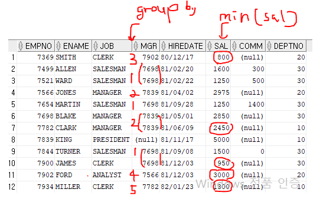

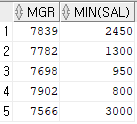
```sql
select mgr, min(sal)from emp where mgr is not null group by mgr having min(sal)>=1000;
```
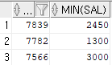
```sql
select mgr, min(sal)from emp where mgr is not null group by mgr having min(sal)>=1000 order by min(sal)
```
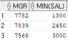

- 36> 부서별로 부서이름, 부서위치, 사원 수 및 평균 급여를 출력하라.
그리고 각각의 컬럼명을 부서명,위치,사원의 수,평균급여로 표시하라.
```sql

select e.deptno as "부서명", d.dname as "부서이름", d.loc as "위치", count(e.empno) as "사원의 수", avg(e.sal) as "평균급여"
from emp e, dept d where e.deptno=d.deptno group by e.deptno, d.dname, d.loc
```

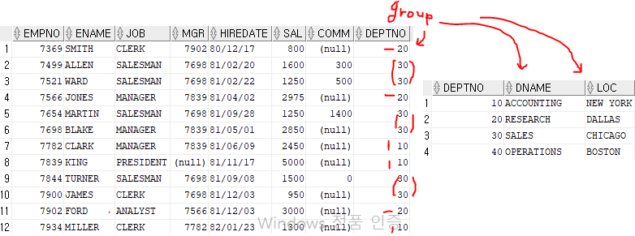


- 37> Smith와 동일한 부서에 속한 모든 사원의 이름 및 입사일을 출력하라.
단, Smith는 제외하고 출력하시오
```sql
select ename, to_char(hiredate,'yyyy-mm-dd')from emp where deptno in(select deptno from emp where ename='SMITH') and ename!='SMITH';
```
```sql
select ename, to_char(hiredate,'yyyy-mm-dd')from emp where deptno in(select deptno from emp where ename='SMITH');
```

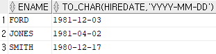

```sql
select ename, to_char(hiredate,'yyyy-mm-dd')from emp where deptno in(select deptno from emp where ename='SMITH') and ename!='SMITH';
```

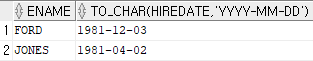

 
- 38> 자신의 급여가 평균 급여보다 많은 모든 사원의 사원 번호, 이름, 급여를
표시하는 질의를 작성하고 급여를 기준으로 결과를 내림차순으로 정렬하라.

```sql
select empno, ename, sal from emp where sal>(select avg(sal) from emp) order by sal desc;
``` 
 
```sql
select empno, ename, sal from emp where sal>(select avg(sal) from emp);
``` 

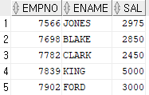

```sql
select empno, ename, sal from emp where sal>(select avg(sal) from emp) order by sal desc;
``` 

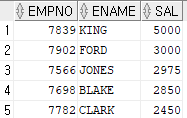 
 
 
- 39> 이름에 T가 들어가는 사원의 속한 부서에서 근무하는 모든 사원의
사원번호 및 이름을 출력하라.

```sql
select empno, ename from emp where deptno in (select deptno from emp where ename like '%T%');
```

```sql
select empno, ename, deptno from emp where ename like '%T%';
```
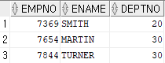

```sql
select empno, ename from emp where deptno in (select deptno from emp where ename like '%T%');
```

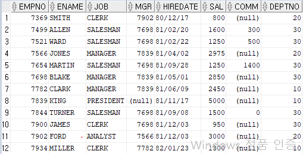

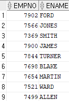


- 40> 부서위치가 Dallas인 모든 사원의 이름,부서번호 및 직위를 출력하라.
```sql
select e.ename, e.deptno, e.job from emp e, dept d where e.deptno=d.deptno and d.loc='DALLAS';
```

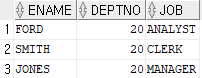


- 41> KING에게 보고하는 모든 사원의 이름과 급여를 출력하라.
```sql
select ename, sal from emp where mgr=(select empno from emp where ename='KING');
```

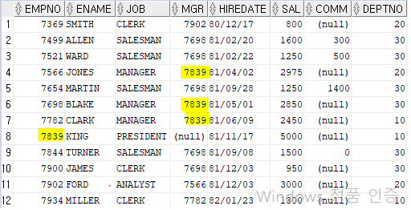

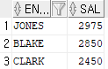

- 42> Sales 부서의 모든 사원에 대한 부서번호, 이름 및 직위를 출력하라.
```sql
select e.deptno, e.ename, e.job from emp e, dept d where e.deptno=d.deptno and d.dname='SALES';
```

```sql
select e.deptno, e.ename, e.job from emp e inner join dept d on e.deptno=d.deptno where d.dname='SALES';
```

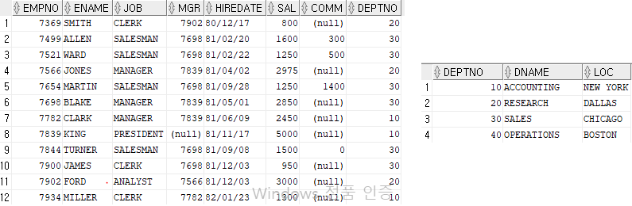

- 43> 자신의 급여가 평균 급여보다 많고 이름에 T가 들어가는 사원과
동일한 부서에 근무하는 모든 사원의 사원 번호, 이름 및 급여를 출력하라.

```sql
select empno, ename, sal from emp 
where sal > (select avg(sal) from emp) 
and deptno in(select deptno from emp where ename like '%T%');
```

- 44> 커미션을 받는 사원과 급여가 일치하는 사원의 이름,부서번호,급여를 출력하라.
```sql
select ename, deptno, sal
from emp
where sal in(select sal
from emp
where comm is not null)
```
 
- 45> Dallas에서 근무하는 사원과 직업이 일치하는 사원의 이름,부서이름, 및 급여를 출력하시오
```sql
select e.ename, d.dname, e.sal
from emp e, dept d
where e.deptno=d.deptno
and e.job in(select e.job
from emp e, dept d
where e.deptno=d.deptno
and d.loc='dallas')
```
 
- 46> Scott과 동일한 급여 및 커미션을 받는 모든 사원의 이름, 입사일 및 급여를 출력하시오
```sql
select ename, hiredate, sal
from emp
where sal=(select sal
from emp
where ename='SCOTT')
and nvl(comm,0)=(select nvl(comm,0)
from emp
where ename='SCOTT')
```
 
- 47> 직업이 Clerk 인 사원들보다 더 많은 급여를 받는 사원의 사원번호, 이름, 급여를 출력하되,
결과를 급여가 높은 순으로 정렬하라.
```sql
select empno, ename, sal
from emp
where sal>all(select sal
from emp
where job='CLERK') --결국 최대값과 비교 any 최소값과 비교
order by sal desc
```
 
- 48> 이름에 A가 들어가는 사원과 같은 직업을 가진 사원의 이름과 월급, 부서번호를 출력하라.
```sql
select ename, sal, deptno
from emp
where job in(select job
from emp
where ename like '%A%')
```
 
- 49> New York 에서 근무하는 사원과 급여 및 커미션이 같은 사원의 사원이름과 부서명을 출력하라.
```sql
select * from emp join dept
on emp.deptno = dept.deptno
and dept.loc='NEW YORK';
``` 
 
```sql 
select e.ename, d.dname
from emp e, dept d
where
e.deptno= d.deptno
and e.sal in(
select e.sal
from emp e, dept d
where e.deptno=d.deptno and loc='NEW YORK'
)
and nvl(comm,0) in(
select nvl(comm,0)
from emp e, dept d
where e.deptno=d.deptno
and loc='NEW YORK');
```
 
- 50> Dallas에서 근무하는 사원과 직업 및 관리자가 같은 사원의 사원번호,사원이름,
직업,월급,부서명,커미션을 출력하되 커미션이 책정되지 않은 사원은 NoCommission으로 표시하고,
커미션의 컬럼명은 Comm으로 나오게 출력하시오. (단, 최고월급부터 출력되게 하시오)
```sql
SELECT E.EMPNO, E.ENAME, E.JOB, E.SAL, D.DNAME,
NVL((TO_CHAR(E.COMM)),'NoCommision') AS "COMM"
FROM EMP E, DEPT D
WHERE E.DEPTNO=D.DEPTNO
AND JOB IN(SELECT JOB
FROM EMP E, DEPT D
WHERE E.DEPTNO=D.DEPTNO AND LOC='DALLAS')
AND MGR IN(SELECT MGR
FROM EMP E, DEPT D
WHERE E.DEPTNO=D.DEPTNO AND LOC='DALLAS')
```

- job 이 MANAGER 이면 ROLE_USER 로 바꿔서 출력
```sql
select 
	ename, 
	CASE 
		when job = 'MANAGER' then 'ROLE_USER' 
	END 
from emp 
where ename = ?
```