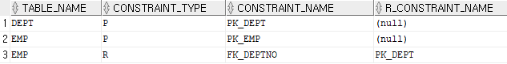
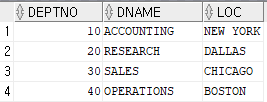
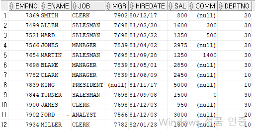
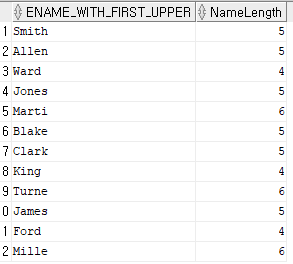
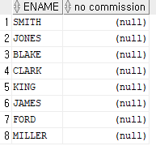

### 1. Foreign key에 대하여 설명하시오.
```sql
 오라클에서 제공하는 EMP 테이블과 DEPT 테이블의 제약 조건을 확인 하는 쿼리
select table_name, constraint_type, constraint_name, r_constraint_name from user_constraints where table_name in ('dept', 'emp');
```

```sql
설명: 
r_constraint_name은 
				foreign key인 경우 
				어떤 primary key를 참조하였는지에 대한 정보를 가진다. 

emp 테이블의 fk_deptno는 
			외래키 제약 조건으로 
			pk_dept 제약 조건을 참조하고 있다는 내용이다. 
			
pk_dept 제약 조건은 
		dept 테이블의 기본키 제약 조건이므로, 
		emp 테이블은 dept 테이블을 참조하고 있다.
```
- Foreign key란
```
Foreign key 란
	emp 테이블의 deptno 은
	반드시 dept 테이블의 detpno 안에 있는 숫자를 사용해야함(참조해야 함)하는데
	이 dept 테이블 안의 deptno의 숫자들을  Foreign key라 한다.
	
	dept테이블의 deptno(컬럼)는 반드시 Primary 키 또는 Unique 키 설정이 되어 있어야 함. (컬럼내의 숫자들을 설정함)
	
```

- dept 테이블

- emp 테이블


- 테이블 생성시 Foreign key를 사용하도록 설정하는 (예) --> reference 부분
```sql
EMP06 테이블을 생성, 기본키 제약 조건, 외래키 제약 조건 설정
drop table emp06;
create table emp06(
			empno number(4) constraint emp06_empno_pk primary key, 
			ename varchar2(10) constraint emp06_ename_nn not null, 
			job varchar(9), 
			deptno number(2) constraint emp06_deptno_fk references dept(deptno));
```			
### 2.아래의 SQL 문을 실행 하시오.

- 18> 모든 사원의 이름(첫 글자는 대문자로, 나머지 글자는 소문자로 표시) 및 이름 길이를 표시하는 쿼리를 작성하고 컬럼 별칭은 적당히 넣어서 출력하라.
```sql
select upper(substr(ename, 1,1)) || lower(substr(ename, 2,4)) as ename_with_first_upper, length(ename) as "NameLength" from emp;
```

  
- 19> 사원의 이름과 커미션을 출력하되, 커미션이 책정되지 않은 사원의 커미션은 'no commission'으로 출력하라.
```sql
select ename, comm as "no commission"  from emp where comm is null;
```

### 3. 게시판에서 아래의 쿼리(SQL 문)를 정리 하시오.
- list 쿼리
```sql
	select * from mvc_board order by bgroup desc, bstep asc;
```
- 답글을 insert를 위한 쿼리
```sql
	insert into mvc_board (bid, bname, btitle, bcontent, bgroup, bstep, bindent) values (mvc_board_seq.nextval, ?, ?, ?, ?, ?, ?);
```
```java
	preparedStatement = connection.prepareStatement(query);
	preparedStatement.setString(1, bname);
	preparedStatement.setString(2, btitle);
	preparedStatement.setString(3, bcontent);
	preparedStatement.setInt(4, Integer.parseInt(bgroup));
	preparedStatement.setInt(5, Integer.parseInt(bstep) + 1);
	preparedStatement.setInt(6, Integer.parseInt(bindent) + 1);
```

- 업데이트 쿼리
```sql
	update mvc_board set bname=?,btitle=?,bcontent=? where bid=?;
```
```java
	preSta = con.prepareStatement(query2);
	preSta.setString(1, bname2);
	preSta.setString(2, btitle2);
	preSta.setString(3, bcontent2);
	preSta.setString(4, bid2);
	int rn = preSta.executeUpdate();
```

- 삭제 쿼리
```sql
	delete from mvc_board where bid=?
```
```java
	connection = dataSource.getConnection();
	preparedStatement = connection.prepareStatement(query);
	preparedStatement.setString(1, bid);
	int rn = preparedStatement.executeUpdate();
```

- insert 쿼리
```sql
	insert into mvc_board (bid, bname, btitle, bcontent, bhit, bgroup, bstep, bindent) values (mvc_board_seq.nextval, ?, ?, ?, 0, mvc_board_seq.currval, 0, 0);
```
```java
	preparedStatement = connection.prepareStatement(query);
	preparedStatement.setString(1, bname);
	preparedStatement.setString(2, btitle);
	preparedStatement.setString(3, bcontent);
	int rn = preparedStatement.executeUpdate();
```


==================================================================================

내일 타이머 내용.
70번 아래 내용 -게시판 짜기 돌리 도록 하겠습니다.


====================================================================================

게시판 속성 강좌 
To do list 기법
=============================
__1. 설계도 외우기 - 2분__

__2. 프로젝트 생성 - 1분 jsp_board_test5__


__3. 라이브러리 집어 넣기 3 개 - 30초 __


__4. DTO 만들기   - 3분__
-desc mvc_board
-BDto - edu.kosmo.ex.dto

__5.DAO 만들기   - 5분__
-BDto - edu.kosmo.ex.dto
- 커넥션풀 
- list()
- select * from mvc_board order by bGroup desc, bStep asc 
sql 문 정리 

__5. Commad 인터페이스 만들기 - 1분__
- edu.kosmo.ex.command

__6. BListCommad class 만들기 - 3분__
-  BCommnad 상속
-  edu.kosmo.ex.command (패기지명)
- DAO 객체 생성
- list 함수 호출 
- request 객체 안에 게시판 넣기

__7. Servelet 객체 만들기(컨트롤러 객체 만들기) - 5분__
 - *.do 설정
 - actionDo 함수 만들기
 - 명령어 해석 
 ```java
	String uri = request.getRequestURI();
	String conPath = request.getContextPath();
	String com = uri.substring(conPath.length());
```	
- 명령해석후 BListCommand 객체 생성
```java
	if(com.equals("/list.do")) {
		command = new BListCommnad();
		command.execute(request, response);
		viewPage = "list.jsp";			
	}
```	
- 빠빠라치 객체 설정
```java
	RequestDispatcher dispatcher = request.getRequestDispatcher(viewPage);
	dispatcher.forward(request, response);	
```
__8.list.jsp 만들기 - 5분__
-UTF-8 ,세팅
-지시자 jstl
- 댓글 RE 다는 부분 주의 할것.
```jsp
<table width="500" border="1">
		<tr>
			<td>번호</td>
			<td>이름</td>
			<td>제목</td>
			<td>날짜</td>
			<td>히트</td>			
		</tr>
	<c:forEach var="dto" items="${list}">
		<tr>
			<td>${dto.bid}</td>
			<td>${dto.bname}</td>
			<td>
				<c:forEach begin="1" end="${dto.bindent}">[Re]</c:forEach>
				<a href="content_view.do?bid=${dto.bid}">${dto.btitle}</a>
			</td>
		</tr>

	</c:forEach>
</table>
```


