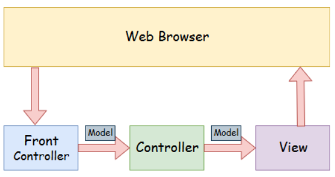

### 1.pom.xml 에 대하여 설명하시오.
```
	POM = Project Object Model
	
	
	메이븐 프로젝트에서 project information and configuration 의 내용을 제공하는 , 핵심적인 부분.
	
	빌드를 위해서 
	메이븐에서 사용하는 
	프로젝트와 컨피규레이션 에 관한 정보를 가지고 있음.
	
	다른 정보로는
		project version, 
		descriptio, 
		developer,
		mailing list,
	등도 가지고 있다.	
	
	프로젝트에 필요한 라이브러리의 내용
	<dependencies>
		ex. lombok,  spring, Servlet, 

	프로젝트 명
		<groupId>edu.kosmo</groupId>
		<artifactId>ex</artifactId>
```
###  2.아래를 설명하시오.
- @RequestMapping
```java
	스프링 Annotatoin 중에서 가장 많이 사용하는 것 중 하나.
	
	http web request ( url ) 를  특정  헨들러 클래스(또는 메소드) 에  mapping 시켜 주는 동작을 함.
	
	( ->  url을  Spring Controller에  메핑을 해 줌.)
	
	사용 예:
	@Controller
	public class GradeController {
		@RequestMapping("grade/input")
		public String input(Grade grade) {
			return "grade/input"; //"grade/input.jsp" 
		}

		@RequestMapping("grade/result")
		public String result(Grade grade) {
			grade.makeGrade();
			return "grade/result"; //"grade/result.jsp" 
		}
	}
```
- @Controller
```java
		controller는 어플리케이션 business logic을  담고 있는데,
		
		클래스가 controller로 사용되고 있다는 것을 표시하는  스프링 annotation임.
		
		스프링 Web MVC에서,
		DispatcherServlet 클래스가  front controller로서 동작을 함. 
		
```
- Model

```
	어플리케이션의  data를 가지고 포함하고 있는 것을 말한다.
	여기서 data는 sigle object 또는  ojbect의 collection을 말한다.
	
```

### 3.maven repository 란?
```
	maven 프로젝트에서 필요로 하는, 모든 dependencies ( 라이브러리 )  를 제공하는 저장소 임.
	
	maven 프로젝트에서 spring을 사용할때, POM.xml 안에 spring framework 와 관련된,
	많은 dependencies ( 라이브러리 )를 추가를 하면, 로컬 pc의 .m2 디레토리에  jar를 다운로드 후 저장을 한다.
	
```
### 4. JS배열에서 mutable 함수 , immutable 함수를 구분하시오.
```javascript
	
	
mutable 함수 :  array method 를 실행후에 Array내용이 변경 됨.

	Array.prototype.pop()    *
	Array.prototype.push()    *
	Array.prototype.shift()    *
	Array.prototype.unshift()
	Array.prototype.reverse()    *
	Array.prototype.sort()    *
	Array.prototype.splice()
	
	(ex) sort
	
	var varArrSort  = new Array( "E", "B", "A", "C", "D");
	alert(varArrSort);          // 결과 : E,B,A,C,D
	alert ( varArrSort.sort()); //결과 : A,B,C,D,E
	alert ( varArrSort);        // 결과 : A,B,C,D,E
	
	(ex) reverse
	
	var varArrReverse  = new Array( "E", "B", "A", "C", "D");
	alert(varArrReverse);  			// 결과 : E,B,A,C,D
	alert ( varArrReverse.reverse()); //결과 : D,C,A,B,E
	alert ( varArrReverse); 		// 결과 : D,C,A,B,E
		
	(ex) push
	var varArrPush = new Array("ABC", "DEF") ;
	alert(varArrPush.push("가나다", "마바사"));   //결과: 4
	alert(varArrPush);  //결과: ABC,DEF,가나다,마바사
	
	(ex) shift, pop
	
	var varrrShiftPop = new Array("가", "나", "다", "라", "마");
	alert(varrrShiftPop.shift());// 결과 : 가
	alert(varrrShiftPop); // 결과 : 나,다,라,마

	alert(varrrShiftPop.pop()); // 결과 :  마
	alert(varrrShiftPop);// 결과 : 나,다,라

	
immutable 함수 :  Array내용이 변경 되지 않음.

	Array.prototype.slice()
	Array.prototype.concat()    *
	Array.prototype.map()
	Array.prototype.filter()
	
	(ex) concat 
	
	var varArrFir = new Array("ABC", "DEF", "GHI", "JKL");
    var varArrSec = new Array ( "가나다", "라마바", "사아차", "카타파");
    var varArrRes = varArrFir.concat(varArrSec);  // 결과 :  ABC,DEF,GHI,JKL,가나다,라마바,사아차,카타파
     
    alert("--8 :    " +varArrFir);//결과 :ABC,DEF,GHI,JKL
    alert("--8 :    " +varArrRes);//결과 :ABC,DEF,GHI,JKL,가나다,라마바,사아차,카타파
    alert("--8 :    " +varArrFir);//결과 :ABC,DEF,GHI,JKL
	
	(ex)  join
	
	    var varArrJoin = new Array("AB", "CD", "EF", "HI");
        alert("--9 :    " + varArrJoin.join()); // 결과 : AB,CD,EF,HI 
        alert("--9 :    " + varArrJoin.join("|"));  // 결과 :  AB|CD|EF|HI
        alert("--9 :    " + varArrJoin.join(":"));  // 결과 : AB:CD:EF:HI
        alert("--9 :    " + varArrJoin.toString());  // 결과 : AB,CD,EF,HI
        alert("--9 :    " + varArrJoin.join()); // 결과 :  AB,CD,EF,HI
```
### 5아래를 Spring으로 짜시오.
- spring_idpw 스프링 legacy 프로젝트 생성
 ~~~/ex/result 로 접속 하면  result.jsp 에 id:abcd pw:1234 출력 되도록함.  


=====================================================================
50번
알고리즘: int a = 10 int b =20 두수를 바꾸기
배열 또는 List 에 3, 4, 5, 6, 10 입력 Max 값 구하기

51번
로또 번호를 Set 을 활용하여 짜시오

3번(자바스크립트) 
JS로 국영수 입력받아, 총점과 평균을 출력하시오.
 
