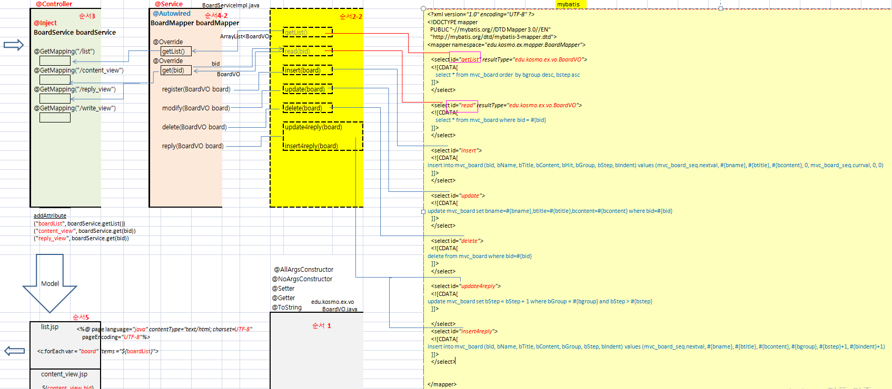

### 1. 게시판을 스프링으로 구현을 완성하시오.

list -> write -> delete -> update -> reply -> update -> uphit



### 2. 아래의 SQL 을 분석하시오.
```sql
SELECT 
	*
FROM(
	SELECT 
		ROWNUM AS RNUM
		, A.* 
	FROM
		(
			SELECT
				*
			FROM
				mvc_board 
			ORDER BY bGroup desc, BSTEP asc   
		)A 
	WHERE ROWNUM <= #{pageNum} * #{amount}
) 
WHERE 
	RNUM > (#{pageNum}-1) * #{amount}
```
```sql
SELECT 
	*
FROM(
	SELECT 
		ROWNUM AS RNUM	--------(4)
		, A.* 			--------(5)
	FROM
		(
			SELECT
				*
			FROM
				mvc_board 
			ORDER BY bGroup desc, BSTEP asc   -------(1)
		)A 				----------(2)
	WHERE ROWNUM <= #{pageNum} * #{amount}	--------(3)
) 
WHERE 
	RNUM > (#{pageNum}-1) * #{amount}	--------(6)
```
#### 게시판에서 pagination을 위한 sql 구문의 분석.
```
(1) : mvc_board 테이블의 데이터를 출력 ( bGroup은 내림차순( 4, 3, 2, 1) 순서, bStep은 오름차순( 1, 2,3,4)으로 출력 )
(2) : (1)의 결과를 A 라고 표시함

(3) :  현재의 페이지 번호 pageNum X amount( 페이지장보여줄 row갯수 )
	보다 ROWNUM이 작은 조건에 맞는

(4) : A결과 에서 POWNUM을 통해 row의 번호를 RNUM 이라는 colume 이름으로 출력함.
(5) : A 결과의 모든 colume 을 의미함.

(6) : (4),(5)의 결과에서 
		RNUM 의 값이   pageNum(현재의 페이지)-1 X amount( 페이지장보여줄 row갯수 )
		보다 큰 경우의 조건이면 모두 출력.
```
 (3) 과 ( 6) 의 의미 : 
		현재페이지가 2 페이지이고,
		한페이지당 row 출력이 10개 라면,
		
		RNUM 가  11 ~ 20 인 row 을 출력하는 것이 됨.


### 3.js 아래를 완성하시오.
```js
단 - es6 문법 class로 완성할것

let circle = new Circle(100);
console.log(circle.getArea()); //넓이 출력 


let rec = new Rectangle(100, 100);
console.log(rec.getArea()); //넓이 출력 
```
#### 작성:
```js
<body>
    <script>

        function Circle(radius){
            this.radius = Number(radius);
            this.getArea = function (){
                return this.radius*this.radius*Math.PI;
            };
        };
        let circle = new Circle(100);
        console.log("circle: area: " + circle.getArea());

        function Rectangle(width, height){
            this.width = Number(width);
            this.height = Number(height);
            this.getArea = function (){
                let area = this.width*this.height;
                return area;
            };
        };
        let rec = new Rectangle(100, 100);
        console.log("rec : area : " + rec.getArea());
        
        
    </script>
</body>
```
#### 결과:
```
circle: area: 31415.926535897932
rec : area : 10000
```


==========================================================

 개별진척도는

-개별진척도 73번  ...게시판 list 구현 - 다시 한번 더 
-개별진척도(JS) 위의 3번

3.아래를 완성하시오.(자바 스크립트)

단 - es6 문법 class로 완성할것

let circle = new Circle(100);
console.log(circle.getArea()); //넓이 출력 


let rec = new Rectangle(100, 100);
console.log(rec.getArea()); //넓이 출력 


=====================================================================


