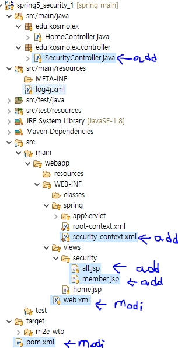

# 2. 스프링 시큐티 설정을 위한 pom.xml 과 web.xml 및 가장 기본적인 security-context.xml 설정은?

프로젝트 수정내용



## pom.xml 안에 아래와 같은 Spring Security 디펜덴시 ( 라이브러리 ) 를 추가한다. spring프레임워크 버젼은 spring시큐리티보다 높아야 한다.
### <org.springframework-version>5.0.7.
### <org.security-version>5.0.6.
```xml

	<properties>
		<java-version>1.8</java-version>
		<org.springframework-version>5.0.7.RELEASE</org.springframework-version>
		<org.aspectj-version>1.6.10</org.aspectj-version>
		<org.slf4j-version>1.6.6</org.slf4j-version>
		<org.security-version>5.0.6.RELEASE</org.security-version>
	</properties>


     <!-- Spring Security -->
      <dependency>
         <groupId>org.springframework.security</groupId>
         <artifactId>spring-security-core</artifactId>
         <version>${org.security-version}</version>
      </dependency>

      <dependency>
         <groupId>org.springframework.security</groupId>
         <artifactId>spring-security-web</artifactId>
         <version>${org.security-version}</version>
      </dependency>

      <dependency>
         <groupId>org.springframework.security</groupId>
         <artifactId>spring-security-config</artifactId>
         <version>${org.security-version}</version>
      </dependency>

      <dependency>
         <groupId>org.springframework.security</groupId>
         <artifactId>spring-security-taglibs</artifactId>
         <version>${org.security-version}</version>
      </dependency>


```

## web.xml 
### (1) security-context.xml 를 사용하도록 추가를 한다.
###    root-context.xml 옆에 , 사용하여 /WEB-INF/spring/security-context.xml을 추가한다
### (2) Spring Security Filter 를 추가한다.

```xml
	<context-param>
		<param-name>contextConfigLocation</param-name>
		<param-value>/WEB-INF/spring/root-context.xml,/WEB-INF/spring/security-context.xml
		</param-value>
	</context-param>
	
	
	
<!-- 한글처리 를 위한 UTF-8 지정해 주는 것인데, 기본적으로 넣어야 한다. -->

 <filter>
          <filter-name>encodingFilter</filter-name>
          <filter-class>org.springframework.web.filter.CharacterEncodingFilter</filter-class>
          <init-param>
            <param-name>encoding</param-name>
            <param-value>UTF-8</param-value>
          </init-param>
    </filter>
     
    <filter-mapping>
          <filter-name>encodingFilter</filter-name>
          <url-pattern>/*</url-pattern>
    </filter-mapping>
    

<!-- 한글처리 필터 밑에 반드시  스프링 시큐리티 필터 체인즈를  넣는다. -->
   <!-- Spring Security Filter -->
    <filter>
        <filter-name>springSecurityFilterChain</filter-name>
        <filter-class>org.springframework.web.filter.DelegatingFilterProxy</filter-class>
    </filter>
 
    <filter-mapping>
          <filter-name>springSecurityFilterChain</filter-name>
        <url-pattern>/*</url-pattern>
    </filter-mapping>
    
	
```


## security-context.xml 에서  아래 부분을 추가 한다.
```xml


	<http>
		<intercept-url pattern="/security/all" access="permitAll" />
		<intercept-url pattern="/security/member" access="hasRole('ROLE_MEMBER')" />

		<form-login/>
	</http>


	<authentication-manager>

		<authentication-provider> 
			<user-service> 
				<user name="member" password="{noop}member" authorities="ROLE_MEMBER" /> 
				<user name="mananger" password="{noop}mananger" authorities="ROLE_MEMBER" /> 
			</user-service> 
		</authentication-provider>

	</authentication-manager>

```