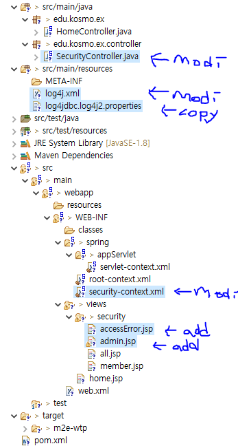

# 스프링시큐리티_2_admin추가_error페이지추가_log4j내용수정

프로젝트 수정내용



## SecurityController.java 
### Log4j 추가
### "/admin" 대한 처리 추가,
### "/accessError" 대한 처리 추가
```java
@Log4j
@RequestMapping("/security/*")
@Controller
public class SecurityController {

	@GetMapping("/all")
	public String all() {
		System.out.println("--- do all access everybody ----");
		return "/security/all";
	}
	
	@GetMapping("/member")
	public String member() {
		System.out.println("--- logined member ----");
		return "/security/member";
	}
	
	@GetMapping("/admin")
	//public String admin() {
	public void admin() {   // <--- use like this,  defaultly return /security/admin 
		log.info("/admin..");
		System.out.println("--- do all access everybody ----");
		//return "/security/admin";
	}
	
	@GetMapping("/accessError")
	public void accessError(Model model) {
		log.info("/accessError..");
		
		model.addAttribute("msg", "ACCESS Denied(404 ?먮윭)");
	}
	
}
```

## log4j.xml
### 기존에서 아래 부분 추가
```java
<!-- Query Loggers -->
    <logger name="jdbc.sqlonly" additivity="false">
        <level value="INFO" />
        <appender-ref ref="console" />
        <appender-ref ref="rollingAppender" />
    </logger>
    <logger name="jdbc.resultsettable" additivity="false">
        <level value="INFO" />
        <appender-ref ref="console" />
    </logger>
    <logger name="jdbc.sqltiming" additivity="false">
        <level value="INFO" />  
           <!--  <appender-ref ref="console"/>  -->
    </logger>
    <logger name="jdbc.resultset" additivity="false">
        <level value="DEBUG" />
    </logger>
    <logger name="jdbc.audit" additivity="false">
        <level value="DEBUG" />
    </logger> 
```

## security-context.xml
### admin 에 대한 인증과 권한을 설정 해 줌
### 접근금지 에러에 대한 custom 에러 페이지 설정


```java

	<http>
		<intercept-url pattern="/security/all" access="permitAll" />
		<intercept-url pattern="/security/member" access="hasRole('ROLE_MEMBER')" />
		<intercept-url pattern="/security/admin" access="hasRole('ROLE_ADMIN')" />

		<form-login/>
		
		<!-- 403 ?먮윭 泥섎━ -->
      	<access-denied-handler error-page="/security/accessError"/>
      
	</http>

	<authentication-manager>

     <authentication-provider> 
       <user-service> 
         <user name="member" password="{noop}member" authorities="ROLE_MEMBER" /> 
         <!-- <user name="mananger" password="{noop}mananger" authorities="ROLE_MEMBER" /> --> 
         <user name="admin" password="{noop}admin" authorities="ROLE_MEMBER,ROLE_ADMIN" />
       </user-service> 
     </authentication-provider>

	</authentication-manager>

```
