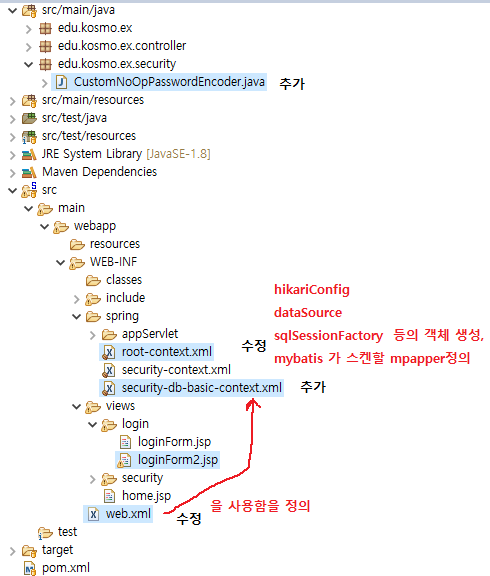
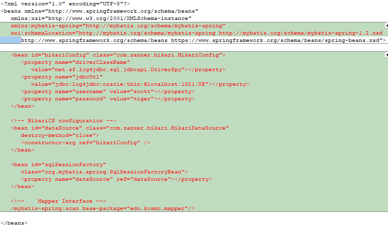
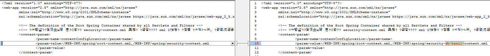

# username과 password를 db에서 가져오도록 수정



## edu\kosmo\ex\security\CustomNoOpPasswordEncoder.java 파일 추가

```java
package edu.kosmo.ex.security;

import org.springframework.security.crypto.password.PasswordEncoder;
import lombok.extern.log4j.Log4j;

@Log4j
public class CustomNoOpPasswordEncoder implements PasswordEncoder {

   public String encode(CharSequence rawPassword) {
      log.warn("before encode :" + rawPassword);
      return rawPassword.toString();
   }

   public boolean matches(CharSequence rawPassword, String encodedPassword) {
      log.warn("matches: " + rawPassword + ":" + encodedPassword);
      return rawPassword.toString().equals(encodedPassword);
   }
}
```
## main\webapp\WEB-INF\spring\root-context.xml 수정



```xml
<?xml version="1.0" encoding="UTF-8"?>
<beans xmlns="http://www.springframework.org/schema/beans"
   xmlns:xsi="http://www.w3.org/2001/XMLSchema-instance"
   xmlns:mybatis-spring="http://mybatis.org/schema/mybatis-spring"
   xsi:schemaLocation="http://mybatis.org/schema/mybatis-spring http://mybatis.org/schema/mybatis-spring-1.2.xsd
      http://www.springframework.org/schema/beans https://www.springframework.org/schema/beans/spring-beans.xsd">
   
   <bean id="hikariConfig" class="com.zaxxer.hikari.HikariConfig">
      <property name="driverClassName"
         value="net.sf.log4jdbc.sql.jdbcapi.DriverSpy"></property>
      <property name="jdbcUrl"
         value="jdbc:log4jdbc:oracle:thin:@localhost:1521:XE"></property>
      <property name="username" value="scott"></property>
      <property name="password" value="tiger"></property>
   </bean>

   <!-- HikariCP configuration -->
   <bean id="dataSource" class="com.zaxxer.hikari.HikariDataSource"
      destroy-method="close">
      <constructor-arg ref="hikariConfig" />
   </bean>

   <bean id="sqlSessionFactory"
      class="org.mybatis.spring.SqlSessionFactoryBean">
      <property name="dataSource" ref="dataSource"></property>
   </bean>
   
   <!--    Mapper Interface -->
   <mybatis-spring:scan base-package="edu.kosmo.mapper"/> 
      
</beans>
```

## main\webapp\WEB-INF\spring\security-db-basic-context.xml 파일 추가
## username 과 password는 DB의 emp 테이블에서 ename 과 empno을 가지고 와서 사용하고 (authentication )
## 권한 ename이 MANAGER 이면은 ROLE_ADMIN을 부여하고,아니면 ROLE_USER를 부여한다.(authorities )

```xml
<?xml version="1.0" encoding="UTF-8"?>
<beans:beans xmlns="http://www.springframework.org/schema/security"
    xmlns:beans="http://www.springframework.org/schema/beans"
   xmlns:xsi="http://www.w3.org/2001/XMLSchema-instance"
   xsi:schemaLocation="http://www.springframework.org/schema/security http://www.springframework.org/schema/security/spring-security.xsd
      http://www.springframework.org/schema/beans http://www.springframework.org/schema/beans/spring-beans.xsd">
   
   
     <http auto-config="true" use-expressions="true">
        <intercept-url pattern="/login/loginForm" access="permitAll" />
        <intercept-url pattern="/" access="permitAll" />
        
         <intercept-url pattern="/security/member" access="hasRole('ROLE_USER')" /> 
      	<intercept-url pattern="/security/admin" access="hasRole('ROLE_ADMIN')" />    

      <!--로그인 페이지 커스텀 화    -->
      <form-login login-page="/login/loginForm"
                    default-target-url="/"
                    authentication-failure-url="/login/loginForm?error"
                    username-parameter="username"
                    password-parameter="pw" />
      
      <logout logout-url="/logout" logout-success-url="/" /> 
                
      <!-- 403 에러 처리 -->
      <access-denied-handler error-page="/security/accessError"/>      
   </http> 
   
<!--    <beans:bean id="userDetailsService" class="org.springframework.security.core.userdetails.jdbc.JdbcDaoImpl">
        <beans:property name="dataSource" ref="dataSource"/>
    </beans:bean>  -->
   
    <beans:bean id="customNoOpPasswordEncoder" class="edu.kosmo.ex.security.CustomNoOpPasswordEncoder"/>

<!-- provider --> 
   <authentication-manager>
      <authentication-provider>
      <password-encoder ref="customNoOpPasswordEncoder"/>  
      <jdbc-user-service 
               data-source-ref="dataSource"
               users-by-username-query="select ename, empno, 1 from emp where ename = ?"
               authorities-by-username-query=" select ename, CASE when job = 'MANAGER' then 'ROLE_ADMIN' else 'ROLE_USER' from emp where ename = ?"
        /> 
      </authentication-provider>
   </authentication-manager>
    
    
</beans:beans>
```

## main\webapp\WEB-INF\web.xml 수정



```xml
<?xml version="1.0" encoding="UTF-8"?>
<web-app version="2.5" xmlns="http://java.sun.com/xml/ns/javaee"
	xmlns:xsi="http://www.w3.org/2001/XMLSchema-instance"
	xsi:schemaLocation="http://java.sun.com/xml/ns/javaee https://java.sun.com/xml/ns/javaee/web-app_2_5.xsd">

	<!-- The definition of the Root Spring Container shared by all Servlets and Filters -->
	<!-- 스프링 시큐리티 관련해서, security-context.xml 추가 수정이 됨, xml 2개를 읽어 들일려면, 아래처럼 해야 함 주의 -->
	<context-param>
		<param-name>contextConfigLocation</param-name>
		<param-value>/WEB-INF/spring/root-context.xml,/WEB-INF/spring/security-db-basic-context.xml
		</param-value>
	</context-param>
	
	<!-- Creates the Spring Container shared by all Servlets and Filters -->
	<listener>
		<listener-class>org.springframework.web.context.ContextLoaderListener</listener-class>
	</listener>

	<!-- Processes application requests -->
	<servlet>
		<servlet-name>appServlet</servlet-name>
		<servlet-class>org.springframework.web.servlet.DispatcherServlet</servlet-class>
		<init-param>
			<param-name>contextConfigLocation</param-name>
			<param-value>/WEB-INF/spring/appServlet/servlet-context.xml</param-value>
		</init-param>
		<load-on-startup>1</load-on-startup>
	</servlet>
		
	<servlet-mapping>
		<servlet-name>appServlet</servlet-name>
		<url-pattern>/</url-pattern>
	</servlet-mapping>


<!-- 한글처리 를 위한 UTF-8 지정해 주는 것인데, 기본적으로 넣어야 한다. -->

 <filter>
          <filter-name>encodingFilter</filter-name>
          <filter-class>org.springframework.web.filter.CharacterEncodingFilter</filter-class>
          <init-param>
            <param-name>encoding</param-name>
            <param-value>UTF-8</param-value>
          </init-param>
    </filter>
     
    <filter-mapping>
          <filter-name>encodingFilter</filter-name>
          <url-pattern>/*</url-pattern>
    </filter-mapping>
    

<!-- 한글처리 필터 밑에 반드시  스프링 시큐리티 필터 체인즈를  넣는다. -->
   <!-- Spring Security Filter -->
    <filter>
        <filter-name>springSecurityFilterChain</filter-name>
        <filter-class>org.springframework.web.filter.DelegatingFilterProxy</filter-class>
    </filter>
 
    <filter-mapping>
          <filter-name>springSecurityFilterChain</filter-name>
        <url-pattern>/*</url-pattern>
    </filter-mapping>
    
    
</web-app>

```
