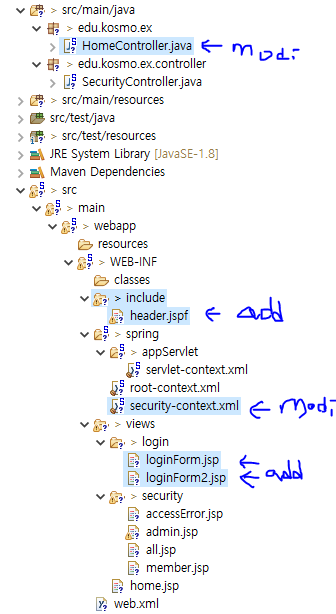
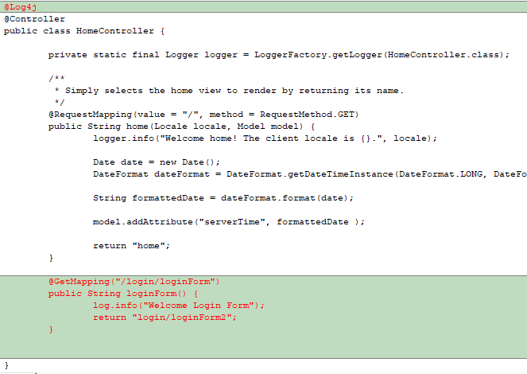
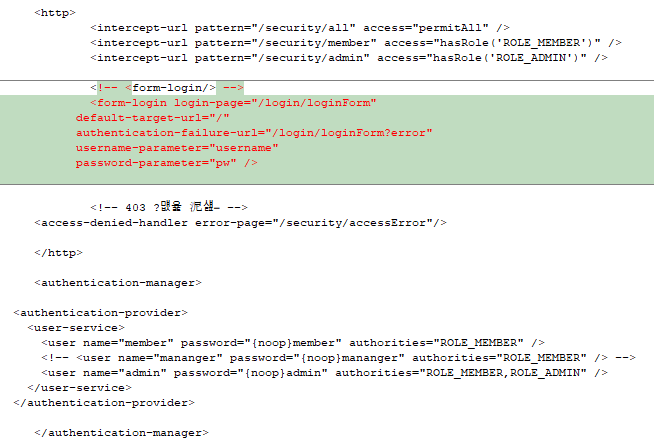

# 스프링시큐리티_3_커스텀loginForm추가



## HomeController.java
### "/login/loginForm" 인 경우에 대한 내용 추가



```java
	@GetMapping("/login/loginForm")
	public String loginForm() {
		log.info("Welcome Login Form");
		return "login/loginForm2";
	}
```

## src\main\webapp\WEB-INF\include\header.jspf  파일의 추가 
### loginForm2.jsp 에서 사용함
```java
<%@ page language="java" contentType="text/html; charset=UTF-8" pageEncoding="UTF-8"%>
<meta charset="utf-8">
<link rel="stylesheet" href="https://maxcdn.bootstrapcdn.com/bootstrap/4.0.0-beta/css/bootstrap.min.css" integrity="sha384-/Y6pD6FV/Vv2HJnA6t+vslU6fwYXjCFtcEpHbNJ0lyAFsXTsjBbfaDjzALeQsN6M" crossorigin="anonymous">
<script src="https://code.jquery.com/jquery-3.2.1.slim.min.js" integrity="sha384-KJ3o2DKtIkvYIK3UENzmM7KCkRr/rE9/Qpg6aAZGJwFDMVNA/GpGFF93hXpG5KkN" crossorigin="anonymous"></script>
<script src="https://cdnjs.cloudflare.com/ajax/libs/popper.js/1.12.3/umd/popper.min.js" integrity="sha384-vFJXuSJphROIrBnz7yo7oB41mKfc8JzQZiCq4NCceLEaO4IHwicKwpJf9c9IpFgh" crossorigin="anonymous"></script>
<script src="https://maxcdn.bootstrapcdn.com/bootstrap/4.0.0-beta/js/bootstrap.min.js" integrity="sha384-h0AbiXch4ZDo7tp9hKZ4TsHbi047NrKGLO3SEJAg45jXxnGIfYzk4Si90RDIqNm1" crossorigin="anonymous"></script>
<link rel="stylesheet" href="h
```

## security-context.xml 안에서 내용의 추가 
###  처음에 "/login/loginForm" url이 들어오면, 스프링스큐리티는 HomeController.java 안의 public String loginForm() { } 호출 하고,
###  WEB-INF\views\login\loginForm2.jsp  에서 username과 pw를 포함해서 다시 /login/loginForm" url이 들어오면
### 스프링 시큐리티가 낚아채서 username과 pw 을 판단하여, 
### "/login/loginForm" 을 HomeController.java 안의 public String loginForm() { }로 보낼지,
### "/login/loginForm?error"을  HomeController.java 안의 public String loginForm() { }로 보낼지 결정한다.
### 주의 : security-context.xml 안의 "username" 와 "pw" 는 
### WEB-INF\views\login\loginForm2.jsp 안의 <form:form 안의 <input type="text" 가, name="username", name="pw" 꼭 되어 있어야 한다.




```java
	<!-- <form-login/> -->
	<form-login login-page="/login/loginForm"
		  default-target-url="/"
		  authentication-failure-url="/login/loginForm?error"
		  username-parameter="username"
		  password-parameter="pw" />
		
```

## src\main\webapp\WEB-INF\views\login\loginForm2.jsp 
### 참고 : <form:form 를 사용하면, _csrf 부분을 자동으로 넣어 주므로, 아래에서
### "<%-- <input name="${_csrf.parameterName}" type="hidden" value="${_csrf.token}"/> --%>" 처럼 막아도 된다.
```java
<%@ page language="java" contentType="text/html; charset=UTF-8" pageEncoding="UTF-8"%>
<%@ taglib prefix="c" uri="http://java.sun.com/jsp/jstl/core" %>
<%@ taglib prefix="form" uri="http://www.springframework.org/tags/form" %>
<!DOCTYPE html>
<html lang="ko">
<head>
<meta http-equiv="Content-Type" content="text/html; charset=UTF-8">
<%@ include file="/WEB-INF/include/header.jspf"  %>
<title>Login</title>
</head>
<body onload="document.f.id.focus();">
      <br><br>
      <div class="container text-center">
          <h1>로그인 페이지</h1><br>
      </div>
      <c:url value="/login" var="loginUrl" />
      <div class="container col-md-4">
	      <form:form name ="f" class="px-4 py-3" action="${loginUrl}" method="post">
	            <c:if test="${param.error != null}">
        			<p>아이디와 비밀번호가 잘못되었습니다.</p>
    			</c:if>
    			
    			<c:if test="${param.logout != null}">
        			<p>로그아웃 하였습니다.</p>
    			</c:if>
    			
	          <div class="form-group">
	              <label for="exampleDropdownFormEmail1">ID</label>
	              <input type="text" class="form-control" name="username" placeholder="example">
	          </div>
	          <div class="form-group">
	              <label for="exampleDropdownFormPassword1">Password</label>
	              <input type="password" class="form-control" name="pw" placeholder="Password">
	          </div>
	          <div class="form-check">
	              <label class="form-check-label">
	              <input type="checkbox" class="form-check-input">
	              Remember me
	              </label>
	          </div>
	          <%-- <input name="${_csrf.parameterName}" type="hidden" value="${_csrf.token}"/> --%>
	          <button type="submit" class="btn btn-primary">Sign in</button>
	   </form:form>
	      <div class="dropdown-divider"></div>
	      <a class="dropdown-item" href="#">New around here? Sign up</a>
	      <a class="dropdown-item" href="#">Forgot password?</a>
	  </div>

</body>
</html>
```

## 참고: 크롬에서 session 삭제하는 방법
### 크롬 -> F12 -> application -> storage -> clear site data ( including third-party cookies 포함)