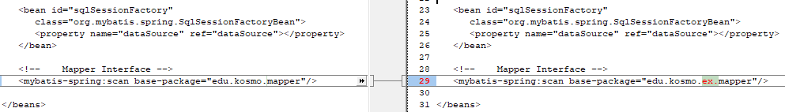
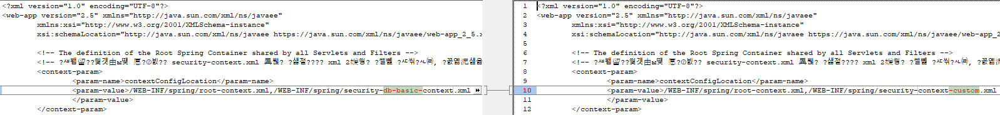

# user의 모든 정보를 가지고 오는, 커스텀 user 정보
### 스프링 시큐리티에서 username과 password뿐만 아니라 다른 모든 정보를 가져갈 수 있도록 수정됨

동작 기본 개념 : 

임시로 emp 테이블을 사용하고,  ename을 username으로, empno을 pw로 사용하여
로그인 페이지의 form을 통해서 받은 username과  pw가  emp 테이블안의 해당 ename과 empno와 
각각 동일하면 권한을 ROLE_USER로 주어지게 함.
USER로 권한이 주어지면 /user/userHome에 접근할수 있고, 이 페이지에 접근을 하면
스프링 시큐리티에서 가지고 있는 user의 모든 정보를 화면에 출력하도록 함.


# 전체적인 동작 블럭도


# 스프링 시큐리티에서 username과 password뿐만 아니라 다른 모든 정보를 가져가도록 (1)준비


# 스프링 시큐리티에 (2)연결 - 스프링 시큐리티에서 customUserDetailsService 을 호출해 감.


# (3)url을 접근하기 위해서 필요한 권한을 스프링 시큐리티에 설정을 해줌


# (4) 스프링 시큐리티의 상태를 tag로 가지고 와서 사용


# 추가 및 수정 코드
## edu\kosmo\ex\mapper\EmpMapper.java  파일 추가
```java
package edu.kosmo.ex.mapper;

import org.apache.ibatis.annotations.Mapper;
import org.apache.ibatis.annotations.Select;

import edu.kosmo.ex.vo.EmpVO;

@Mapper
public interface EmpMapper {
	   @Select("select * from emp where ename = #{ename}")
	   public EmpVO readUser(String name);
}
```
## edu\kosmo\ex\security\CustomUserDetailsService.java 파일 추가
```java
package edu.kosmo.ex.security;

import org.springframework.beans.factory.annotation.Autowired;
import org.springframework.security.core.userdetails.UserDetails;
import org.springframework.security.core.userdetails.UserDetailsService;
import org.springframework.security.core.userdetails.UsernameNotFoundException;

import edu.kosmo.ex.mapper.EmpMapper;
import edu.kosmo.ex.vo.CustomUser;
import edu.kosmo.ex.vo.EmpVO;
import lombok.Setter;
import lombok.extern.log4j.Log4j;

@Log4j
public class CustomUserDetailsService implements UserDetailsService{

	@Setter(onMethod_ = @Autowired)
	private EmpMapper empMapper;
	
	@Override
	public UserDetails loadUserByUsername(String ename) throws UsernameNotFoundException{
		log.warn("Load User by Employee number: " + ename);
		
		EmpVO vo = empMapper.readUser(ename);
		
		log.warn("queried by EmpVO mapper: "  + vo);
		
		return vo == null ? null : new CustomUser(vo);
	}
}

```
## edu\kosmo\ex\service\EmpService.java 파일 추가
```java
package edu.kosmo.ex.service;

import javax.inject.Inject;

import org.springframework.stereotype.Service;

import edu.kosmo.ex.mapper.EmpMapper;
import edu.kosmo.ex.vo.EmpVO;
import lombok.extern.log4j.Log4j;

@Log4j
@Service
public class EmpService {
	   @Inject
	   private EmpMapper empMapper;
	   
	   public EmpVO getUser(String empNo){
	      log.info("readUser .. ");
	      return empMapper.readUser(empNo);
	   }
}
```
## edu\kosmo\ex\service\EmpService.java 파일 추가
```java
package edu.kosmo.ex.service;

import javax.inject.Inject;

import org.springframework.stereotype.Service;

import edu.kosmo.ex.mapper.EmpMapper;
import edu.kosmo.ex.vo.EmpVO;
import lombok.extern.log4j.Log4j;

@Log4j
@Service
public class EmpService {
	   @Inject
	   private EmpMapper empMapper;
	   
	   public EmpVO getUser(String empNo){
	      log.info("readUser .. ");
	      return empMapper.readUser(empNo);
	   }
}
```
# edu\kosmo\ex\vo\CustomUser.java 파일 추가
```java
package edu.kosmo.ex.vo;

 
import java.text.DateFormat;
import java.util.Collection;
import java.util.Collections;
import java.util.Date;
import java.util.Locale;

import org.slf4j.Logger;
import org.slf4j.LoggerFactory;
import org.springframework.security.core.GrantedAuthority;
import org.springframework.security.core.authority.SimpleGrantedAuthority;
import org.springframework.security.core.userdetails.User;
import org.springframework.stereotype.Controller;
import org.springframework.ui.Model;
import org.springframework.web.bind.annotation.GetMapping;
import org.springframework.web.bind.annotation.RequestMapping;
import org.springframework.web.bind.annotation.RequestMethod;

import lombok.AllArgsConstructor;
import lombok.Getter;
import lombok.NoArgsConstructor;
import lombok.Setter;
import lombok.extern.log4j.Log4j;

/**
 * Handles requests for the application home page.
 */
@Log4j
@Getter
@Setter
public class CustomUser extends User {
   
   private EmpVO emp;
   
 //기본적으로 부모의 생성자를 호출해야만 정상적으로 작동

   public CustomUser(String username, String password, Collection<? extends GrantedAuthority> authorities) {
      super(username, password, authorities);
      
   }
   
   public CustomUser(EmpVO empVO) {
      super(empVO.getEname(), Integer.toString(empVO.getEmpno()),Collections
             .singletonList(new SimpleGrantedAuthority("ROLE_USER")));
      // TODO Auto-generated constructor stub
      this.emp = empVO;
   }   
}
```
# edu\kosmo\ex\vo\EmpVO.java 추가
```java
package edu.kosmo.ex.vo;

import java.sql.Timestamp;

import lombok.AllArgsConstructor;
import lombok.Getter;
import lombok.NoArgsConstructor;
import lombok.Setter;
import lombok.ToString;
import lombok.extern.log4j.Log4j;

@Log4j
@Getter
@Setter
@AllArgsConstructor
@NoArgsConstructor
@ToString
public class EmpVO {

	   int empno;    //NOT NULL NUMBER(4)    
	   String ename; //             VARCHAR2(10) 
	   String job;//               VARCHAR2(9)  
	   int mgr;//               NUMBER(4)    
	   Timestamp hiredate;//          DATE         
	   int sal;//               NUMBER(7,2)  
	   int comm;//              NUMBER(7,2)  
	   int deptno;//            NUMBER(2)  	
	
}
```
## edu\kosmo\ex\HomeController.java  수정
## 기존코드에 아래 추가
```java
	@GetMapping("/user/userHome")
	public void userHome() {
		log.info("Welcome user Home");
	}
	@GetMapping("/admin/adminHome")
	public void adminHome() {
		log.info("Welcome admin Home");
	}
```
## 추가 후 전체 소스
```java
package edu.kosmo.ex;

import java.text.DateFormat;
import java.util.Date;
import java.util.Locale;

import org.slf4j.Logger;
import org.slf4j.LoggerFactory;
import org.springframework.stereotype.Controller;
import org.springframework.ui.Model;
import org.springframework.web.bind.annotation.GetMapping;
import org.springframework.web.bind.annotation.RequestMapping;
import org.springframework.web.bind.annotation.RequestMethod;

import lombok.extern.log4j.Log4j;

/**
 * Handles requests for the application home page.
 */
@Log4j
@Controller
public class HomeController {
	
	private static final Logger logger = LoggerFactory.getLogger(HomeController.class);
	
	/**
	 * Simply selects the home view to render by returning its name.
	 */
	@RequestMapping(value = "/", method = RequestMethod.GET)
	public String home(Locale locale, Model model) {
		logger.info("Welcome home! The client locale is {}.", locale);
		
		Date date = new Date();
		DateFormat dateFormat = DateFormat.getDateTimeInstance(DateFormat.LONG, DateFormat.LONG, locale);
		
		String formattedDate = dateFormat.format(date);
		
		model.addAttribute("serverTime", formattedDate );
		System.out.println("---home---");
		return "home";
	}
	@GetMapping("/user/userHome")
	public void userHome() {
		log.info("Welcome user Home");
	}
	@GetMapping("/admin/adminHome")
	public void adminHome() {
		log.info("Welcome admin Home");
	}	
	
	@GetMapping("/login/loginForm")
	public String loginForm() {
		log.info("Welcome Login Form");
		System.out.println("---loginForm---loginForm2");
		return "login/loginForm2";
	}
	
	
}
```
## src\main\webapp\WEB-INF\spring\root-context.xml 수정



```xml
<?xml version="1.0" encoding="UTF-8"?>
<beans xmlns="http://www.springframework.org/schema/beans"
   xmlns:xsi="http://www.w3.org/2001/XMLSchema-instance"
   xmlns:mybatis-spring="http://mybatis.org/schema/mybatis-spring"
   xsi:schemaLocation="http://mybatis.org/schema/mybatis-spring http://mybatis.org/schema/mybatis-spring-1.2.xsd
      http://www.springframework.org/schema/beans https://www.springframework.org/schema/beans/spring-beans.xsd">
   
   <bean id="hikariConfig" class="com.zaxxer.hikari.HikariConfig">
      <property name="driverClassName"
         value="net.sf.log4jdbc.sql.jdbcapi.DriverSpy"></property>
      <property name="jdbcUrl"
         value="jdbc:log4jdbc:oracle:thin:@localhost:1521:XE"></property>
      <property name="username" value="scott"></property>
      <property name="password" value="tiger"></property>
   </bean>

   <!-- HikariCP configuration -->
   <bean id="dataSource" class="com.zaxxer.hikari.HikariDataSource"
      destroy-method="close">
      <constructor-arg ref="hikariConfig" />
   </bean>

   <bean id="sqlSessionFactory"
      class="org.mybatis.spring.SqlSessionFactoryBean">
      <property name="dataSource" ref="dataSource"></property>
   </bean>
   
   <!--    Mapper Interface -->
   <mybatis-spring:scan base-package="edu.kosmo.ex.mapper"/> 
      
</beans>
```
## main\webapp\WEB-INF\spring\security-context-custom.xml 파일 추가
```xml
<?xml version="1.0" encoding="UTF-8"?>
<beans:beans xmlns="http://www.springframework.org/schema/security"
    xmlns:beans="http://www.springframework.org/schema/beans"
   xmlns:xsi="http://www.w3.org/2001/XMLSchema-instance"
   xsi:schemaLocation="http://www.springframework.org/schema/security http://www.springframework.org/schema/security/spring-security.xsd
      http://www.springframework.org/schema/beans http://www.springframework.org/schema/beans/spring-beans-4.3.xsd">
    
    <!-- 검사 URL -->
    <http auto-config="true" use-expressions="true">
        <intercept-url pattern="/login/loginForm" access="permitAll" />
        <intercept-url pattern="/" access="permitAll" />
        <intercept-url pattern="/admin/**" access="hasRole('ADMIN')" />
        <intercept-url pattern="/**" access="hasAnyRole('USER, ADMIN')" />
        
        <form-login login-page="/login/loginForm"
                    default-target-url="/"
                    authentication-failure-url="/login/loginForm?error"
                    username-parameter="username"
                    password-parameter="pw" />

         <logout logout-url="/logout"
                logout-success-url="/" /> 
                
        <access-denied-handler error-page="/security/accessDenied" />
    </http>    
 
    <beans:bean id="customNoOpPasswordEncoder" class="edu.kosmo.ex.security.CustomNoOpPasswordEncoder"/> 
    <beans:bean id="customUserDetailsService" class="edu.kosmo.ex.security.CustomUserDetailsService"/> 
    
    <!-- BLAKE 7698 -->
    <!--  provider  -->
      <authentication-manager>
        <authentication-provider user-service-ref="customUserDetailsService">
        <password-encoder ref="customNoOpPasswordEncoder"/> 
        </authentication-provider>
    </authentication-manager> 

</beans:beans>
```
## main\webapp\WEB-INF\views\user\userHome.jsp 파일 추가
```html
<%@ page language="java" contentType="text/html; charset=UTF-8" pageEncoding="UTF-8"%>
<%@ taglib prefix="c" uri="http://java.sun.com/jsp/jstl/core" %>
<%@ taglib prefix="form" uri="http://www.springframework.org/tags/form" %>
<%@ taglib prefix="sec" uri="http://www.springframework.org/security/tags" %>
<!DOCTYPE html>
<html lang="ko">
<head>
    <meta http-equiv="Content-Type" content="text/html; charset=UTF-8" />
   <title>유저 페이지</title>
</head>

<body>

<h1>유저 페이지 입니다.</h1>

<p>principal: <sec:authentication property="principal"/></p>
<p>EmpVO: <sec:authentication property="principal.emp"/></p>
<p>사용자이름: <sec:authentication property="principal.emp.ename"/></p>
<p>사용자월급: <sec:authentication property="principal.emp.sal"/></p>
<p>사용자입사일자: <sec:authentication property="principal.emp.hiredate"/></p>
<p><a href="<c:url value="/" />">홈</a></p>

</body>
</html>
```
## main\webapp\WEB-INF\views\home.jsp 수정
```html
<%@ page language="java" contentType="text/html; charset=UTF-8" pageEncoding="UTF-8"%>
<%@ taglib prefix="c" uri="http://java.sun.com/jsp/jstl/core" %>
<%@ taglib prefix="form" uri="http://www.springframework.org/tags/form" %>
<%@ taglib prefix="sec" uri="http://www.springframework.org/security/tags" %>
<!DOCTYPE html>
<html lang="ko">
<head>
    <meta http-equiv="Content-Type" content="text/html; charset=UTF-8" />
   <title>메이페이지</title>
</head>

<body>

<h1>메인페이지</h1>

<sec:authorize access="isAnonymous()">
   <p><a href="<c:url value="/login/loginForm" />">로그인</a></p>
</sec:authorize>

<sec:authorize access="isAuthenticated()">
   <form:form action="${pageContext.request.contextPath}/logout" method="POST">
       <input type="submit" value="로그아웃" />
   </form:form>
   <p><a href="<c:url value="/loginInfo" />">로그인 정보 확인 방법3 가지</a></p>
</sec:authorize>

<h3>
    [<a href="<c:url value="/user/userForm" />">회원가입</a>]
    [<a href="<c:url value="/user/userHome" />">유저 홈</a>]
    [<a href="<c:url value="/admin/adminHome" />">관리자 홈</a>]
</h3>
</body>
</html>
```
## main\webapp\WEB-INF\web.xml 수정



```xml
<?xml version="1.0" encoding="UTF-8"?>
<web-app version="2.5" xmlns="http://java.sun.com/xml/ns/javaee"
	xmlns:xsi="http://www.w3.org/2001/XMLSchema-instance"
	xsi:schemaLocation="http://java.sun.com/xml/ns/javaee https://java.sun.com/xml/ns/javaee/web-app_2_5.xsd">

	<!-- The definition of the Root Spring Container shared by all Servlets and Filters -->
	<!-- 스프링 시큐리티 관련해서, security-context.xml 추가 수정이 됨, xml 2개를 읽어 들일려면, 아래처럼 해야 함 주의 -->
	<context-param>
		<param-name>contextConfigLocation</param-name>
		<param-value>/WEB-INF/spring/root-context.xml,/WEB-INF/spring/security-context-custom.xml
		</param-value>
	</context-param>
	
	<!-- Creates the Spring Container shared by all Servlets and Filters -->
	<listener>
		<listener-class>org.springframework.web.context.ContextLoaderListener</listener-class>
	</listener>

	<!-- Processes application requests -->
	<servlet>
		<servlet-name>appServlet</servlet-name>
		<servlet-class>org.springframework.web.servlet.DispatcherServlet</servlet-class>
		<init-param>
			<param-name>contextConfigLocation</param-name>
			<param-value>/WEB-INF/spring/appServlet/servlet-context.xml</param-value>
		</init-param>
		<load-on-startup>1</load-on-startup>
	</servlet>
		
	<servlet-mapping>
		<servlet-name>appServlet</servlet-name>
		<url-pattern>/</url-pattern>
	</servlet-mapping>


<!-- 한글처리 를 위한 UTF-8 지정해 주는 것인데, 기본적으로 넣어야 한다. -->

 <filter>
          <filter-name>encodingFilter</filter-name>
          <filter-class>org.springframework.web.filter.CharacterEncodingFilter</filter-class>
          <init-param>
            <param-name>encoding</param-name>
            <param-value>UTF-8</param-value>
          </init-param>
    </filter>
     
    <filter-mapping>
          <filter-name>encodingFilter</filter-name>
          <url-pattern>/*</url-pattern>
    </filter-mapping>
    

<!-- 한글처리 필터 밑에 반드시  스프링 시큐리티 필터 체인즈를  넣는다. -->
   <!-- Spring Security Filter -->
    <filter>
        <filter-name>springSecurityFilterChain</filter-name>
        <filter-class>org.springframework.web.filter.DelegatingFilterProxy</filter-class>
    </filter>
 
    <filter-mapping>
          <filter-name>springSecurityFilterChain</filter-name>
        <url-pattern>/*</url-pattern>
    </filter-mapping>
    
    
</web-app>

```

