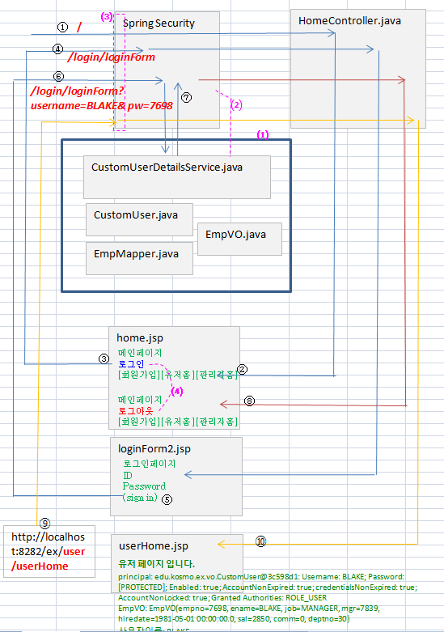

# user의 모든 정보를 가지고 오는, 커스텀 user 정보
### 스프링 시큐리티에서 username과 password뿐만 아니라 다른 모든 정보를 가져갈 수 있도록 수정됨

동작 기본 개념 : 

임시로 emp 테이블을 사용하고,  ename을 username으로, empno을 pw로 사용하여
로그인 페이지의 form을 통해서 받은 username과  pw가  emp 테이블안의 해당 ename과 empno와 
각각 동일하면 권한을 ROLE_USER로 주어지게 함.
USER로 권한이 주어지면 /user/userHome에 접근할수 있고, 이 페이지에 접근을 하면
스프링 시큐리티에서 가지고 있는 user의 모든 정보를 화면에 출력하도록 함.

# 전체적인 동작 블럭도

# 스프링 시큐리티에서 username과 password뿐만 아니라 다른 모든 정보를 가져가도록 (1)준비

# 스프링 시큐리티에 (2)연결

# (3)url을 접근하기 위해서 필요한 권한을 스프링 시큐리티에 설정을 해줌

# (4) 스프링 시큐리티의 상태를 tag로 가지고 와서 사용

