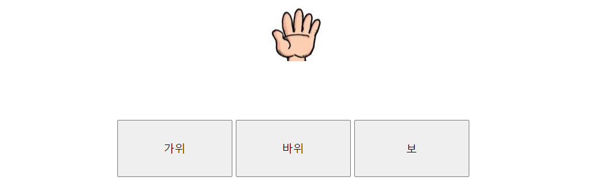

# 1. jS - 가위 바위 보 3개의 버튼을 작성후 해당 버튼을 누르면 이미지가 바뀌게 하시오
```js
<!DOCTYPE html>
<html lang="en">
<head>
		<meta charset="UTF-8">
		<meta http-equiv="X-UA-Compatible" content="IE=edge">
		<meta name="viewport" content="width=device-width, initial-scale=1.0">
		<title>Document</title>
	
		<script src="https://ajax.googleapis.com/ajax/libs/jquery/3.2.1/jquery.min.js"></script>

		<script>
			$(document).ready(function(){

				
				$(".Btn1").click(function(){
					console.log("click event1");

					$('#rspImg').attr("src", "./img/21.PNG");
					// $('#rspImg').attr("width", "200");

				});

			   
				$(".Btn2").click( function(){
					console.log("click event2");

					$('#rspImg').attr("src", "./img/22.PNG");

				});

				
				$(".Btn3").click( function(){
					console.log("click event3");

					$('#rspImg').attr("src", "./img/23.PNG");

				});
			});

		</script>
		
		<style>
			#imgdiv{
				text-align: center;
				height: 200px;
			}
			#wrap2{
				width: 100%;
			   
			}
			#wrap{
				width: 620px;
				margin: 0 auto;
				overflow: hidden;

			}
			.Btn1 {
				float:left;
				width: 200px; height: 100px;
				font-size: 1.2em;
				margin: 3px;
				
			}
			.Btn2 {
				float:left;
				width: 200px; height: 100px;
				font-size: 1.2em;
				margin: 3px;
			}
			.Btn3 {
				float:left;
				width: 200px; height: 100px;
				font-size: 1.2em;
				margin: 3px;
			}        
		</style>
		
	</head>
		<body>
			<div id="imgdiv">
				
			</div>
			<div id="wrap2">
				<div id="wrap">
					
					<input class="Btn1" type="button" value="가위">
					<input class="Btn2" type="button" value="바위">
					<input class="Btn3" type="button"  value="보">

				</div>    
			</div>    
		</body>
</html>
```


# 2. 스프링 시큐티 설정을 위한 pom.xml 과 web.xml 및 가장 기본적인
### security-context.xml 설정은?

## pom.xml 안에 아래와 같은 Spring Security 디펜덴시 ( 라이브러리 ) 를 추가한다.
```xml
     <!-- Spring Security -->
      <dependency>
         <groupId>org.springframework.security</groupId>
         <artifactId>spring-security-core</artifactId>
         <version>${org.security-version}</version>
      </dependency>

      <dependency>
         <groupId>org.springframework.security</groupId>
         <artifactId>spring-security-web</artifactId>
         <version>${org.security-version}</version>
      </dependency>

      <dependency>
         <groupId>org.springframework.security</groupId>
         <artifactId>spring-security-config</artifactId>
         <version>${org.security-version}</version>
      </dependency>

      <dependency>
         <groupId>org.springframework.security</groupId>
         <artifactId>spring-security-taglibs</artifactId>
         <version>${org.security-version}</version>
      </dependency>


```

#### web.xml 에서, /WEB-INF/spring/security-context.xml을 추가한다.
```xml
	<context-param>
		<param-name>contextConfigLocation</param-name>
		<param-value>/WEB-INF/spring/root-context.xml,/WEB-INF/spring/security-context.xml
		</param-value>
	</context-param>
```


#### security-context.xml 에서  아래 부분을 추가 한다.
```xml


	<http>
		<intercept-url pattern="/security/all" access="permitAll" />
		<intercept-url pattern="/security/member" access="hasRole('ROLE_MEMBER')" />

		<form-login/>
	</http>

	<authentication-manager>

		<authentication-provider> 
			<user-service> 
				<user name="member" password="{noop}member" authorities="ROLE_MEMBER" /> 
				<user name="mananger" password="{noop}mananger" authorities="ROLE_MEMBER" /> 
			</user-service> 
		</authentication-provider>

	</authentication-manager>

```


### 3. 인증과 권한에 대하여 설명하시오.

```
	Authentication :
		인증 과정, 
		사용자로 부터 입력받은 ip, pwd와 DB에 저장된 것과 일치하는지
		확인하는 과정. 일치하지않으면 HTTP status=401을 보낸다.
		
	Authorization :
		권한 부여, 
		사용자가 웹사이트에서 제공하는 다양한 기능이나 정보를 사용가능한지 여부를 확인하는데 사용함
			ex)
			인스타그램 : 로그인한 사용자만 스토리를 보고 게시물에 댓글을 달수 있도록 허용.
			Netflix : 유료 구독자만 영화와 프로그램을 볼수 잇도록 허용.
		승인은 대부분의 웹 사이트에서 핵심기능임 ( 대부분의 웹 사이트는 서비스를 특정 사용자 그룹으로 제한을 함)

```


