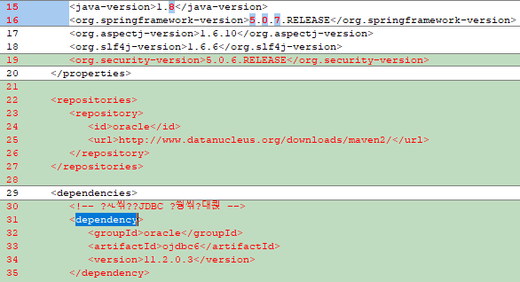
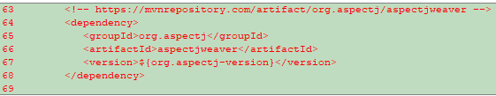
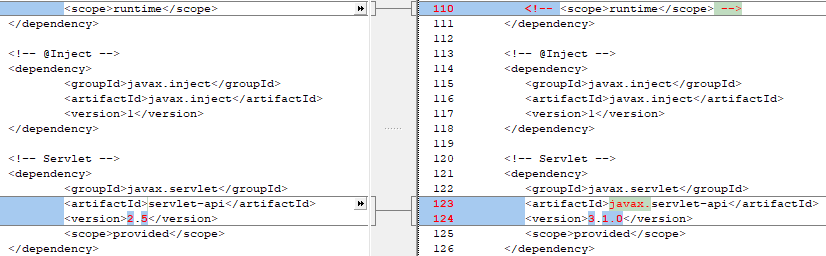
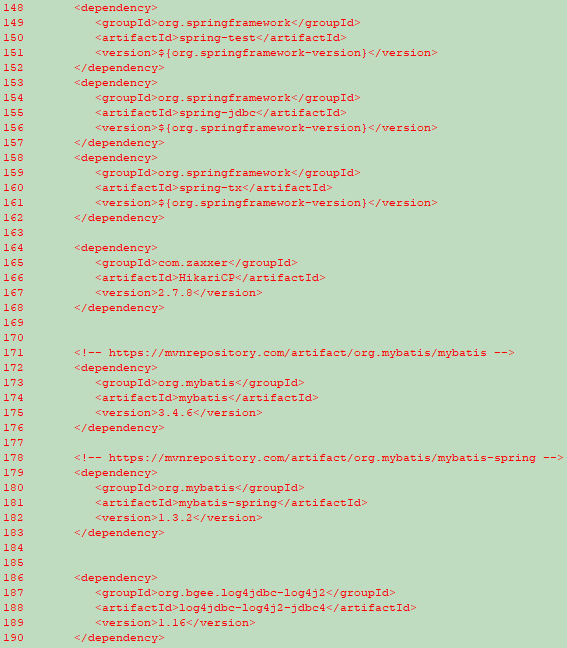
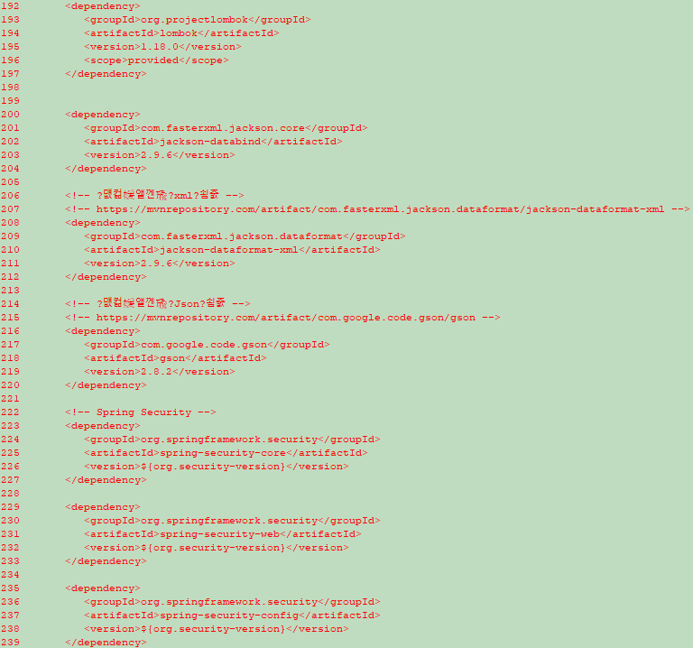
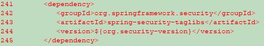
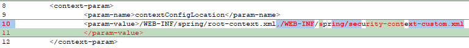
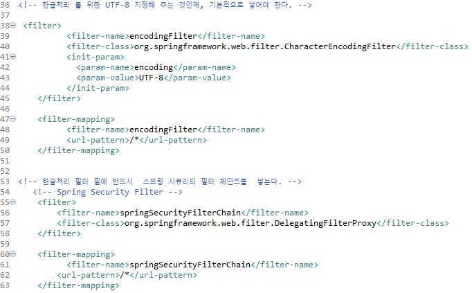
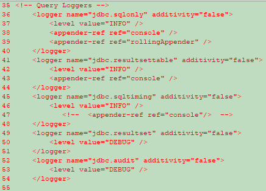
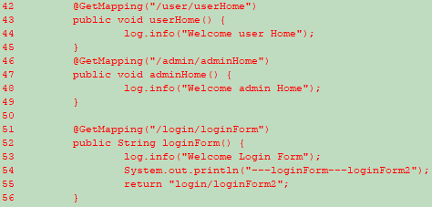

# 1. 스프링 시큐리티를 커스텀 마이징 하여 아래의 요소가 나오도록 하시오.(
```
-프로젝트를 새롭게 생성할것 
-todo list 를 작성할것

<p>사용자월급: <sec:authentication property="principal.emp.sal"/></p>
<p>사용자입사일자: <sec:authentication property="principal.emp.hiredate"/></p> 
```

# pom.xml









```xml
<?xml version="1.0" encoding="UTF-8"?>
<project xmlns="http://maven.apache.org/POM/4.0.0" xmlns:xsi="http://www.w3.org/2001/XMLSchema-instance"
	xsi:schemaLocation="http://maven.apache.org/POM/4.0.0 https://maven.apache.org/maven-v4_0_0.xsd">
	<modelVersion>4.0.0</modelVersion>
	<groupId>edu.kosmo</groupId>
	<artifactId>ex</artifactId>
	<name>spring5_security_1</name>
	<packaging>war</packaging>
	<version>1.0.0-BUILD-SNAPSHOT</version>

	
	
	
	<properties>
      <java-version>1.8</java-version>
      <org.springframework-version>5.0.7.RELEASE</org.springframework-version>
      <org.aspectj-version>1.6.10</org.aspectj-version>
      <org.slf4j-version>1.6.6</org.slf4j-version>
      <org.security-version>5.0.6.RELEASE</org.security-version>
   </properties>

   <repositories>
      <repository>
         <id>oracle</id>
         <url>http://www.datanucleus.org/downloads/maven2/</url>
      </repository>
   </repositories>

   <dependencies>
      <!-- 오라클 JDBC 드라이버 -->
      <dependency>
         <groupId>oracle</groupId>
         <artifactId>ojdbc6</artifactId>
         <version>11.2.0.3</version>
      </dependency>

      <!-- Spring -->
      <dependency>
         <groupId>org.springframework</groupId>
         <artifactId>spring-context</artifactId>
         <version>${org.springframework-version}</version>
         <exclusions>
            <!-- Exclude Commons Logging in favor of SLF4j -->
            <exclusion>
               <groupId>commons-logging</groupId>
               <artifactId>commons-logging</artifactId>
            </exclusion>
         </exclusions>
      </dependency>
      <dependency>
         <groupId>org.springframework</groupId>
         <artifactId>spring-webmvc</artifactId>
         <version>${org.springframework-version}</version>
      </dependency>

      <!-- AspectJ -->
      <dependency>
         <groupId>org.aspectj</groupId>
         <artifactId>aspectjrt</artifactId>
         <version>${org.aspectj-version}</version>
      </dependency>

      <!-- https://mvnrepository.com/artifact/org.aspectj/aspectjweaver -->
      <dependency>
         <groupId>org.aspectj</groupId>
         <artifactId>aspectjweaver</artifactId>
         <version>${org.aspectj-version}</version>
      </dependency>

      <!-- Logging -->
      <dependency>
         <groupId>org.slf4j</groupId>
         <artifactId>slf4j-api</artifactId>
         <version>${org.slf4j-version}</version>
      </dependency>
      <dependency>
         <groupId>org.slf4j</groupId>
         <artifactId>jcl-over-slf4j</artifactId>
         <version>${org.slf4j-version}</version>
         <scope>runtime</scope>
      </dependency>
      <dependency>
         <groupId>org.slf4j</groupId>
         <artifactId>slf4j-log4j12</artifactId>
         <version>${org.slf4j-version}</version>
         <scope>runtime</scope>
      </dependency>
      <dependency>
         <groupId>log4j</groupId>
         <artifactId>log4j</artifactId>
         <version>1.2.15</version>
         <exclusions>
            <exclusion>
               <groupId>javax.mail</groupId>
               <artifactId>mail</artifactId>
            </exclusion>
            <exclusion>
               <groupId>javax.jms</groupId>
               <artifactId>jms</artifactId>
            </exclusion>
            <exclusion>
               <groupId>com.sun.jdmk</groupId>
               <artifactId>jmxtools</artifactId>
            </exclusion>
            <exclusion>
               <groupId>com.sun.jmx</groupId>
               <artifactId>jmxri</artifactId>
            </exclusion>
         </exclusions>
         <!-- <scope>runtime</scope> -->
      </dependency>

      <!-- @Inject -->
      <dependency>
         <groupId>javax.inject</groupId>
         <artifactId>javax.inject</artifactId>
         <version>1</version>
      </dependency>

      <!-- Servlet -->
      <dependency>
         <groupId>javax.servlet</groupId>
         <artifactId>javax.servlet-api</artifactId>
         <version>3.1.0</version>
         <scope>provided</scope>
      </dependency>

      <dependency>
         <groupId>javax.servlet.jsp</groupId>
         <artifactId>jsp-api</artifactId>
         <version>2.1</version>
         <scope>provided</scope>
      </dependency>
      <dependency>
         <groupId>javax.servlet</groupId>
         <artifactId>jstl</artifactId>
         <version>1.2</version>
      </dependency>

      <!-- Test -->
      <dependency>
         <groupId>junit</groupId>
         <artifactId>junit</artifactId>
         <version>4.12</version>
         <scope>test</scope>
      </dependency>

      <dependency>
         <groupId>org.springframework</groupId>
         <artifactId>spring-test</artifactId>
         <version>${org.springframework-version}</version>
      </dependency>
      <dependency>
         <groupId>org.springframework</groupId>
         <artifactId>spring-jdbc</artifactId>
         <version>${org.springframework-version}</version>
      </dependency>
      <dependency>
         <groupId>org.springframework</groupId>
         <artifactId>spring-tx</artifactId>
         <version>${org.springframework-version}</version>
      </dependency>

      <dependency>
         <groupId>com.zaxxer</groupId>
         <artifactId>HikariCP</artifactId>
         <version>2.7.8</version>
      </dependency>


      <!-- https://mvnrepository.com/artifact/org.mybatis/mybatis -->
      <dependency>
         <groupId>org.mybatis</groupId>
         <artifactId>mybatis</artifactId>
         <version>3.4.6</version>
      </dependency>

      <!-- https://mvnrepository.com/artifact/org.mybatis/mybatis-spring -->
      <dependency>
         <groupId>org.mybatis</groupId>
         <artifactId>mybatis-spring</artifactId>
         <version>1.3.2</version>
      </dependency>


      <dependency>
         <groupId>org.bgee.log4jdbc-log4j2</groupId>
         <artifactId>log4jdbc-log4j2-jdbc4</artifactId>
         <version>1.16</version>
      </dependency>

      <dependency>
         <groupId>org.projectlombok</groupId>
         <artifactId>lombok</artifactId>
         <version>1.18.0</version>
         <scope>provided</scope>
      </dependency>


      <dependency>
         <groupId>com.fasterxml.jackson.core</groupId>
         <artifactId>jackson-databind</artifactId>
         <version>2.9.6</version>
      </dependency>

      <!-- 자바객체를 xml으로 -->
      <!-- https://mvnrepository.com/artifact/com.fasterxml.jackson.dataformat/jackson-dataformat-xml -->
      <dependency>
         <groupId>com.fasterxml.jackson.dataformat</groupId>
         <artifactId>jackson-dataformat-xml</artifactId>
         <version>2.9.6</version>
      </dependency>

      <!-- 자바객체를 Json으로 -->
      <!-- https://mvnrepository.com/artifact/com.google.code.gson/gson -->
      <dependency>
         <groupId>com.google.code.gson</groupId>
         <artifactId>gson</artifactId>
         <version>2.8.2</version>
      </dependency>

      <!-- Spring Security -->
      <dependency>
         <groupId>org.springframework.security</groupId>
         <artifactId>spring-security-core</artifactId>
         <version>${org.security-version}</version>
      </dependency>

      <dependency>
         <groupId>org.springframework.security</groupId>
         <artifactId>spring-security-web</artifactId>
         <version>${org.security-version}</version>
      </dependency>

      <dependency>
         <groupId>org.springframework.security</groupId>
         <artifactId>spring-security-config</artifactId>
         <version>${org.security-version}</version>
      </dependency>

      <dependency>
         <groupId>org.springframework.security</groupId>
         <artifactId>spring-security-taglibs</artifactId>
         <version>${org.security-version}</version>
      </dependency>

   </dependencies>


   <build>
      <plugins>
         <plugin>
            <artifactId>maven-eclipse-plugin</artifactId>
            <version>2.9</version>
            <configuration>
               <additionalProjectnatures>
                  <projectnature>org.springframework.ide.eclipse.core.springnature</projectnature>
               </additionalProjectnatures>
               <additionalBuildcommands>
                  <buildcommand>org.springframework.ide.eclipse.core.springbuilder</buildcommand>
               </additionalBuildcommands>
               <downloadSources>true</downloadSources>
               <downloadJavadocs>true</downloadJavadocs>
            </configuration>
         </plugin>
         <plugin>
            <groupId>org.apache.maven.plugins</groupId>
            <artifactId>maven-compiler-plugin</artifactId>
            <version>2.5.1</version>
            <configuration>
               <source>1.8</source>
               <target>1.8</target>
               <compilerArgument>-Xlint:all</compilerArgument>
               <showWarnings>true</showWarnings>
               <showDeprecation>true</showDeprecation>
            </configuration>
         </plugin>
         <plugin>
            <groupId>org.codehaus.mojo</groupId>
            <artifactId>exec-maven-plugin</artifactId>
            <version>1.2.1</version>
            <configuration>
               <mainClass>org.test.int1.Main</mainClass>
            </configuration>
         </plugin>
         
         
      </plugins>
   </build>
</project>


	
	
```
# web.xml




```xml
<?xml version="1.0" encoding="UTF-8"?>
<web-app version="2.5" xmlns="http://java.sun.com/xml/ns/javaee"
	xmlns:xsi="http://www.w3.org/2001/XMLSchema-instance"
	xsi:schemaLocation="http://java.sun.com/xml/ns/javaee https://java.sun.com/xml/ns/javaee/web-app_2_5.xsd">

	<!-- The definition of the Root Spring Container shared by all Servlets and Filters -->
	<!-- 스프링 시큐리티 관련해서, security-context.xml 추가 수정이 됨, xml 2개를 읽어 들일려면, 아래처럼 해야 함 주의 -->
	<context-param>
		<param-name>contextConfigLocation</param-name>
		<param-value>/WEB-INF/spring/root-context.xml,/WEB-INF/spring/security-context-custom.xml
		</param-value>
	</context-param>
	
	<!-- Creates the Spring Container shared by all Servlets and Filters -->
	<listener>
		<listener-class>org.springframework.web.context.ContextLoaderListener</listener-class>
	</listener>

	<!-- Processes application requests -->
	<servlet>
		<servlet-name>appServlet</servlet-name>
		<servlet-class>org.springframework.web.servlet.DispatcherServlet</servlet-class>
		<init-param>
			<param-name>contextConfigLocation</param-name>
			<param-value>/WEB-INF/spring/appServlet/servlet-context.xml</param-value>
		</init-param>
		<load-on-startup>1</load-on-startup>
	</servlet>
		
	<servlet-mapping>
		<servlet-name>appServlet</servlet-name>
		<url-pattern>/</url-pattern>
	</servlet-mapping>


<!-- 한글처리 를 위한 UTF-8 지정해 주는 것인데, 기본적으로 넣어야 한다. -->

 <filter>
          <filter-name>encodingFilter</filter-name>
          <filter-class>org.springframework.web.filter.CharacterEncodingFilter</filter-class>
          <init-param>
            <param-name>encoding</param-name>
            <param-value>UTF-8</param-value>
          </init-param>
    </filter>
     
    <filter-mapping>
          <filter-name>encodingFilter</filter-name>
          <url-pattern>/*</url-pattern>
    </filter-mapping>
    

<!-- 한글처리 필터 밑에 반드시  스프링 시큐리티 필터 체인즈를  넣는다. -->
   <!-- Spring Security Filter -->
    <filter>
        <filter-name>springSecurityFilterChain</filter-name>
        <filter-class>org.springframework.web.filter.DelegatingFilterProxy</filter-class>
    </filter>
 
    <filter-mapping>
          <filter-name>springSecurityFilterChain</filter-name>
        <url-pattern>/*</url-pattern>
    </filter-mapping>
    
    
</web-app>

```
# main\webapp\WEB-INF\spring\root-context.xml

```xml
<?xml version="1.0" encoding="UTF-8"?>
<beans xmlns="http://www.springframework.org/schema/beans"
   xmlns:xsi="http://www.w3.org/2001/XMLSchema-instance"
   xmlns:mybatis-spring="http://mybatis.org/schema/mybatis-spring"
   xsi:schemaLocation="http://mybatis.org/schema/mybatis-spring http://mybatis.org/schema/mybatis-spring-1.2.xsd
      http://www.springframework.org/schema/beans https://www.springframework.org/schema/beans/spring-beans.xsd">
   
   <bean id="hikariConfig" class="com.zaxxer.hikari.HikariConfig">
      <property name="driverClassName"
         value="net.sf.log4jdbc.sql.jdbcapi.DriverSpy"></property>
      <property name="jdbcUrl"
         value="jdbc:log4jdbc:oracle:thin:@localhost:1521:XE"></property>
      <property name="username" value="scott"></property>
      <property name="password" value="tiger"></property>
   </bean>

   <!-- HikariCP configuration -->
   <bean id="dataSource" class="com.zaxxer.hikari.HikariDataSource"
      destroy-method="close">
      <constructor-arg ref="hikariConfig" />
   </bean>

   <bean id="sqlSessionFactory"
      class="org.mybatis.spring.SqlSessionFactoryBean">
      <property name="dataSource" ref="dataSource"></property>
   </bean>
   
   <!--    Mapper Interface -->
   <mybatis-spring:scan base-package="edu.kosmo.ex.mapper"/> 
      
</beans>
```
# main\webapp\WEB-INF\spring\security-context-custom.xml

```xml
<?xml version="1.0" encoding="UTF-8"?>
<beans:beans xmlns="http://www.springframework.org/schema/security"
    xmlns:beans="http://www.springframework.org/schema/beans"
   xmlns:xsi="http://www.w3.org/2001/XMLSchema-instance"
   xsi:schemaLocation="http://www.springframework.org/schema/security http://www.springframework.org/schema/security/spring-security.xsd
      http://www.springframework.org/schema/beans http://www.springframework.org/schema/beans/spring-beans-4.3.xsd">
    
    <!-- 검사 URL -->
    <http auto-config="true" use-expressions="true">
        <intercept-url pattern="/login/loginForm" access="permitAll" />
        <intercept-url pattern="/" access="permitAll" />
        <intercept-url pattern="/admin/**" access="hasRole('ADMIN')" />
        <intercept-url pattern="/**" access="hasAnyRole('USER, ADMIN')" />
        
        <form-login login-page="/login/loginForm"
                    default-target-url="/"
                    authentication-failure-url="/login/loginForm?error"
                    username-parameter="username"
                    password-parameter="pw" />

<!--         <form-login login-page="/login/loginForm"
                    default-target-url="/"
                    authentication-failure-url="/login/loginForm?error"
                    username-parameter="id"
                    password-parameter="password" /> -->
        
         <logout logout-url="/logout"
                logout-success-url="/" /> 
                
        <access-denied-handler error-page="/security/accessDenied" />
    </http>    
    
 <!--    <beans:bean id="bcryptPasswordEncoder" class="org.springframework.security.crypto.bcrypt.BCryptPasswordEncoder" /> -->
         
<!--      <beans:bean id="userDetailsService" class="org.springframework.security.core.userdetails.jdbc.JdbcDaoImpl">
        <beans:property name="dataSource" ref="dataSource"/>
    </beans:bean> -->
    <beans:bean id="customNoOpPasswordEncoder" class="edu.kosmo.ex.security.CustomNoOpPasswordEncoder"/> 
    <beans:bean id="customUserDetailsService" class="edu.kosmo.ex.security.CustomUserDetailsService"/> 
    
    <!-- BLAKE 7698 -->
    <!--  provider  -->
      <authentication-manager>
        <authentication-provider user-service-ref="customUserDetailsService">
        <password-encoder ref="customNoOpPasswordEncoder"/> 
<!--         <jdbc-user-service 
            data-source-ref="dataSource"
         users-by-username-query="select ename, empno, 1  from emp where ename = ?"
           authorities-by-username-query="select ename,case when job='MANAGER' then 'ROLE_ADMIN' else  'ROLE_USER' end authority from emp where ename=?"            
        /> -->
        </authentication-provider>
    </authentication-manager> 
    
<!--    <authentication-manager>
        <authentication-provider>
        <jdbc-user-service 
            data-source-ref="dataSource"
         />
        </authentication-provider>
    </authentication-manager> -->
   
</beans:beans>
```
# edu\kosmo\ex\vo\EmpVO.java
```java
package edu.kosmo.ex.vo;

import java.sql.Timestamp;

import lombok.AllArgsConstructor;
import lombok.Getter;
import lombok.NoArgsConstructor;
import lombok.Setter;
import lombok.ToString;
import lombok.extern.log4j.Log4j;

@Log4j
@Getter
@Setter
@AllArgsConstructor
@NoArgsConstructor
@ToString
public class EmpVO {

	   int empno;    //NOT NULL NUMBER(4)    
	   String ename; //             VARCHAR2(10) 
	   String job;//               VARCHAR2(9)  
	   int mgr;//               NUMBER(4)    
	   Timestamp hiredate;//          DATE         
	   int sal;//               NUMBER(7,2)  
	   int comm;//              NUMBER(7,2)  
	   int deptno;//            NUMBER(2)  	
	
}
```

# edu\kosmo\ex\vo\CustomUser.java

```java
package edu.kosmo.ex.vo;

 
import java.text.DateFormat;
import java.util.Collection;
import java.util.Collections;
import java.util.Date;
import java.util.Locale;

import org.slf4j.Logger;
import org.slf4j.LoggerFactory;
import org.springframework.security.core.GrantedAuthority;
import org.springframework.security.core.authority.SimpleGrantedAuthority;
import org.springframework.security.core.userdetails.User;
import org.springframework.stereotype.Controller;
import org.springframework.ui.Model;
import org.springframework.web.bind.annotation.GetMapping;
import org.springframework.web.bind.annotation.RequestMapping;
import org.springframework.web.bind.annotation.RequestMethod;

import lombok.AllArgsConstructor;
import lombok.Getter;
import lombok.NoArgsConstructor;
import lombok.Setter;
import lombok.extern.log4j.Log4j;

/**
 * Handles requests for the application home page.
 */
@Log4j
@Getter
@Setter
public class CustomUser extends User {
   
   private EmpVO emp;
   
 //기본적으로 부모의 생성자를 호출해야만 정상적으로 작동

   public CustomUser(String username, String password, Collection<? extends GrantedAuthority> authorities) {
      super(username, password, authorities);
      
   }
   
   public CustomUser(EmpVO empVO) {
      super(empVO.getEname(), Integer.toString(empVO.getEmpno()),Collections
             .singletonList(new SimpleGrantedAuthority("ROLE_USER")));
      // TODO Auto-generated constructor stub
      this.emp = empVO;
   }   
}
```

# edu\kosmo\ex\mapper\EmpMapper.java

```java
package edu.kosmo.ex.mapper;

import org.apache.ibatis.annotations.Mapper;
import org.apache.ibatis.annotations.Select;

import edu.kosmo.ex.vo.EmpVO;

@Mapper
public interface EmpMapper {
	   @Select("select * from emp where ename = #{ename}")
	   public EmpVO readUser(String name);
}
```
# edu\kosmo\ex\service\EmpService.java

```java
package edu.kosmo.ex.service;

import javax.inject.Inject;

import org.springframework.stereotype.Service;

import edu.kosmo.ex.mapper.EmpMapper;
import edu.kosmo.ex.vo.EmpVO;
import lombok.extern.log4j.Log4j;

@Log4j
@Service
public class EmpService {
	   @Inject
	   private EmpMapper empMapper;
	   
	   public EmpVO getUser(String empNo){
	      log.info("readUser .. ");
	      return empMapper.readUser(empNo);
	   }
}
```
# edu\kosmo\ex\security\CustomNoOpPasswordEncoder.java
```java
package edu.kosmo.ex.security;


import org.springframework.security.crypto.password.PasswordEncoder;

import lombok.extern.log4j.Log4j;

@Log4j
public class CustomNoOpPasswordEncoder implements PasswordEncoder {

   public String encode(CharSequence rawPassword) {

      log.warn("before encode :" + rawPassword);

      return rawPassword.toString();
   }

   public boolean matches(CharSequence rawPassword, String encodedPassword) {

      log.warn("matches: " + rawPassword + ":" + encodedPassword);

      return rawPassword.toString().equals(encodedPassword);
   }

}
```
# edu\kosmo\ex\security\CustomUserDetailsService.java

```java
package edu.kosmo.ex.security;


import org.springframework.beans.factory.annotation.Autowired;
import org.springframework.security.core.userdetails.UserDetails;
import org.springframework.security.core.userdetails.UserDetailsService;
import org.springframework.security.core.userdetails.UsernameNotFoundException;

import edu.kosmo.ex.mapper.EmpMapper;
import edu.kosmo.ex.vo.CustomUser;
import edu.kosmo.ex.vo.EmpVO;
import lombok.Setter;
import lombok.extern.log4j.Log4j;

@Log4j
public class CustomUserDetailsService implements UserDetailsService{

	@Setter(onMethod_ = @Autowired)
	private EmpMapper empMapper;
	
	@Override
	public UserDetails loadUserByUsername(String ename) throws UsernameNotFoundException{
		log.warn("Load User by Employee number: " + ename);
		
		EmpVO vo = empMapper.readUser(ename);
		
		log.warn("queried by EmpVO mapper: "  + vo);
		
		return vo == null ? null : new CustomUser(vo);
	}
}
```
# edu\kosmo\ex\controller\SecurityController.java
```java
package edu.kosmo.ex.controller;

import org.springframework.stereotype.Controller;
import org.springframework.ui.Model;
import org.springframework.web.bind.annotation.GetMapping;
import org.springframework.web.bind.annotation.RequestMapping;

import lombok.extern.log4j.Log4j;

@Log4j
@RequestMapping("/security/*")
@Controller
public class SecurityController {

	@GetMapping("/all")
	public String all() {
		System.out.println("--- do all access everybody ----");
		return "/security/all";
	}
	
	@GetMapping("/member")
	public String member() {
		System.out.println("--- logined member ----");
		return "/security/member";
	}
	
	@GetMapping("/admin")
	//public String admin() {
	public void admin() {   // <--- use like this,  defaultly return /security/admin 
		log.info("/admin..");
		System.out.println("--- do all access everybody ----");
		//return "/security/admin";
	}
	
	@GetMapping("/accessError")
	public void accessError(Model model) {
		log.info("/accessError..");
		
		model.addAttribute("msg", "ACCESS Denied(404 에러)");
	}
	
}

```

# edu\kosmo\ex\HomeController.java

```java
package edu.kosmo.ex;

import java.text.DateFormat;
import java.util.Date;
import java.util.Locale;

import org.slf4j.Logger;
import org.slf4j.LoggerFactory;
import org.springframework.stereotype.Controller;
import org.springframework.ui.Model;
import org.springframework.web.bind.annotation.GetMapping;
import org.springframework.web.bind.annotation.RequestMapping;
import org.springframework.web.bind.annotation.RequestMethod;

import lombok.extern.log4j.Log4j;

/**
 * Handles requests for the application home page.
 */
@Log4j
@Controller
public class HomeController {
	
	private static final Logger logger = LoggerFactory.getLogger(HomeController.class);
	
	/**
	 * Simply selects the home view to render by returning its name.
	 */
	@RequestMapping(value = "/", method = RequestMethod.GET)
	public String home(Locale locale, Model model) {
		logger.info("Welcome home! The client locale is {}.", locale);
		
		Date date = new Date();
		DateFormat dateFormat = DateFormat.getDateTimeInstance(DateFormat.LONG, DateFormat.LONG, locale);
		
		String formattedDate = dateFormat.format(date);
		
		model.addAttribute("serverTime", formattedDate );
		System.out.println("---home---");
		return "home";
	}
	@GetMapping("/user/userHome")
	public void userHome() {
		log.info("Welcome user Home");
	}
	@GetMapping("/admin/adminHome")
	public void adminHome() {
		log.info("Welcome admin Home");
	}	
	
	@GetMapping("/login/loginForm")
	public String loginForm() {
		log.info("Welcome Login Form");
		System.out.println("---loginForm---loginForm2");
		return "login/loginForm2";
	}
	
	
}
```

# src\main\resources\log4j.xml


```xml
<?xml version="1.0" encoding="UTF-8"?>
<!DOCTYPE log4j:configuration SYSTEM "http://logging.apache.org/log4j/1.2/apidocs/org/apache/log4j/xml/doc-files/log4j.dtd">
<log4j:configuration xmlns:log4j="http://jakarta.apache.org/log4j/">

   <!-- Appenders -->
   <appender name="console" class="org.apache.log4j.ConsoleAppender">
      <param name="Target" value="System.out" />
      <layout class="org.apache.log4j.PatternLayout">
         <param name="ConversionPattern" value="%-5p: %c - %m%n" />
      </layout>
   </appender>
   
   <!-- Application Loggers -->
   <logger name="edu.kosmo.ex">
      <level value="info" />
   </logger>
   
   <!-- 3rdparty Loggers -->
   <logger name="org.springframework.core">
      <level value="info" />
   </logger>
   
   <logger name="org.springframework.beans">
      <level value="info" />
   </logger>
   
   <logger name="org.springframework.context">
      <level value="info" />
   </logger>

   <logger name="org.springframework.web">
      <level value="info" />
   </logger>

<!-- Query Loggers -->
    <logger name="jdbc.sqlonly" additivity="false">
        <level value="INFO" />
        <appender-ref ref="console" />
        <appender-ref ref="rollingAppender" />
    </logger>
    <logger name="jdbc.resultsettable" additivity="false">
        <level value="INFO" />
        <appender-ref ref="console" />
    </logger>
    <logger name="jdbc.sqltiming" additivity="false">
        <level value="INFO" />  
           <!--  <appender-ref ref="console"/>  -->
    </logger>
    <logger name="jdbc.resultset" additivity="false">
        <level value="DEBUG" />
    </logger>
    <logger name="jdbc.audit" additivity="false">
        <level value="DEBUG" />
    </logger> 
    
   <!-- Root Logger -->
   <root>
      <priority value="warn" />
      <appender-ref ref="console" />
   </root>
   
</log4j:configuration>
```
# 파일 복사
src\main\resources\log4jdbc.log4j2.properties

main\webapp\WEB-INF\include\header.jspf

main\webapp\WEB-INF\views\admin\adminHome.jsp

main\webapp\WEB-INF\views\login\loginForm.jsp
main\webapp\WEB-INF\views\login\loginForm2.jsp

main\webapp\WEB-INF\views\security\accessError.jsp
main\webapp\WEB-INF\views\security\admin.jsp
main\webapp\WEB-INF\views\security\all.jsp
main\webapp\WEB-INF\views\security\member.jsp

main\webapp\WEB-INF\views\user\userHome.jsp

main\webapp\WEB-INF\views\home.jsp


