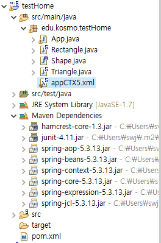

### 1.아래의 용어에 대하여 설명하시오.
- DI
```
Dependency Injection:
	자기 클래스 내부에서 다른 객체를 생성하여 사용하지 않고,
	외부에 있는 객체를 받아다가(setter) 사용하는 개념.
	
	쉽게 예를 들면,
	밖에서 만든 부품을  꽂아 주는 것
	
	부품은 dependency
	조립 해 주는것은 injection
	
	조립해 주는 방법 1 : setter injection
				2 : contruction injection

	스프링의 가장 기본적인 기능 :
		부품을 조립해 주는 기능
		-->
		객체를 생성해 주고, 객체를 조립해 줌.
		

```
- IOC
```
	Inversion Of Control
	
	IOC 란,
	
	부품을 조립하는 순서 관계 가
	작은 부품을 먼저 생성하고,
	큰부품을 만들어 결합하는 형태를 말함
	
	가장 먼저 만드는 것이, 
	작은 부품이고 이것으로
	큰 부품을 만듬.
```
- IOC 컨테이너
```java
	부품을 주문서대로 조립을 해야 하는데,
	(xml 또는 annotation을 사용하여 조립을 하고)
	
	주문서 입력대로  부품을 결합 까지 해서 ( IoC ) 
	담아 놓은 그릇을 
	IoC 컨테이너 라 함.

코드 상으로는
(예)
	ApplicationContext context = new ClassPathXmlApplicationContext("edu/kosmo/testHome/appCTX5.xml");
	Rectangle rec = context.getBean(Rectangle.class);
	Triangle tri = context.getBean(Triangle.class);
에서
	System.out.println(rec.getArea());
	System.out.println(tri.getArea());
	
	
ApplicationContext 이것이 IoC컨터이너 임
	
추가설명:	
	ClassPathXmlApplicationContext( 입력 ) 
	
		입력 : sping bean configuration file 
		
		Central interface to provide configuration for an application.
		This is read-only while the application is running, 
		but may bereloaded if the implementation supports this.
	
```


- [로드 존슨]
이 스프링을 만들 때 위의 세 가지 개념으로 만들었다고 했기 때문에 중요하고 반드시 알아야한다.
 이 세 가지 개념은 스프링에서 생겨난 것은 아니고 원래 있던 유명한 개념이다. 
(이 개념들은 현실에 있는걸 표현하기 위해서 추상화 시킨 것)
- 결국 스프링이란 부품을 생성하고 조립하는 라이브러리의 집합체라고 할 수 있다.
- 스프링 이전에는 EJB로 어렵게 작업을 했다.

### 2..삼각형및 사각형의 넓이를 구하는 프로그래밍을 IoC 컨테이너를 이용하여 프로그래밍 하시오.
- 삼각형과 사각형 Class 만들기
- appCTX.xml 에서 사각형과 삼각형 객체 생성및 가로세로 설정
- main 클래스에서 Ioc 컨테이너 생성후 삼각형 사각형 객체를 받아 온후, 넓이 함수 호출 


#### 작성: app.java
```java

import org.springframework.context.ApplicationContext;
import org.springframework.context.support.ClassPathXmlApplicationContext;


/**
 * Hello world!
 *
 */
public class App 
{
    public static void main( String[] args )
    {

        ApplicationContext context = new ClassPathXmlApplicationContext("edu/kosmo/testHome/appCTX5.xml");
        
        Rectangle rec = context.getBean(Rectangle.class);
        System.out.println(rec.getArea());
        
        Triangle tri = context.getBean(Triangle.class);
        System.out.println(tri.getArea());
        
    }
}

```
#### 작성: Rectangle.java
```java
public class Rectangle {
	private int width;
	private int height;
	private double area;
	public Rectangle() {
		super();
		// TODO Auto-generated constructor stub
	}
	public Rectangle(int width, int height) {
		super();
		this.width = width;
		this.height = height;
	}
	public int getWidth() {
		return width;
	}
	public void setWidth(int width) {
		this.width = width;
	}
	public int getHeight() {
		return height;
	}
	public void setHeight(int height) {
		this.height = height;
	}
	public double getArea() {
		area = width * height; 
		return area;
	}
	public void setArea(double area) {
		this.area = area;
	}
	
}
```
#### 작성: Triangle.java
```java
public class Triangle {
	private int width;
	private int height;
	private double area;
	public Triangle() {

	}
	public Triangle(int width, int height) {
		super();
		this.width = width;
		this.height = height;
	}
	public int getWidth() {
		return width;
	}
	public void setWidth(int width) {
		this.width = width;
	}
	public int getHeight() {
		return height;
	}
	public void setHeight(int height) {
		this.height = height;
	}
	public double getArea() {
		area = width * height /2.0f;
		return area;
	}
	public void setArea(double area) {
		this.area = area;
	}

	
}
```
#### 작성: appCTX5.xml
```xml
<?xml version="1.0" encoding="UTF-8"?>
<beans xmlns="http://www.springframework.org/schema/beans"
	xmlns:xsi="http://www.w3.org/2001/XMLSchema-instance"
	xsi:schemaLocation="http://www.springframework.org/schema/beans http://www.springframework.org/schema/beans/spring-beans.xsd">

<!--    Rectangle rec = new Rectangle(10,10);
        Triangle tri = new Triangle(10,10);
 -->
 	<bean id="rec" class="edu.kosmo.testHome.Rectangle">
 		<constructor-arg name="width" value="10"/>
 		<constructor-arg name="height" value="10"/>
 	</bean>
 	<bean id="try" class="edu.kosmo.testHome.Triangle">
 		<constructor-arg name="width" value="20"/>
 		<constructor-arg name="height" value="20"/>
 	</bean>
 
</beans>
```
#### 작성: pom.xml  (  spring-context  부분을 추가함 )
```xml
<?xml version="1.0" encoding="UTF-8"?>

<project xmlns="http://maven.apache.org/POM/4.0.0" xmlns:xsi="http://www.w3.org/2001/XMLSchema-instance"
  xsi:schemaLocation="http://maven.apache.org/POM/4.0.0 http://maven.apache.org/xsd/maven-4.0.0.xsd">
  <modelVersion>4.0.0</modelVersion>

  <groupId>edu.kosmo</groupId>
  <artifactId>testHome</artifactId>
  <version>0.0.1-SNAPSHOT</version>

  <name>testHome</name>
  <!-- FIXME change it to the project's website -->
  <url>http://www.example.com</url>

  <properties>
    <project.build.sourceEncoding>UTF-8</project.build.sourceEncoding>
    <maven.compiler.source>1.7</maven.compiler.source>
    <maven.compiler.target>1.7</maven.compiler.target>
  </properties>

  <dependencies>
    <dependency>
      <groupId>junit</groupId>
      <artifactId>junit</artifactId>
      <version>4.11</version>
      <scope>test</scope>
    </dependency>
    <!-- QQQQQQQQQQQQQQQ  ssj add QQQQQQQQQQQQQQQ -->
	<dependency>
		<groupId>org.springframework</groupId>
		<artifactId>spring-context</artifactId>
		<version>5.3.13</version>
	</dependency>    
  </dependencies>

  <build>
    <pluginManagement><!-- lock down plugins versions to avoid using Maven defaults (may be moved to parent pom) -->
      <plugins>
        <!-- clean lifecycle, see https://maven.apache.org/ref/current/maven-core/lifecycles.html#clean_Lifecycle -->
        <plugin>
          <artifactId>maven-clean-plugin</artifactId>
          <version>3.1.0</version>
        </plugin>
        <!-- default lifecycle, jar packaging: see https://maven.apache.org/ref/current/maven-core/default-bindings.html#Plugin_bindings_for_jar_packaging -->
        <plugin>
          <artifactId>maven-resources-plugin</artifactId>
          <version>3.0.2</version>
        </plugin>
        <plugin>
          <artifactId>maven-compiler-plugin</artifactId>
          <version>3.8.0</version>
        </plugin>
        <plugin>
          <artifactId>maven-surefire-plugin</artifactId>
          <version>2.22.1</version>
        </plugin>
        <plugin>
          <artifactId>maven-jar-plugin</artifactId>
          <version>3.0.2</version>
        </plugin>
        <plugin>
          <artifactId>maven-install-plugin</artifactId>
          <version>2.5.2</version>
        </plugin>
        <plugin>
          <artifactId>maven-deploy-plugin</artifactId>
          <version>2.8.2</version>
        </plugin>
        <!-- site lifecycle, see https://maven.apache.org/ref/current/maven-core/lifecycles.html#site_Lifecycle -->
        <plugin>
          <artifactId>maven-site-plugin</artifactId>
          <version>3.7.1</version>
        </plugin>
        <plugin>
          <artifactId>maven-project-info-reports-plugin</artifactId>
          <version>3.0.0</version>
        </plugin>
      </plugins>
    </pluginManagement>
  </build>
</project>
```
#### 결과: 
```
100.0
200.0
```

### 3.아래의 SQL를 푸시오
--35> 관리자 번호 및 해당 관리자에 속한 사원들의 최저 급여를 출력하라.
단, 관리자가 없는 사원 및 최저 급여가 1000 미만인 그룹은 제외시키고 급여를 기준으로
출력 결과를 내림차순으로 정렬하라.

--36> 부서별로 부서이름, 부서위치, 사원 수 및 평균 급여를 출력하라.
그리고 각각의 컬럼명을 부서명,위치,사원의 수,평균급여로 표시하라.

 
--37> Smith와 동일한 부서에 속한 모든 사원의 이름 및 입사일을 출력하라.
단, Smith는 제외하고 출력하시오

 
--38> 자신의 급여가 평균 급여보다 많은 모든 사원의 사원 번호, 이름, 급여를
표시하는 질의를 작성하고 급여를 기준으로 결과를 내림차순으로 정렬하라.

 
--39> 이름에 T가 들어가는 사원의 속한 부서에서 근무하는 모든 사원의
사원번호 및 이름을 출력하라.

 
--40> 부서위치가 Dallas인 모든 사원의 이름,부서번호 및 직위를 출력하라.


개별진척도
==================================================================================
52번)
 아래와 같이 출력이 나오도록 프로그래밍을 하시오.

        HashSet<Num> set = new HashSet<>();
        set.add(new Num(7799));
        set.add(new Num(9955));
        set.add(new Num(7799));

        System.out.println("인스턴스 수: " + set.size());

        for(Num n : set)
            System.out.print(n.toString() + '\t');

        System.out.println();

/*
====출력
인스턴스 수: 2
7799        9955
*/

53번 

   HashMap<Integer, String> map = new HashMap<>();
   map.put(45, "Brown");
   map.put(37, "James");
   map.put(23, "Martin");

======================================
위의 Value 값이 다나오도록 for 문 돌리시오.


====================================================================================


