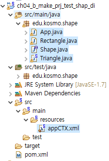

### 1. 아래와 같이 프포그래밍 하시오.
interface Shape
- double getArea();
- void setWidth(double width)
- void setHeight(double height)

삼각형 , 사각형 객체를 위의 인터페이스를 구현하여, 
appCTX4에 객체 생성후 Pencile 과 같이 다형성이 적용되도록 Main을 짜시오.



#### App.java
```java
import org.springframework.context.support.AbstractApplicationContext;
import org.springframework.context.support.GenericXmlApplicationContext;

/**
 * Hello world!
 *
 */
public class App 
{
    public static void main( String[] args )
    {
        System.out.println( "Hello World! " );
        String loc = "classpath:appCTX.xml";
        AbstractApplicationContext ctx = new GenericXmlApplicationContext(loc);
        Shape shape = ctx.getBean("shape", Shape.class);
        System.out.println("넓이 : " + shape.getArea());
        
    }
}

```
#### Shape.java
```java
package edu.kosmo.shape;

public interface Shape {
	double getArea();
	void setWidth(double width);
	void setHeight(double height);
}
```
#### appCTX.xml
```xml
<?xml version="1.0" encoding="UTF-8"?>
<beans xmlns="http://www.springframework.org/schema/beans"
	xmlns:xsi="http://www.w3.org/2001/XMLSchema-instance"
	xsi:schemaLocation="http://www.springframework.org/schema/beans http://www.springframework.org/schema/beans/spring-beans.xsd">
	
	<bean id="shape" class="edu.kosmo.shape.Triangle">
		<property name="width" value="10"></property>
		<property name="height" value="21"></property>
	</bean>


</beans>


```

#### Rectangle.java
```java
package edu.kosmo.shape;

public class Rectangle implements Shape {
	private double area;
	private double width;
	private double height;
	
	public Rectangle() {
	}
	 
		
	public Rectangle(double area, double width, double height) {
		super();
		this.area = area;
		this.width = width;
		this.height = height;
	}


	@Override
	public double getArea() {
		// TODO Auto-generated method stub
		return width*height;
	}

	@Override
	public void setWidth(double width) {
		this.width = width;

	}

	@Override
	public void setHeight(double height) {
		this.height = height;

	}

}

```
#### Triangle.java
```java
package edu.kosmo.shape;

public class Triangle implements Shape {
	private double area;
	private double width;
	private double height;
	
	public Triangle() {
	}
	 
		
	public Triangle(double area, double width, double height) {
		super();
		this.area = area;
		this.width = width;
		this.height = height;
	}


	@Override
	public double getArea() {
		// TODO Auto-generated method stub
		return width*height/2.0f;
	}

	@Override
	public void setWidth(double width) {
		this.width = width;

	}

	@Override
	public void setHeight(double height) {
		this.height = height;

	}

}

```


### 2. javascript 에서, 데이터 타입 종류와 변수 선언 방법은?
```
	c 나 java 같은 언어와 달리  변수에 데이터 타입을 사용하지 않는다. (ex: int score; 이런것은 없고,  var score; 이런식으로 사용함)
					
		데이터 타입 종류 : 
			숫자 타입 : 42, 3.14
			논리 타입 : true, false
			문자열    :  '좋은 세상'
			객체 레퍼런스 타입  :  객체를 가리킴.
			null :  값이 없음을 표시하는 특수 키워드,  Null 또는 NULL 과는 다름.
			
	
	
	
		변수 선언 방법: 
			1) var 키워드를 사용하여 선언하는 방법
				ex:
					var score;
					var year, month, day;
					var address = "서울시";
				
			2) var 키워드 없이 변수를 선언 하는 방법
				ex:
					age = 21;
```
### 3. javascript 에서 아래의 함수는?
```
	사용자에게 메시지를 출력하거나, 입력 받을수 있는 3가지 다이얼로그 함수 임.
	
```

- alret
```
	다이얼로그를 출력하여 단순히, 사용자에게 메시지를 전달함.
```
- prompt
```
	사용자가 입력한 문자열을 리턴 해 주는 함수임. (사용자가 다이얼로그에 글짜를 입력하면 그 값을 함수 리턴값으로 전달해줌)
```
- confirm
```
	ok,cancel 버턴 을 가진 다이얼로그 함수임.
	사용자가 누른 버턴의 값을 리턴해 준다.
```

=====================================================================
#### 54번

        ThreadCount threadCount = new ThreadCount();
                threadCount.start();
                
                String input = JOptionPane.showInputDialog("아무 값이나 입력하세요."); 
                System.out.println("입력하신 값은 " + input + "입니다.");
10 9 8 7 6 ... 이 1초마다 실행 되도록 쓰레를 완성하시오.

#### 55번
html - 메뉴 4개 구성 

#### html 12강 css속성 에 있습니다. 
####  12-2. font-style, font-weight, line-height 속성 
CSS 코드줄은 몇줄 되지 않아요. 
한번 복습해서, 내일 돌려보도록 합시다.

꼭 하도록 합시다.